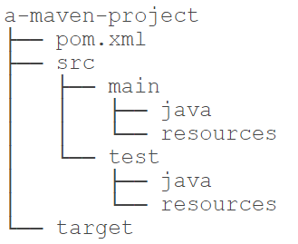

# Maven介绍

&emsp;&emsp;在了解Maven之前，我们先来看看一个Java项目需要的东西。

首先，我们需要确定引入哪些依赖包。例如，如果我们需要用到commons logging，我们就必须把commons logging的jar包放入classpath。如果我们还需要log4j，就需要把log4j相关的jar包都放到classpath中。这些就是<font color=red>依赖包的管理</font>。

其次，我们要确定项目的<font color=red>目录结构</font>。例如，src目录存放Java源码，resources目录存放配置文件，bin目录存放编译生成的.class文件。

此外，我们还需要<font color=red>配置环境</font>，例如JDK的版本，编译打包的流程，当前代码的版本号。

最后，除了使用Eclipse这样的IDE进行<font color=red>编译外</font>，我们还必须能通过命令行工具进行编译，才能够让项目在一个独立的服务器上编译、测试、部署。

这些工作难度不大，但是非常琐碎且耗时。如果每一个项目都自己搞一套配置，肯定会一团糟。我们需要的是一个标准化的Java项目管理和构建工具。

Maven就是是专门为Java项目打造的<font color=red>管理和构建工具</font>，它的主要功能有：
* 提供了一套标准化的项目结构；
* 提供了一套标准化的构建流程（编译，测试，打包，发布……）；
* 提供了一套依赖管理机制。

## Maven项目结构
&emsp;&emsp;一个使用Maven管理的普通的Java项目，它的目录结构默认如下：
[^_^]: # 
<div align=left></div>

项目的根目录 *a-maven-project* 是<font color=red>项目名</font>，它有一个<font color=red>项目描述文件 *pom.xml* </font>，存放<font color=red>Java源码</font>的目录是src/main/java，存放<font color=red>资源文件</font>的目录是 *src/main/resources*，存放<font color=red>测试源码</font>的目录是 *src/test/java*，存放<font color=red>测试资源</font>的目录是 *src/test/resources*，最后，<font color=red>所有编译、打包生成的文件都放在 *target* 目录里</font>。这些就是一个Maven项目的标准目录结构。

<font color=red>所有的目录结构都是约定好的标准结构</font>，我们千万不要随意修改目录结构。使用标准结构不需要做任何配置，Maven就可以正常使用。

我们再来看最关键的一个项目描述文件pom.xml，它的内容长得像下面：
```xml
<?xml version="1.0" encoding="UTF-8"?>
<project xmlns="http://maven.apache.org/POM/4.0.0" xmlns:xsi="http://www.w3.org/2001/XMLSchema-instance"
         xsi:schemaLocation="http://maven.apache.org/POM/4.0.0 https://maven.apache.org/xsd/maven-4.0.0.xsd">
    <modelVersion>4.0.0</modelVersion>

    <parent>
        <groupId>org.springframework.boot</groupId>
        <artifactId>spring-boot-starter-parent</artifactId>
        <version>2.2.4.RELEASE</version>
        <relativePath/> <!-- lookup parent from repository -->
    </parent>

    <groupId>com.example</groupId>
    <artifactId>hello</artifactId>
    <version>0.0.1-SNAPSHOT</version>
    <name>hello</name>
    <description>Demo project for Spring Boot</description>

    <properties>
        <java.version>13</java.version>
    </properties>

    <dependencies>
        <dependency>
            <groupId>org.springframework.boot</groupId>
            <artifactId>spring-boot-starter-web</artifactId>
        </dependency>

        <dependency>
            <groupId>org.springframework.boot</groupId>
            <artifactId>spring-boot-devtools</artifactId>
            <scope>runtime</scope>
            <optional>true</optional>
        </dependency>

        <dependency>
            <groupId>org.springframework.boot</groupId>
            <artifactId>spring-boot-starter-test</artifactId>
            <scope>test</scope>
            <exclusions>
                <exclusion>
                    <groupId>org.junit.vintage</groupId>
                    <artifactId>junit-vintage-engine</artifactId>
                </exclusion>
            </exclusions>
        </dependency>
    </dependencies>

    <build>
        <plugins>
            <plugin>
                <groupId>org.springframework.boot</groupId>
                <artifactId>spring-boot-maven-plugin</artifactId>
                <configuration><fork>true</fork></configuration>
            </plugin>
        </plugins>
    </build>

</project>
```
其中，<font color=red>*groupId* 类似于Java的包名</font>，通常是公司或组织名称，<font color=red>*artifactId* 类似于Java的类名</font>，通常是项目名称，再加上version，<font color=red>一个Maven工程就是由groupId，artifactId和version作为唯一标识</font>。我们在引用其他第三方库的时候，也是通过这3个变量确定。例如，依赖：*org.springframework.boo*
```xml
<dependency>
    <groupId>org.springframework.boot</groupId>
    <artifactId>spring-boot-starter-web</artifactId>
</dependency>
```
使用<dependency>声明一个依赖后，Maven就会自动下载这个依赖包并把它放到classpath中。

## 安装Maven
&emsp;&emsp;要安装Maven，可以从Maven官网下载最新的Maven 3.6.x，然后在本地解压，安装Maven的前提是完成Java环境安装，Maven依赖于Java环境。Maven为绿色软件解压后即可使用。解压后需要设置环境变量：
<div align=center></div>

然后，打开命令行窗口，输入mvn -version，应该看到Maven的版本信息：
<div align=center></div>

### settings.xml 设置
&emsp;&emsp;Maven解压后目录下会有一个`settings.xml`文件，位置 */conf/settings.xml*，用来<font color=red>配置Maven的仓库和本地Jar包存储地址</font>。Maven仓库地址代表从哪里去下载项目中的依赖包Jar包；Maven会将所有的Jar包统一存储到一个地址下，方便各个项目复用。

<font color=red>*localRepository* 设置本地存放Jar包地址</font>，可以根据自己的情况改动：
```xml
<!-- localRepository
 | The path to the local repository maven will use to store artifacts.
 |
 | Default: ${user.home}/.m2/repository
<localRepository>/path/to/local/repo</localRepository>
-->
  <localRepository>D:\WinSoftware\Maven\repository</localRepository>
```
<span id="mirrors">`mirrors`</span><font color=red>为仓库列表配置的下载镜像列表</font>：
```xml
<!-- mirrors
 | This is a list of mirrors to be used in downloading artifacts from remote repositories.
 |
 | It works like this: a POM may declare a repository to use in resolving certain artifacts.
 | However, this repository may have problems with heavy traffic at times, so people have mirrored
 | it to several places.
 |
 | That repository definition will have a unique id, so we can create a mirror reference for that
 | repository, to be used as an alternate download site. The mirror site will be the preferred
 | server for that repository.
 |-->
<mirrors>
  <!-- mirror
   | Specifies a repository mirror site to use instead of a given repository. The repository that
   | this mirror serves has an ID that matches the mirrorOf element of this mirror. IDs are used
   | for inheritance and direct lookup purposes, and must be unique across the set of mirrors.
   |
  <mirror>
    <id>mirrorId</id>
    <mirrorOf>repositoryId</mirrorOf>
    <name>Human Readable Name for this Mirror.</name>
    <url>http://my.repository.com/repo/path</url>
  </mirror>
   -->

    <mirror>
        <id>alimaven</id>
        <mirrorOf>central</mirrorOf>
        <name>aliyun maven</name>
        <url>http://maven.aliyun.com/nexus/content/groups/public/</url>
    </mirror>

    <mirror>
        <id>repo2</id>
        <mirrorOf>central</mirrorOf>
        <name>spring2.0 for this Mirror.</name>
        <url>https://repo.spring.io/libs-milestone</url>
    </mirror>

    <mirror>
        <id>jboss-public-repository-group</id>
        <mirrorOf>central</mirrorOf>
        <name>JBoss Public Repository Group</name>
        <url>http://repository.jboss.org/nexus/content/groups/public</url>
    </mirror>

</mirrors>
```

# 依赖管理
&emsp;&emsp;如果我们的项目依赖第三方的jar包，例如commons logging，那么问题来了：<u>commons logging发布的jar包在哪下载</u>？如果我们还希望依赖log4j，那么<u>使用log4j需要哪些jar包</u>？类似的依赖还包括：JUnit，JavaMail，MySQL驱动等等。一个可行的方法是通过搜索引擎搜索到项目的官网，然后<font color=red>手动下载zip包，解压，放入classpath</font>。但是，这个过程非常繁琐。

&emsp;&emsp;<font color=red>Maven解决了依赖管理问题</font>。例如，我们的项目依赖abc这个jar包，而abc又依赖xyz这个jar包：
<div align=center></div>

<u>当我们声明了abc的依赖时，Maven自动把abc和xyz都加入了我们的项目依赖，不需要我们自己去研究abc是否需要依赖xyz</u>。因此，`Maven的第一个作用就是解决依赖管理`。我们声明了自己的项目需要abc，Maven会自动导入abc的jar包，再判断出abc需要xyz，又会自动导入xyz的jar包，这样，最终我们的项目会依赖abc和xyz两个jar包。

&emsp;&emsp;我们来看一个复杂依赖示例：
```xml
<groupId>org.springframework.boot</groupId>
<artifactId>spring-boot-starter-parent</artifactId>
<version>2.2.4.RELEASE</version>
```
当我们声明一个`spring-boot-starter-web`依赖时，Maven会自动解析并判断最终需要大概二三十个其他依赖：
<div align=center></div>
如果我们自己去手动管理这些依赖是非常费时费力的，而且出错的概率很大。

## 依赖关系
&emsp;&emsp;Maven通过解析依赖关系确定项目所需的jar包，Maven定义了几种依赖关系，分别是`compile`、`test`、`runtime`和`provided`：
<div align=center></div>

其中，默认的`compile`是最常用的，Maven会把这种类型的依赖直接放入classpath。

`test依赖`表示仅在测试时使用，正常运行时并不需要。最常用的test依赖就是JUnit：
```xml
<dependency>
    <groupId>org.junit.jupiter</groupId>
    <artifactId>junit-jupiter-api</artifactId>
    <version>5.3.2</version>
    <scope>test</scope>
</dependency>
```
`runtime依赖`表示编译时不需要，但运行时需要。最典型的runtime依赖是JDBC驱动，例如MySQL驱动：
```xml
<dependency>
    <groupId>mysql</groupId>
    <artifactId>mysql-connector-java</artifactId>
    <version>5.1.48</version>
    <scope>runtime</scope>
</dependency>
```
`provided依赖`表示编译时需要，但运行时不需要。最典型的provided依赖是Servlet API，编译的时候需要，但是运行时，Servlet服务器内置了相关的jar，所以运行期不需要：
```xml
<dependency>
    <groupId>javax.servlet</groupId>
    <artifactId>javax.servlet-api</artifactId>
    <version>4.0.0</version>
    <scope>provided</scope>
</dependency>
```

&emsp;&emsp;<u>Maven如何知道从何处下载所需的依赖</u>？也就是相关的jar包？答案是Maven维护了一个[中央仓库](https://repo1.maven.org/maven2)，<font color=red>所有第三方库将自身的jar以及相关信息上传至中央仓库</font>，Maven就可以从中央仓库把所需依赖下载到本地。

Maven并不会每次都从中央仓库下载jar包。<font color=red>一个jar包一旦被下载过，就会被Maven自动缓存在本地目录（用户主目录的.m2目录）</font>。所以，除了第一次编译时因为下载需要时间会比较慢，后续过程因为有本地缓存，并不会重复下载相同的jar包。

## 唯一ID
&emsp;&emsp;对于某个依赖，Maven只需要3个变量即可唯一确定某个jar包：
* groupId：属于组织的名称，类似Java的包名；
* artifactId：该jar包自身的名称，类似Java的类名；
* version：该jar包的版本。

通过上述3个变量，即可唯一确定某个jar包。Maven通过对jar包进行PGP签名确保<u>任何一个jar包一经发布就无法修改</u>。修改已发布jar包的唯一方法是发布一个新版本。因此，某个jar包一旦被Maven下载过，即可永久地安全缓存在本地。

注：只有以`SNAPSHOT-`开头的版本号会被Maven视为开发版本，开发版本每次都会重复下载，<font color=red>这种SNAPSHOT版本只能用于内部私有的Maven repo，公开发布的版本不允许出现SNAPSHOT</font>。

## Maven镜像
&emsp;&emsp;除了可以从Maven的中央仓库下载外，还可以从Maven的镜像仓库下载。如果访问Maven的中央仓库非常慢，我们可以选择一个速度较快的Maven的镜像仓库，Maven镜像仓库定期从中央仓库同步。如何设置`mirrors`可参见[“settings.xml中设置mirrors”](#mirrors)。
[^_^]: # 文内链接#mirrors不能含中文

## 搜索第三方组件
&emsp;&emsp;如果我们要引用一个第三方组件，比如`okhttp`，<u>如何确切地获得它的groupId、artifactId和version</u>？方法是通过[search.maven.org](https://search.maven.org/)搜索关键字，找到对应的组件后，直接复制：
<div align=center></div>

# 构建流程
