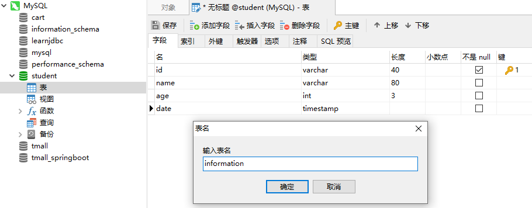

# MySQL安装

# 2 Navicat安装与使用

## 2.1 Navicat安装

## 2.2 Navicat使用

- 连接数据库

点击`连接`，选择`MySQL`：主机名：`127.0.0.1`（默认为`localhost`）


- 新建数据库

右击`MySQL`，选择`新建数据库`：


对应的`sql`语言为：

```mysql
CREATE DATABASE `student` CHARACTER SET 'utf8';
```

- 新建表（双击打开数据库）
  - 可以点击`查询`->`新建查询`，通过`sql`语句进行创建

  ```mysql
  CREATE TABLE `student`.`information`  (
    `id` varchar(40) NOT NULL,
    `name` varchar(80) NULL,
    `age` int(3) NULL,
    `date` timestamp NULL,
    PRIMARY KEY (`id`)
  );
  ```

  

  - 可以点击`表`->`新建表`，通过图形化界面进行创建

