# 参考资料

[快速入门Spring](https://www.bilibili.com/video/BV12k4y167jK?p=1)

# 1 MVC

## 1.1 三层架构

开发架构一般基于两种形式

- C/S：客户端/服务端
- B/S：浏览器/服务器

在`JavaEE`开发中，几乎全都是基于B/S架构的开发。

标准的三层架构

- **表现层**——web层：接收客户端请求（http），向客户端响应结果
  - **展示层**：展示结果；**控制层**：接收请求
  - 表现层依赖业务层，接收到客户端请求会调用业务层进行业务处理，并将处理结果响应给客户端
  - 表现层的设计一般使用MVC模型（**`MVC是表现层的设计模型`**）
  - **`Spring MVC`**
- **业务层**——Service层
  - 负责业务逻辑处理，与开发项目的需求相关
  - 业务层在处理业务时会依赖持久层，如果要对数据持久化，则需要保证事务一致性
  - **`Spring框架`**
- **持久层**——DAO层
  - 负责数据持久化：和数据库交互，对数据库进行增删改查。
  - **`Mybatis`**

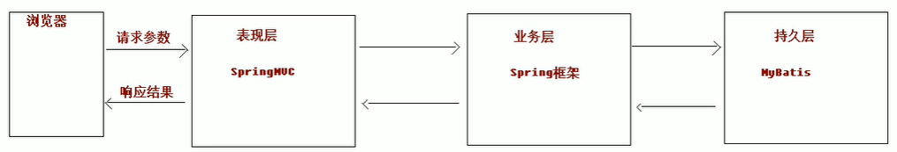

## 1.2 MVC模型

MVC（Model View Controller）是模型、视图和控制器的缩写，是一种用于设计创建Web应用程序`表现层`的模式。

- Model模型
  - `service、dao、entity`
  - `jdbc->Mybatis`
- View视图
  - webapp页面
  - `jsp（动态网页——根据数据库中数据动态展现）、html`
- Controller控制器
  - `action`
  - `servlet->Struts2->SpringMVC`

## 1.3 SSM架构图

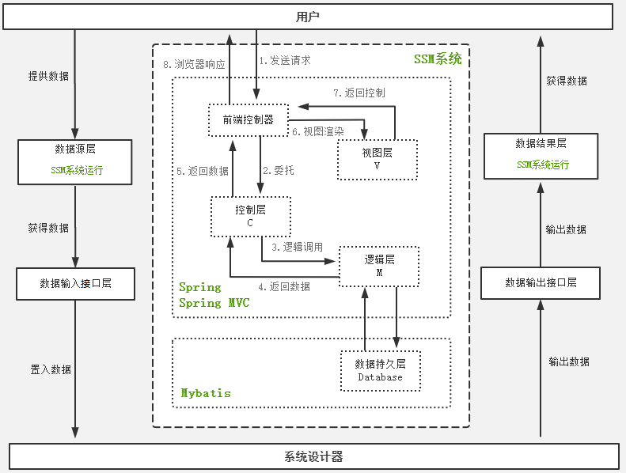

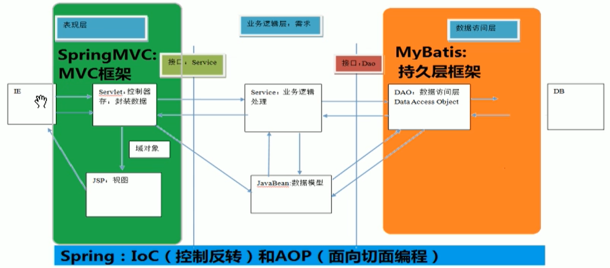

# 2 项目搭建

Spring框架是一个集众多**`设计模式`**于一身的`开源的`、`轻量级`的**`项目管理框架`**。致力于Java EE轻量级解决方案。

Spring框架用来`整合、管理`项目中的`组件`（单层框架），由于Spring框架可以帮我们**`创建、使用和销毁项目中组件对象`**，因此也习惯称Spring是一个**工厂、容器（存放已创建的组件对象）**。通过对象在工厂中的唯一标识来获取对象！

- **`组件`:** 项目中的`service`、`dao`、`action`，都是项目中的组件 
- Spring框架**不必通过`new`来创建组件对象**，而是通过其他方式来负责项目中**组件对象的创建、使用和销毁**
- Spring框架不负责**`entity`组件**的创建、使用和销毁

## 2.1 示例项目

该项目展示了，不使用`Spring`时，该如何创建、使用和销毁组件！

1. 创建模块

在`D:\MarkdownFiles\Spring\SpringDemo`路径下创建工程：

`GroupId`为`com.chenzf`；`AritfactId`为`demo_without_spring`：

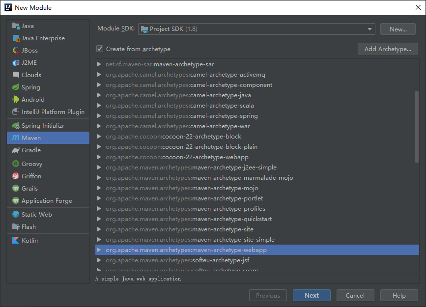

设置`Maven`路径：

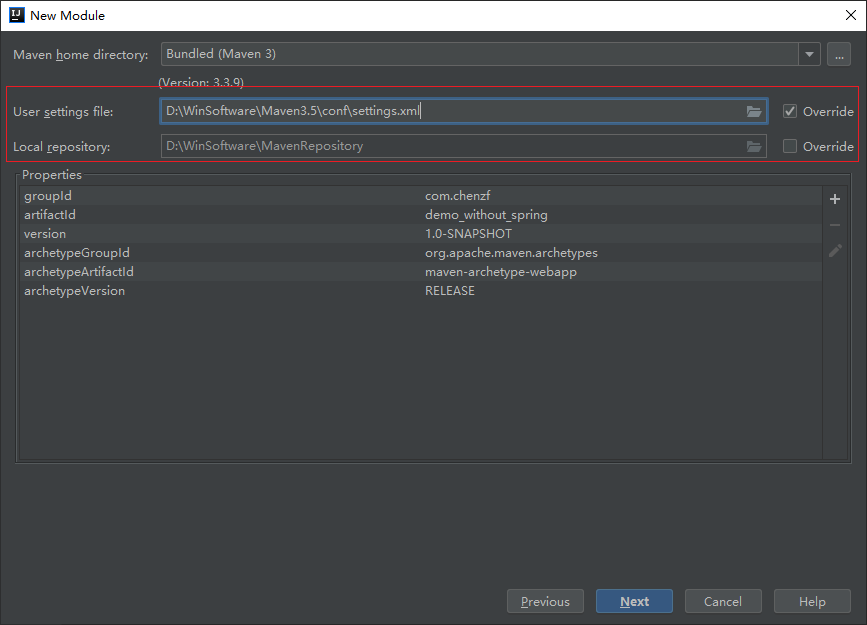

2. 完善目录结构

在`main`目录下新建`java`和`resources`并分别设置`Mark Directory as`：`Sources Root`和`Resources Root`。

3. 在`main.java`下新建`init`目录

   - 编写`UserDAO`接口：

   ```java
   package init;
   
   public interface UserDAO {
       void save(String name);
   }
   ```

   - 编写`USerDAOImpl`实现类

   ```java
   package init;
   
   public class UserDAOImpl implements UserDAO {
       
       @Override
       public void save(String name) {
           System.out.println("name = " + name);
       }
   }
   ```

   - 编写`TestUserDAO`类，**创建组件对象并使用**

   ```java
   package init;
   
   public class TestUserDAO {
       public static void main(String[] args) {
           // 创建组件对象
           UserDAOImpl user = new UserDAOImpl();
   
           // 使用组件
           user.save("chenzufeng");
   
           // 由JVM来销毁对象
       }
   }
   ```

## 2.2 第一个Spring程序

[Spring官网](https://spring.io/projects/spring-framework#learn)

### 2.2.1 创建模块

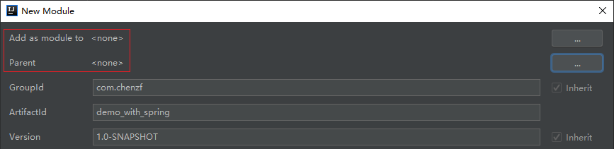

### 2.2.1 引入项目依赖

在`pom.xml`中[引入Spring核心和依赖模块](https://mvnrepository.com/search?q=Spring)，并点击`Import Changes`：

```xml
<dependency>
      <groupId>org.springframework</groupId>
      <artifactId>spring-core</artifactId>
      <version>4.3.2.RELEASE</version>
  </dependency>
  <dependency>
      <groupId>org.springframework</groupId>
      <artifactId>spring-beans</artifactId>
      <version>4.3.2.RELEASE</version>
  </dependency>
  <dependency>
      <groupId>org.springframework</groupId>
      <artifactId>spring-web</artifactId>
      <version>4.3.2.RELEASE</version>
  </dependency>
  <dependency>
      <groupId>org.springframework</groupId>
      <artifactId>spring-expression</artifactId>
      <version>4.3.2.RELEASE</version>
  </dependency>
  <dependency>
      <groupId>org.springframework</groupId>
      <artifactId>spring-context</artifactId>
      <version>4.3.2.RELEASE</version>
  </dependency>
  <dependency>
      <groupId>org.springframework</groupId>
      <artifactId>spring-context-support</artifactId>
      <version>4.3.2.RELEASE</version>
  </dependency>
  <dependency>
      <groupId>org.springframework</groupId>
      <artifactId>spring-aspects</artifactId>
      <version>4.3.2.RELEASE</version>
  </dependency>
  <dependency>
      <groupId>org.springframework</groupId>
      <artifactId>spring-jdbc</artifactId>
      <version>4.3.2.RELEASE</version>
  </dependency>
  <dependency>
      <groupId>org.springframework</groupId>
      <artifactId>spring-aop</artifactId>
      <version>4.3.2.RELEASE</version>
  </dependency>
```

### 2.2.2 引入Spring框架配置文件

- 配置文件名称：任意名称
  - `applicationContext.xml`或`Spring.xml`
- 配置文件位置：项目中根下任意位置
  - `resources.init`目录下
- 配置文件内容

```xml
<?xml version="1.0" encoding="UTF-8"?>
<beans xmlns="http://www.springframework.org/schema/beans"
       xmlns:xsi="http://www.w3.org/2001/XMLSchema-instance"
       xsi:schemaLocation="http://www.springframework.org/schema/beans http://www.springframework.org/schema/beans/spring-beans.xsd">

</beans>
```

### 2.2.3 创建组件

- 在`main.java.init`目录下创建`UserDAO`接口：

```java
package init;

public interface UserDAO {
    void save(String name);
}
```

- 在`main.java.init`目录下创建`UserDAOImpl`实现类：

```java
package init;

public class UserDAOImpl implements UserDAO {

    @Override
    public void save(String name) {
        System.out.println("name = " + name);
    }
}
```

### 2.2.4 工厂管理

工厂管理比手动（`new`）创建要轻量：工厂创建对象默认是`单例模式`，无论从工厂中获取多少个对象，获得的都是`同一个对象`；而通过`new`创建对象，每`new`一次，就在`JVM`中创建了一个新的对象！

通过`spring.xml`配置文件来管理组件：**使用`bean`标签来创建组件对象**

```xml
<?xml version="1.0" encoding="UTF-8"?>
<beans xmlns="http://www.springframework.org/schema/beans"
       xmlns:xsi="http://www.w3.org/2001/XMLSchema-instance"
       xsi:schemaLocation="http://www.springframework.org/schema/beans http://www.springframework.org/schema/beans/spring-beans.xsd">

        <!--通过Spring管理组件
            bean: 用来管理组件对象的创建
            class: 用来指定管理组件对象的全限定名 包.类
 				   肯定是实现类，只有实现类才能创建对象
            id: 用来指定Spring框架创建的当前组件在Spring框架（容器、工厂）中的（全局）唯一标识，
                方便获取Spring框架中已经创建好的对象
				推荐使用当前实现类的接口首字母小写userDAO-->
        <bean class="init.UserDAOImpl" id="userDAO"></bean>

</beans>
```

### 2.2.5 测试

启动工厂，获取对象，进行测试：

在`main.java.init`下创建`TestSpring.java`

```java
package init;

import org.springframework.context.ApplicationContext;
import org.springframework.context.support.ClassPathXmlApplicationContext;

public class TestSpring {
    public static void main(String[] args) {
        // 启动工厂
        // 读取配置文件，根据指定的类创建组件对象，并为其取了唯一的标识
        ApplicationContext context = new ClassPathXmlApplicationContext("/init/spring.xml");

        // 获取对象
        // 参数：获取工厂中指定的唯一标识
        // context.getBean("UserDAO") 返回Object，需要强制转换
        UserDAO userDAO = (UserDAO) context.getBean("userDAO");
		System.out.println(userDAO);
        userDAO.save("chenzf");
    }
}
```

输出：

```markdown
init.UserDAOImpl@12108b5
name = chenzf
```

# 3 控制反转与依赖注入

## 3.1 IOC(Inversion of Control)

控制反转（**控制权力反转**）：将对象的创建由原来(`new`)的方式（在任意地方随意创建）转移到`配置文件`中，交给`Spring工厂`来创建对象。在此基础上，还需通过`DI`的方式维护组件与组件之间的调用关系！

## 3.2 DI(Dependency Injection)

Spring不仅要`创建对象`，还要在创建对象时`维护组件与组件的依赖关系`！

依赖注入：解决**`组件之间的调用`**关系问题；为组件中成员变量完成赋值过程。

语法：

- 组件对象中需要哪个组件，就将该组件声明为成员变量并提供公开的`SET`方法
- 在Spring的配置文件里对应的`组件标签`内使用`property`完成属性的`赋值操作`

### 3.2.1 控制反转过程

- 在`java`下新建`di`目录，然后创建`DeptDAO`接口并实现

  - `DeptDAO`接口

    ```java
    package di;
    
    public interface DeptDAO {
        void save(String name);
    }
    ```

  - `DeptDAOImpl`实现类

    ```java
    package di;
    
    public class DeptDAOImpl implements DeptDAO {
        @Override
        public void save(String name) {
            System.out.println("验证依赖注入：name = " + name);
        }
    }
    ```

- 在`resources`下新建`di`目录，然后创建`springDI.xml`，管理`DAO`组件

  ```xml
  <?xml version="1.0" encoding="UTF-8"?>
  <beans xmlns="http://www.springframework.org/schema/beans"
         xmlns:xsi="http://www.w3.org/2001/XMLSchema-instance"
         xsi:schemaLocation="http://www.springframework.org/schema/beans http://www.springframework.org/schema/beans/spring-beans.xsd">
  
      <!--通过Spring管理组件
          bean: 用来管理组件对象的创建
          class: 用来指定管理组件对象的全限定名 包.类
          id: 用来指定Spring框架创建的当前组件在Spring框架（容器、工厂）中的（全局）唯一标识，
              方便获取Spring框架中已经创建好的对象
              推荐使用当前实现类的接口首字母小写userDAO-->
      <bean class="di.DeptDAOImpl" id="deptDAO"></bean>
  
  </beans>
  ```

- 在`java.di`下创建`TestSpringDI.java`

  ```java
  package di;
  
  import org.springframework.context.ApplicationContext;
  import org.springframework.context.support.ClassPathXmlApplicationContext;
  
  public class TestSpringDI {
      public static void main(String[] args) {
          // 启动工厂
          // 读取配置文件，根据指定的类创建组件对象，并为其取了唯一的标识
          ApplicationContext context = new ClassPathXmlApplicationContext("/di/springDI.xml");
  
          // 获取对象
          // 参数：获取工厂中指定的唯一标识
          // context.getBean("DeptDAO") 返回Object，需要强制转换
          DeptDAO deptDAO = (DeptDAO) context.getBean("deptDAO");
          System.out.println(deptDAO);
          deptDAO.save("chenzf");
  
      }
  }
  ```

- 运行输出：

  ```
  di.DeptDAOImpl@12108b5
  验证依赖注入(DeptDAOImpl)：name = chenzf
  ```

### 3.2.2 基于控制反转的依赖注入

- 在`java.di`下创建`DeptService`接口并实现

  - `DeptService`接口

    ```java
    package di;
    
    public interface DeptService {
        void save(String name);
    }
    ```

  - `DeptServiceImpl`实现类

    ```java
    package di;
    
    public class DeptServiceImpl implements DeptService {
        @Override
        public void save(String name) {
            System.out.println("验证依赖注入(DeptServiceImpl)：name = " + name);
        }
    }
    ```

- 修改`springDI.xml`，管理`Service`组件

  ```xml
  <?xml version="1.0" encoding="UTF-8"?>
  <beans xmlns="http://www.springframework.org/schema/beans"
         xmlns:xsi="http://www.w3.org/2001/XMLSchema-instance"
         xsi:schemaLocation="http://www.springframework.org/schema/beans http://www.springframework.org/schema/beans/spring-beans.xsd">
  
      <!--管理DAO组件-->
      <bean class="di.DeptDAOImpl" id="deptDAO"></bean>
  
      <!--管理Service组件-->
      <bean class="di.DeptServiceImpl" id="deptService"></bean>
  
  </beans>
  ```

- 修改`TestSpringDI.java`

  ```java
  package di;
  
  import org.springframework.context.ApplicationContext;
  import org.springframework.context.support.ClassPathXmlApplicationContext;
  
  public class TestSpringDI {
      public static void main(String[] args) {
          // 启动工厂
          ApplicationContext context = new ClassPathXmlApplicationContext("/di/springDI.xml");
  
          // 获取service组件
          DeptService deptService = (DeptService) context.getBean("deptService");
          deptService.save("chenzufeng");
      }
  }
  ```

- 运行输出：`验证依赖注入(DeptServiceImpl)：name = chenzufeng`

#### `Service`组件调用`DAO`组件

- 在`di.DeptServiceImpl`中注入依赖——事务处理最终需要调取`DAO`

  - 原始方式：在`di.DeptServiceImpl`中创建一个对象：==第6行和第11行==

    ```java
    package di;
    
    public class DeptServiceImpl implements DeptService {
    
        // 依赖DAO组件
        private DeptDAO deptDAO = new DeptDAOImpl();
    
        @Override
        public void save(String name) {
            System.out.println("验证依赖注入(DeptServiceImpl)：name = " + name);
            deptDAO.save(name);
        }
    }
    ```

  - 运行`TestSpringDI.java`输出：

    ```
    验证依赖注入(DeptServiceImpl)：name = chenzufeng
    验证依赖注入(DeptDAOImpl)：name = chenzufeng
    ```

- 工厂中已经有了`DeptDAO`对象，无需再使用`new`方式创建，`依赖注入即向需要的对象赋值`

  - 组件对象中需要哪个组件，就将该组件声明为成员变量并提供公开的`SET`方法（右键->`Generate`->`Setter`）

    ```java
    // 依赖DAO组件
    private DeptDAO deptDAO;
    
    // 公开的Set方法
    public void setDeptDAO(DeptDAO deptDAO) {
        this.deptDAO = deptDAO;
    }
    ```

    此时运行会出现`空指针`（`private DeptDAO deptDAO;`）！

  - 在Spring的配置文件里对应的`组件标签`内完成属性的`赋值操作`：==第9-15行==

    ```xml
    <?xml version="1.0" encoding="UTF-8"?>
    <beans xmlns="http://www.springframework.org/schema/beans"
           xmlns:xsi="http://www.w3.org/2001/XMLSchema-instance"
           xsi:schemaLocation="http://www.springframework.org/schema/beans http://www.springframework.org/schema/beans/spring-beans.xsd">
    
        <!--管理DAO组件-->
        <bean class="di.DeptDAOImpl" id="deptDAO"></bean>
    
        <!--管理Service组件，该组件依赖DAO组件-->
        <bean class="di.DeptServiceImpl" id="deptService">
            <!--依赖的注入
                property: 用来给组件中的属性进行赋值
                name: 用来指定给组件中哪个属性名进行赋值
                ref: 用来指定赋值对象在工厂中的唯一标识，即DAO组件bean的id-->
            <property name="deptDAO" ref="deptDAO"/>
        </bean>
    
    </beans>
    ```

  - 运行结果

    ```markdown
    验证依赖注入(DeptServiceImpl)：name = chenzufeng
    验证依赖注入(DeptDAOImpl)：name = chenzufeng
    ```

## 3.3 Spring注入方式

- SET注入——重点
  - 使用成员变量SET方法进行赋值
- 构造注入
  - 使用构造方法的形式进行属性赋值
- 自动注入
  - 通过在配置文件中完成类中属性自动赋值

### 3.3.1 SET注入语法

使用`property`标签

#### 3.3.1.1 基本类型+String类型+日期类型的注入

`八种基本类型`、`String类型`与`Date`注入时，使用`value`属性进行赋值，其中`Date`的格式为`yyyy/MM/dd HH:mm:ss`

新建`injection`文件夹，添加`InjectDAO`、`InjectService`、`applicationContext`等文件，完成基本测试环境的搭建！

1. 注入`String`类型的名称

   在`InjectServiceImpl`中进行修改：添加==第12-16行，第23行==

   ```java
   package injection;
   
   public class InjectServiceImpl implements InjectService {
   
       // 依赖InjectDAO组件
       private InjectDAO injectDAO;
       // 提供SET方法
       public void setInjectDAO(InjectDAO injectDAO) {
           this.injectDAO = injectDAO;
       }
   
       private String name;
   
       public void setName(String name) {
           this.name = name;
       }
   
       @Override
       public void testInject(String string) {
           System.out.println("Test Injection(InjectService): " + string);
           injectDAO.testInject(string);
   
           System.out.println("String类型注入一个名字: " + name);
       }
   }
   ```

   在`applicationContext.xml`中添加：

   ```xml
   <!--注入String-->
   <property name="name" value="chenzufeng"/>
   ```

   输出：`String类型注入一个名字: chenzufeng`

2. 注入`Integer`类型

   在`InjectServiceImpl`中添加

   ```java
   /**
   * SET注入Integer
   */
   private Integer age;
   
   public void setAge(Integer age) {
       this.age = age;
   }
   ```

   在`applicationContext.xml`中添加：

   ```xml
   <!--注入Integer-->
   <property name="age" value="27"/>
   ```

   输出：`Integer类型注入年龄: 27`

3. 注入`Date`类型

   在`InjectServiceImpl`中添加

   ```java
   /**
   * SET注入Date类型
   */
   private Date date;
   
   public void setDate(Date date) {
       this.date = date;
   }
   ```

   在`applicationContext.xml`中添加

   ```xml
   <!--注入Date，日期格式为yyyy/MM/dd HH:mm:ss-->
   <property name="date" value="1993/11/10"/>
   ```

   输出：`Date类型注入一个日期：Wed Nov 10 00:00:00 CST 1993`

#### 3.3.1.2 数组类型注入

使用`array`标签

在`InjectServiceImpl`中添加

```java
/**
* 注入数组
*/
private String[] stringArray;

public void setStringArray(String[] stringArray) {
    his.stringArray = stringArray;
}

private InjectDAO[] injectDAOS;

public void setInjectDAOS(InjectDAO[] injectDAOS) {
    this.injectDAOS = injectDAOS;
}

System.out.println("遍历数组");
for (String str : stringArray) {
    System.out.print(str + " ");
}
```

在`applicationContext.xml`中添加

```xml
<!--注入数组-->
<property name="stringArray">
    <array>
        <value>chen</value>
        <value>zu</value>
        <value>feng</value>
    </array>
</property>

<property name="injectDAOS">
    <array>
        <ref bean="injectDAO"/>
        <ref bean="injectDAO"/>
        <ref bean="injectDAO"/>
    </array>
</property>
```

输出：

```
遍历数组
chen zu feng 
injection.InjectDAOImpl@1536d79
injection.InjectDAOImpl@1536d79
injection.InjectDAOImpl@1536d79
```

由结果可知，[工厂是使用单例模式创建对象的](# 2.2.4-工厂管理)！

#### 3.3.1.3 引用类型注入

使用`ref`进行注入

在`InjectServiceImpl`中添加

```java
/**
* 依赖InjectDAO组件
* 提供SET方法
*/
private InjectDAO injectDAO;

public void setInjectDAO(InjectDAO injectDAO) {
    this.injectDAO = injectDAO;
}
```

在`applicationContext.xml`中添加

```xml
<property name="injectDAO" ref="injectDAO"/>
```

#### 3.3.1.4 集合类型注入

- 注入`List、Map`

  - 在`InjectServiceImpl`中添加

  ```java
  /**
  * 注入集合
  */
  private List<String> habbies;
  
  public void setHabbies(List<String> habbies) {
      this.habbies = habbies;
  }
  
  private Map<String, String> maps;
  
  public void setMaps(Map<String, String> maps) {
      this.maps = maps;
  }
  
  System.out.println("遍历集合");
  habbies.forEach(habby -> System.out.println("habby: " + habby));
  
  maps.forEach((key, value) -> System.out.println("key: " + key + "; value: " + value));
  ```

  第11行使用了`Lambda`表达式，`IDEA`报错：`Lambda expressions are not supported at language level '7'`。因此需要在`Project Structure`中做以下修改：

  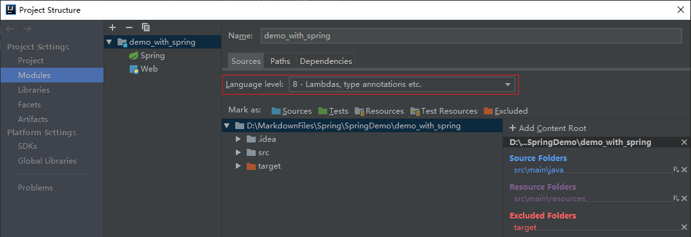

  - 在`applicationContext.xml`中添加

  ```xml
  <!--注入集合-->
  <property name="habbies">
      <list>
          <value>看书</value>
          <value>打球</value>
      </list>
  </property>
  
  <!--key; key-ref-->
  <property name="maps">
      <map>
          <entry key="1" value="chen"/>
          <entry key="2" value="zufeng"/>
      </map>
  </property>
  ```

  - 输出：

  ```
  遍历集合
  habby: 看书
  habby: 打球
  key: 1; value: chen
  key: 2; value: zufeng
  ```

- 注入`Properties`——特殊的`Map`，只能放文本字符串

  - 在`InjectServiceImpl`中添加

  ```java
  /**
  * 注入Properties
  */
  private Properties properties;
  
  public void setProperties(Properties properties) {
      this.properties = properties;
  }
  
  System.out.println("遍历配置文件Properties");
  properties.forEach((key, value) -> System.out.println("配置文件key: " + key + "; value: " + value));
  ```

  - 在`applicationContext.xml`中添加

  ```xml
  <!--注入Properties：特殊的map，只能放文本字符串-->
  <property name="properties">
      <props>
          <prop key="driver">com.mysql.jdbc</prop>
          <prop key="url">jdbc:mysql://localhost:3306/test</prop>
          <prop key="username">root</prop>
          <prop key="password">admin</prop>
      </props>
  </property>
  ```

  - 运行结果

  ```
  遍历配置文件Properties
  key: username; value: root
  key: driver; value: com.mysql.jdbc
  key: url; value: jdbc:mysql://localhost:3306/test
  key: password; value: admin
  ```

### 3.3.2 构造注入

1. 定义

   - 使用类中构造方法为类中成员变量赋值的过程

2. 语法

   - 需要哪个组件属性就将谁声明为成员变量，并提供公开的**构造方法**
   - 在配置文件中对应的组件标签内，使用`<constructor-arg>`标签进行注入

3. 实例

   - 按照[验证DI所搭建的环境](# 3.2 DI(Dependency Injection))构建`constructorInjection`测试环境：`ConstructorInjectionDAO`接口及其实现类、`spring.xml`配置文件、`TestConstructorInjection`

   - 修改`ConstructorInjectionDAOImpl`：==第5-20行，第25-26行==

     ```java
     package constructorInjection;
     
     public class ConstructorInjectionDAOImpl implements ConstructorInjectionDAO {
     
         /**
          * 构造注入
          */
         private String inputString;
         private Integer age;
     
         public ConstructorInjectionDAOImpl() {}
     
         public ConstructorInjectionDAOImpl(String inputString) {
             this.inputString = inputString;
         }
     
         public ConstructorInjectionDAOImpl(String inputString, Integer age) {
             this.inputString = inputString;
             this.age = age;
         }
     
         @Override
         public void testConstructorInjection(String inputString) {
             System.out.println("TestConstructorInjection(ConstructorInjectionDAOImpl): inputString = " + inputString);
             System.out.println("TestConstructorInjection(ConstructorInjectionDAOImpl): this.inputString = " + this.inputString);
             System.out.println("TestConstructorInjection(ConstructorInjectionDAOImpl): age = " + age);
         }
     }
     ```

   - 在`constructorInjection/spring.xml`中完成构造注入：==第10-15行==

     ```xml
     <?xml version="1.0" encoding="UTF-8"?>
     <beans xmlns="http://www.springframework.org/schema/beans"
            xmlns:xsi="http://www.w3.org/2001/XMLSchema-instance"
            xsi:schemaLocation="http://www.springframework.org/schema/beans http://www.springframework.org/schema/beans/spring-beans.xsd">
     
         <!--ConstructorInjectionDAO组件-->
         <!--默认匹配无参构造
         <bean class="constructorInjection.ConstructorInjectionDAOImpl" id="constructorInjectionDAO"></bean>
         -->
         <!--构造注入
                 index: 从0开始，表示调用的构造器中的参数位置
                 name: 参数名称-->
         <bean class="constructorInjection.ConstructorInjectionDAOImpl" id="constructorInjectionDAO">
             <constructor-arg index="0" name="inputString" value="chen"/>
             <constructor-arg index="1" name="age" value="27"/>
         </bean>
     
         <!--ConstructorInjectionService组件-->
         <bean class="constructorInjection.ConstructorInjectionServiceImpl" id="constructorInjectionService"></bean>
     
     </beans>
     ```

     如果注入的是对象，则使用`ref`标签

4. 问题

   - 由上述代码可知，构造函数中有`inputString`和`age`参数，如果想完成单个参数的赋值，只能编写只含有该参数的构造方法。
   - 不够灵活


### 3.3.3 自动注入

1. 在Spring工厂配置文件中通过制定自动注入方式，开启组件属性的自动赋值

2. 注意

   - 底层实现原理是SET注入方式
   - 自动注入需要在对应组件标签开启才能使用
   - `只能用于引用类型、对象类型、组件类型的注入`

3. 语法

   - 需要哪个组件属性就将谁声明为成员变量，并**提供公开的`SET`方法**
   - 在对应组件标签上，加入`autowire`属性，并指定自动注入方式

4. 实例

   - 环境搭建：创建`autowiredinject`及`StudentDAO`接口与其实现类、`spring.xml`、`StudentService`接口与其实现类、`TestAutowire`。

   - 在`autowireinject.StudentServiceImpl`中添加

     ```java
     package autowireinject;
     
     public class StudentServiceImpl implements StudentService {
     
         /**
          * 自动注入
          */
         private StudentDAO studentDAO;
     
         public void setStudentDAO(StudentDAO studentDAO) {
             this.studentDAO = studentDAO;
         }
     
         @Override
         public void testAutowired(String name) {
             System.out.println("Test Autowired(StudentServiceImpl): " + name);
             studentDAO.testAutowired(name);
         }
     }
     ```

   - 在`autowireinject/spring.xml`中添加`autowire`属性

     ```xml
     <?xml version="1.0" encoding="UTF-8"?>
     <beans xmlns="http://www.springframework.org/schema/beans"
            xmlns:xsi="http://www.w3.org/2001/XMLSchema-instance"
            xsi:schemaLocation="http://www.springframework.org/schema/beans http://www.springframework.org/schema/beans/spring-beans.xsd">
     
         <!--管理DAO组件-->
         <bean class="autowireinject.StudentDAOImpl" id="studentDAO"></bean>
     
         <!--管理Service组件
             autowire: 用来给组件中成员变量完成自动赋值操作
                             byType: 根据类型完成自动注入；根据成员变量类型去工厂找，找到对应类型完成赋值
                                             DAO组件中id可以任意取名
                             byName: 根据名称完成自动注入；根据成员变量名字去工厂找，找到对应名字完成赋值
                                             DAO组件中id不可以任意取名-->
         <bean class="autowireinject.StudentServiceImpl" id="studentService" autowire="byType"></bean>
     
     </beans>
     ```

   - 注意：如果工厂中存在多个类型一致的组件，使用`byType`会报错

     添加`StudentDAONew`接口及其实现类，配置文件中：

     ```xml
     <!--管理DAO组件-->
     <bean class="autowireinject.StudentDAOImpl" id="studentDAO"></bean>
     <bean class="autowireinject.StudentDAONewImpl" id="studentDAONew"></bean>
     ```


# 4 工厂特性

## 4.1 bean的创建模式

### 4.1.1 单例

Spring在管理组件创建对象时，默认是单例（`singleton`）模式，在工厂中`全局唯一，只创建一次`。

1. 注意

   - 工厂默认在管理对象时，采用单例方式；单例方式无论在工厂获取多少次对象，获取的都是同一个对象！

2. 创建测试环境`singleton`

3. 创建`TestSingleton.java`

   ```java
   package singleton;
   
   import org.springframework.context.ApplicationContext;
   import org.springframework.context.support.ClassPathXmlApplicationContext;
   
   public class TestSingleton {
       public static void main(String[] args) {
           // 启动工厂
           ApplicationContext context = new ClassPathXmlApplicationContext("singleton/spring.xml");
           // 获取对象
           SingletonDAO singletonDAO = (SingletonDAO) context.getBean("singletonDAO");
           singletonDAO.testSingleton("chenzufeng");
   
           SingletonDAO singletonDAO1 = (SingletonDAO) context.getBean("singletonDAO");
   
           System.out.println();
           System.out.println("工厂默认采用单例模式");
           System.out.println(singletonDAO);
           System.out.println(singletonDAO1);
       }
   }
   ```

4. 运行结果：

   ```
   Test Singleton(SingletonDAOImpl): name = chenzufeng
   
   工厂默认采用单例模式
   singleton.SingletonDAOImpl@12108b5
   singleton.SingletonDAOImpl@12108b5
   ```

5. `service、dao`必须以单例形式管理，而`struts2`中`action`组件必须以多例形式管理


### 4.1.2 多例

`全局不唯一，每次使用都会创建一个新的对象`

```xml
<bean id="" class="xxxx.userAction" scope="prototype|singleton">
		service,dao    ----->  singleton
		struts2 action -----> prototype
    
<bean class="singleton.SingletonDAOImpl" id="singletonDAO" scope="prototype"></bean>
```

运行结果：

```
singleton.SingletonDAOImpl@1ee9989
singleton.SingletonDAOImpl@13ad2d6
```


## 4.2 bean的生产原理

原理：`反射`+`构造原理`

在`TestSingleton.java`添加

```java
// 工厂原理
SingletonDAO singletonDAO2 = (SingletonDAO) Class.forName("singleton.SingletonDAOImpl").newInstance();

System.out.println("工厂原理：" + singletonDAO2);
```

结果输出：`工厂原理：singleton.SingletonDAOImpl@85bdee`

`newInstance`通过调用**`类中构造方法`**进行对象的创建！

## 4.3 bean的生命周期

1. 何时创建

   - 随着工厂启动，**`所有单例bean随之创建；非单例的bean，每次使用时创建`**

   - 在`singleton.SingletonDAOImpl`中添加==第9-16行==

     ```java
     package singleton;
     
     public class SingletonDAOImpl implements SingletonDAO {
         @Override
         public void testSingleton(String name) {
             System.out.println("Test Singleton(SingletonDAOImpl): name = " + name);
         }
         
         // init-method
         public void initMethod() {
             System.out.println("组件对象初始化");
         }
         
         // destroy-method
         public void destroyMethod() {
             System.out.println("组件对象销毁");
         }
     }
     ```

     

   - 配置文件中

     - `init-method`在对象初始化时调用方法
     - `destroy-method`在对象销毁时调用方法

     ```xml
     <!--管理DAO组件-->
     <bean class="singleton.SingletonDAOImpl" id="singletonDAO" scope="singleton"
           init-method="initMethod" destroy-method="destroyMethod"></bean>
     ```

     

   -  在`singleton.TestSingleton`中只保留启动工厂代码，来验证**单例**在何时创建

     ```java
     package singleton;
     
     import org.springframework.context.ApplicationContext;
     import org.springframework.context.support.ClassPathXmlApplicationContext;
     
     public class TestSingleton {
         public static void main(String[] args) throws ClassNotFoundException, IllegalAccessException, InstantiationException {
             // 启动工厂
             ApplicationContext context = new ClassPathXmlApplicationContext("singleton/spring.xml");
         }
     }
     ```

     运行结果：

     ```
     组件对象初始化
     ```

     结果表明：随着工厂启动，**`所有单例bean随之创建`**！

   -  在`singleton.TestSingleton`中添加获取对象代码，来验证**多例**在何时创建

     ```java
     package singleton;
     
             import org.springframework.context.ApplicationContext;
             import org.springframework.context.support.ClassPathXmlApplicationContext;
     
     public class TestSingleton {
         public static void main(String[] args) throws ClassNotFoundException, IllegalAccessException, InstantiationException {
             // 启动工厂
             ApplicationContext context = new ClassPathXmlApplicationContext("singleton/spring.xml");
             SingletonDAO singletonDAO = (SingletonDAO) context.getBean("singletonDAO");
     
             // 关闭工厂
             ((ClassPathXmlApplicationContext) context).close();
         }
     }
     ```

     修改配置文件：` scope="prototype"`

     运行结果：`组件对象初始化`

     结果表明：随着工厂启动，**`非单例的bean，每次使用时创建`**；没有发生销毁过程！Spring工厂不负责该工作而由`JVM`负责！

     

2. 何时销毁

   - **`工厂关闭，所有单例bean随之销毁`** (  注意：`Spring对多例bean管理松散，不会负责多例bean的销毁`)

     ```java
     package singleton;
     
     import org.springframework.context.ApplicationContext;
     import org.springframework.context.support.ClassPathXmlApplicationContext;
     
     public class TestSingleton {
         public static void main(String[] args) throws ClassNotFoundException, IllegalAccessException, InstantiationException {
             // 启动工厂
             ApplicationContext context = new ClassPathXmlApplicationContext("singleton/spring.xml");
     
             // 关闭工厂
             ((ClassPathXmlApplicationContext) context).close();
         }
     }
     ```

     运行结果

     ```
     组件对象初始化
     组件对象销毁
     ```


## 4.4 bean工厂创建对象的好处

1. `解耦合：使用配置文件管理java类，在生产环境中更换类的实现时不需要修改源代码，修改配置文件即可`
2. `Spring默认使用单例的模式创建bean，减少内存的占用`
3. `通过依赖注入建立了类与类之间的关系(使java之间关系更为清晰，方便了维护与管理)`


# 5 面向切面编程

## 5.1 代理

1. 什么是代理
   - Java中的一种`设计模式`
2. 为什么需要代理
   - 很多时候除了当前类能够提供的功能外，我们还需要`补充一些额外功能`。
3. 代理的作用
   - 代理对象可以在客户和目标对象之间`起到中介作用`，**`从而为目标对象增添额外的功能`**——**`让业务逻辑对象专注做核心事务`**。
   - `保证原始功能不变`的情况下，完成业务逻辑中`附加操作`
4. 代理图例

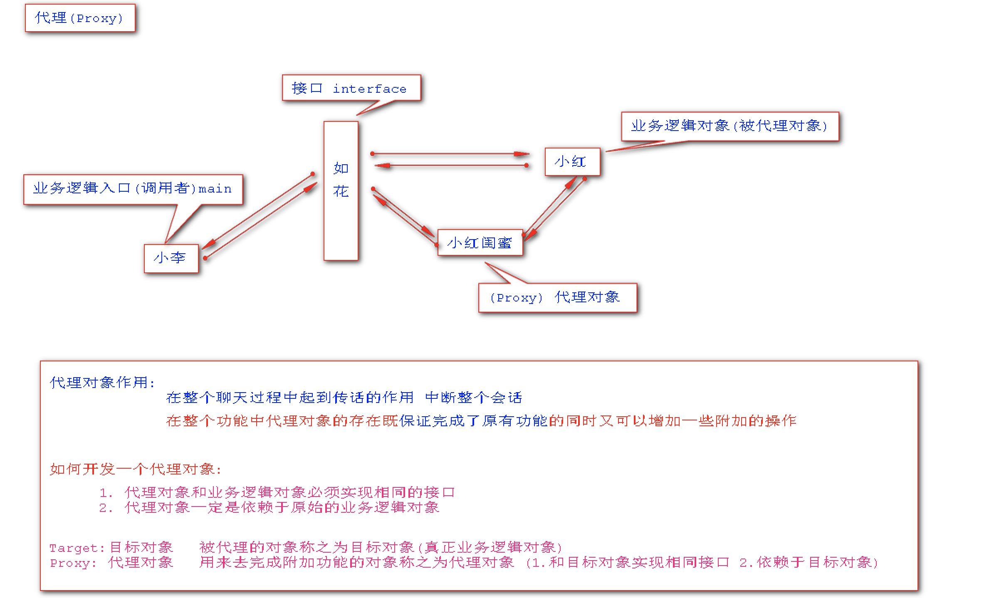


### 5.1.1现有业务层开发存在问题

1. 定义业务接口：`UserService`

   ```java
   public interface UserService {
       void save(String name);
       void delete(String id);
       void update();
       String findAll(String name);
       String findOne(String id);
   }
   ```

2. 实现业务接口

   ```java
   public class UserServiceImpl implements UserService {
       @Override
       public void save(String name) {
           try {
               System.out.println("开启事务");
               System.out.println("处理业务逻辑,调用DAO~~~");
               System.out.println("提交事务");
           } catch (Exception e) {
               System.out.println("回滚事务");
               e.printStackTrace();
           }
       }
   
       @Override
       public void delete(String id) {
           try {
               System.out.println("开启事务");
               System.out.println("处理业务逻辑,调用DAO~~~");
               System.out.println("提交事务");
           } catch (Exception e) {
               System.out.println("回滚事务");
               e.printStackTrace();
           }
       }
   
       @Override
       public void update() {
           try {
               System.out.println("开启事务");
               System.out.println("处理业务逻辑,调用DAO~~~");
               System.out.println("提交事务");
           } catch (Exception e) {
               System.out.println("回滚事务");
               e.printStackTrace();
           }
       }
   
       @Override
       public String findAll(String name) {
           try {
               System.out.println("开启事务");
               System.out.println("处理业务逻辑,调用DAO~~~");
               System.out.println("提交事务");
           } catch (Exception e) {
               System.out.println("回滚事务");
               e.printStackTrace();
           }
           return name;
       }
   
       @Override
       public String findOne(String id) {
           try {
               System.out.println("开启事务");
               System.out.println("处理业务逻辑,调用DAO~~~");
               System.out.println("提交事务");
           } catch (Exception e) {
               System.out.println("回滚事务");
               e.printStackTrace();
           }
           return id;
       }
   }
   ```

3. 存在的问题

   `开启事务、调用DAO处理业务、提交事务、回滚事务`这四部分——`控制事务`在每个方法中都会被调用，在现有业务层中`控制事务代码出现了大量的冗余`！

### 5.1.2 静态代理的开发

1. `target`：目标类、对象——`被代理类`被称为`目标类`或者`被代理的对象`被称为`目标对象`

2. 开发代理的原则：`代理类和目标类功能一致且实现相同的接口，同时代理类依赖于目标类对象`

3. 静态代理对象：**`为每一个业务层通过手动开发一个代理对象的过程`**

4. [创建基本环境](# 2.2-第一个Spring程序)：`staticproxy`

5. `UserServiceImpl`可以被视为`业务逻辑对象`，其中有大量的冗余代码，`TestStaticProxy`为业务逻辑的调用者，可以添加`代理`，避免`UserServiceImpl`有太多冗余代码，而让其只专心做核心业务！

6. 创建`UserServiceStaticProxy`，完成：

   - 代理类和目标类功能一致且实现相同的接口

     ```java
     @Override
     public void save(String name)
     ```

   - 代理类依赖于目标类对象、原始业务逻辑对象

     ```java
     private UserService userService;
     
     public void setUserService(UserService userService) {
         this.userService = userService;
     }
     ```

   - `调用原始业务逻辑对象的方法`并`返回给原始业务逻辑对象`

     ```java
     @Override
     public String findAll(String name) {
         try {
             System.out.println("开启事务");
             // System.out.println("处理业务逻辑,调用DAO~~~");
     
             // 调用原始业务逻辑对象的方法
             String all = userService.findAll(name);
     
             System.out.println("提交事务");
                 
             return all;
             
         } catch (Exception e) {
             System.out.println("回滚事务");
             e.printStackTrace();
         }
         return null;
     }
     ```

   完整代码如下：

   ```java
   package staticproxy;
   
   // 代理对象
   
   public class UserServiceStaticProxy implements UserService {
   
       // 代理类依赖于目标类对象、原始业务逻辑对象
   
       private UserService userService;
   
       public void setUserService(UserService userService) {
           this.userService = userService;
       }
   
       // 代理类和目标类功能一致且实现相同的接口
   
       @Override
       public void save(String name) {
           try {
               System.out.println("开启事务");
               // System.out.println("处理业务逻辑,调用DAO~~~");
   
               // 调用原始业务逻辑对象的方法
               userService.save(name);
   
               System.out.println("提交事务");
           } catch (Exception e) {
               System.out.println("回滚事务");
               e.printStackTrace();
           }
       }
   
       @Override
       public void delete(String id) {
           try {
               System.out.println("开启事务");
               // System.out.println("处理业务逻辑,调用DAO~~~");
   
               // 调用原始业务逻辑对象的方法
               userService.delete(id);
   
               System.out.println("提交事务");
           } catch (Exception e) {
               System.out.println("回滚事务");
               e.printStackTrace();
           }
       }
   
       @Override
       public void update() {
           try {
               System.out.println("开启事务");
               // System.out.println("处理业务逻辑,调用DAO~~~");
   
               // 调用原始业务逻辑对象的方法
               userService.update();
   
               System.out.println("提交事务");
           } catch (Exception e) {
               System.out.println("回滚事务");
               e.printStackTrace();
           }
       }
   
       @Override
       public String findAll(String name) {
           try {
               System.out.println("开启事务");
               // System.out.println("处理业务逻辑,调用DAO~~~");
   
               // 调用原始业务逻辑对象的方法
               String all = userService.findAll(name);
   
               System.out.println("提交事务");
               
               return all;
               
           } catch (Exception e) {
               System.out.println("回滚事务");
               e.printStackTrace();
           }
           return null;
       }
   
       @Override
       public String findOne(String id) {
           try {
               System.out.println("开启事务");
               // System.out.println("处理业务逻辑,调用DAO~~~");
   
               // 调用原始业务逻辑对象的方法
               String one = userService.findOne(id);
   
               System.out.println("提交事务");
               
               return one;
               
           } catch (Exception e) {
               System.out.println("回滚事务");
               e.printStackTrace();
           }
           return null;
       }
   }
   ```

   

7. 修改`UserServiceImpl`

   ```java
   package staticproxy;
   
   // 业务逻辑对象
   
   public class UserServiceImpl implements UserService {
       @Override
       public void save(String name) {
           System.out.println("处理业务逻辑,调用DAO~~~");
       }
   
       @Override
       public void delete(String id) {
           System.out.println("处理业务逻辑,调用DAO~~~");
       }
   
       @Override
       public void update() {
           System.out.println("处理业务逻辑,调用DAO~~~");
       }
   
       @Override
       public String findAll(String name) {
           System.out.println("处理业务逻辑,调用DAO~~~");
           return name;
       }
   
       @Override
       public String findOne(String id) {
           System.out.println("处理业务逻辑,调用DAO~~~");
           return id;
       }
   }
   ```


8. 修改配置文件：==第9-13行==

   ```xml
   <?xml version="1.0" encoding="UTF-8"?>
   <beans xmlns="http://www.springframework.org/schema/beans"
          xmlns:xsi="http://www.w3.org/2001/XMLSchema-instance"
          xsi:schemaLocation="http://www.springframework.org/schema/beans http://www.springframework.org/schema/beans/spring-beans.xsd">
   
       <!--管理Service-->
       <bean class="staticproxy.UserServiceImpl" id="userService"></bean>
   
       <!--管理Service中proxy-->
       <bean class="staticproxy.UserServiceStaticProxy" id="userServiceStaticProxy">
           <!--依赖于业务逻辑对象，因此需要进行注入-->
           <property name="userService" ref="userService"/>
       </bean>
   
   </beans>
   ```

   

9. **调用代理方法**

   修改`TestStaticProxy`，通过代理实现事务控制：`UserService userService = (UserService) context.getBean("userServiceStaticProxy");`（将原来的`userService`换成`userServiceStaticProxy`）

   ```java
   package staticproxy;
   
   import org.springframework.context.ApplicationContext;
   import org.springframework.context.support.ClassPathXmlApplicationContext;
   
   // 业务逻辑调用者
   
   public class TestStaticProxy {
       public static void main(String[] args) {
           ApplicationContext context = new ClassPathXmlApplicationContext("staticproxy/spring.xml");
           
           // 调用静态代理方法
           UserService userService = (UserService) context.getBean("userServiceStaticProxy");
           userService.findAll("chenzufeng");
       }
   }
   ```

   

10. 存在的问题

    - `在实际开发时，业务层会有很多。如果为每一个业务层都开发一个静态代理类，工作量增加很多`
    - `为业务层在运行过程中动态创建代理类，通过动态代理类去解决现有业务层中代码冗余的问题`


### 5.1.3 动态代理

含义：在程序运行过程中，动态地通过代码为指定类生成动态代理对象！

`利用jdk提供的Proxy这个类，动态为现有的业务生成代理类`

- 参数一：`classLoader`当前线程类加载器——通过底层类的信息创建代理对象
- 参数二：`Class[]`生成代理类接口类型——基于接口生成的代理对象
- 参数三：`InvocationHandler`接口，通过代理类对象调用方法时会优先进入参数三中的`invoke`方法`Proxy.newProxyInstance(loader, interfaces, h);`，用来设置额外功能、附加操作
- 返回值就是动态代理对象

新建`TestDynamicProxy`：

```java
package staticproxy;

import java.lang.reflect.InvocationHandler;
import java.lang.reflect.Method;
import java.lang.reflect.Proxy;

public class TestDynamicProxy {
    public static void main(String[] args) {

        // 目标类
        final UserService userService =  new UserServiceImpl();

        //参数1：当前线程类加载器
        ClassLoader contextClassLoader = Thread.currentThread().getContextClassLoader();

        //参数2：目标对象接口类型的数组
        Class[] classes =  new Class[] {UserService.class};

        // 参数3：InvocationHandler接口类型，invoke方法用来设置额外功能
        // 返回值：创建好的动态代理对象
        UserService userServiceDynamicProxy = (UserService) Proxy.newProxyInstance(contextClassLoader, classes, new InvocationHandler() {
            @Override
            // 通过代理类对象调用方法时会优先进入参数三中的invoke方法
            // 参数1：当前创建好的代理对象；参数2：当前代理对象执行的方法对象；参数3：当前代理执行方法的参数封装成数组
            public Object invoke(Object proxy, Method method, Object[] args) throws Throwable {
                try {
                    System.out.println("当前执行的方法：" + method.getName());
                    System.out.println("当前执行的方法的参数：" + args[0]);
                    System.out.println();
                    System.out.println("开启事务");  //附加操作
                    System.out.println("通过反射，调用目标类业务对应的方法");
                    // Object invoke = method.invoke(userService, args);
                    Object invoke = method.invoke(new UserServiceImpl(), args);
                    System.out.println("提交事务");  //附加操作
                    return invoke;  // 返回值
                } catch (Exception e) {
                    System.out.println("回滚事务");  //附加操作
                }
                return null;
            }
        });

        // 通过代理优先执行代理中的操作
        String result = userServiceDynamicProxy.findAll("chenzufeng");
        System.out.println("代理返回值：" + result);
    }
}
```

运行结果：

```
当前执行的方法：findAll
当前执行的方法的参数：chenzufeng

开启事务
通过反射，调用目标类业务对应的方法
处理业务逻辑,调用findAllDAO
提交事务
代理返回值：chenzufeng
```


## 5.2 AOP原理

AOP（Aspect Oriented Programming）：面向切面编程，`底层实现`就是Java中的[动态代理](# 6.1.3-动态代理)，在保持原始业务功能不变情况下，通过代理对象完成业务中的附加操作，将业务中核心操作放在目标对象中执行，实现了附加操作与核心业务的解耦。

定义：通过在程序运行过程中，动态地为项目中某些组件，生成动态代理对象。通过在生成地动态代理对象中，执行相应的附加操作，实现额外的功能。减少项目中通用代码的冗余问题！

### 5.2.1 AOP底层原理

Spring对下列代码——**动态代理进行了封装**：

```java
		// 1.切入点
		UserService userServiceDynamicProxy = (UserService) Proxy.newProxyInstance(contextClassLoader, classes, new InvocationHandler() {
            @Override
            // 通过代理类对象调用方法时会优先进入参数三中的invoke方法
            // 参数1：当前创建好的代理对象；参数2：当前代理对象执行的方法对象；参数3：当前代理执行方法的参数封装成数组
            public Object invoke(Object proxy, Method method, Object[] args) throws Throwable {
                // 2.通知
                try {
                    System.out.println("当前执行的方法：" + method.getName());
                    System.out.println("当前执行的方法的参数：" + args[0]);
                    System.out.println();
                    System.out.println("开启事务");  //附加操作
                    System.out.println("通过反射，调用目标类业务对应的方法");
                    Object invoke = method.invoke(userService, args);
                    //Object invoke = method.invoke(new UserServiceImpl(), args);
                    System.out.println("提交事务");  //附加操作
                    return invoke;  // 返回值
                } catch (Exception e) {
                    System.out.println("回滚事务");  //附加操作
                }
                return null;
            }
        });

        // 通过代理优先执行代理中的操作
        String result = userServiceDynamicProxy.findAll("chenzufeng");
        System.out.println("代理返回值：" + result);
```

- `通知（Advice）`：除了**`目标方法以外的操作`**都称之为通知
- `切入点（PointCut）`：**`要为哪些类中的哪些方法加入通知`**，一般通知多用于业务层
- `切面（Aspect）`：开发通知 + 配置切入点

### 5.2.2 通知分类

通知接口

- 环绕通知：`MethodInterceptor`
- 前置通知：`MethodBeforeAdvice` 
- 后置通知：`AfterReturningAdvice`
- 异常通知：`ThrowsAdvice`

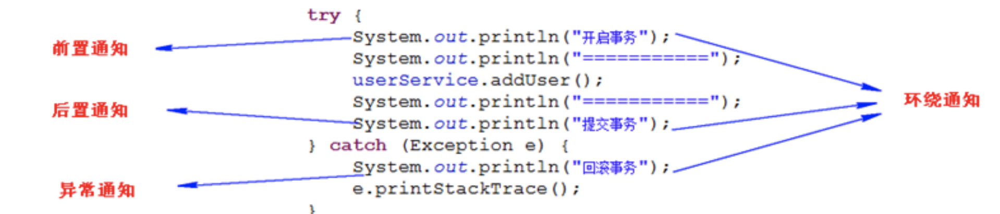

## 5.3 AOP编程

创建AOP工程！

`service.EmpService`

```java
package service;

public interface EmpService {
    void save(String name);

    String find(String name);
}
```

`service.EmpServiceImpl`

```java
package service;

// 原始业务对象——目标对象

public class EmpServiceImpl implements EmpService {
    @Override
    public void save(String name) {
        System.out.println("EmpServiceImpl处理业务逻辑（调用saveDAO）：" + name);
    }

    @Override
    public String find(String name) {
        System.out.println("EmpServiceImpl处理业务逻辑（调用findDAO）：" + name);
        return name;
    }
}
```

`service/spring.xml`

```xml
<?xml version="1.0" encoding="UTF-8"?>
<beans xmlns="http://www.springframework.org/schema/beans"
       xmlns:xsi="http://www.w3.org/2001/XMLSchema-instance"
       xsi:schemaLocation="http://www.springframework.org/schema/beans http://www.springframework.org/schema/beans/spring-beans.xsd">

    <!--管理Service组件-->
    <bean class="service.EmpServiceImpl" id="empService"></bean>

</beans>
```

`service.TestAOP`

```java
package service;

import org.springframework.context.ApplicationContext;
import org.springframework.context.support.ClassPathXmlApplicationContext;

public class TestAOP {
    public static void main(String[] args) {
        // 启动工厂
        ApplicationContext context = new ClassPathXmlApplicationContext("service/spring.xml");
        EmpService service = (EmpService) context.getBean("empService");
        service.save("陈祖峰");
    }
}
```

运行结果：`处理业务逻辑（调用saveDAO）：陈祖峰`

### 5.3.1 AOP编程步骤

1. 引入依赖

   `spring-aop、spring-expression、spring-aspects`

   ```xml
       <dependency>
         <groupId>org.springframework</groupId>
         <artifactId>spring-expression</artifactId>
         <version>4.3.2.RELEASE</version>
       </dependency>
   
       <dependency>
         <groupId>org.springframework</groupId>
         <artifactId>spring-aspects</artifactId>
         <version>4.3.2.RELEASE</version>
       </dependency>
   
       <dependency>
         <groupId>org.springframework</groupId>
         <artifactId>spring-aop</artifactId>
         <version>4.3.2.RELEASE</version>
       </dependency>
   ```

2. 开发额外功能通知

   - 通知接口

     - 环绕通知：`MethodInterceptor`
     - 前置通知：`MethodBeforeAdvice` 
     - 后置通知：`AfterReturningAdvice`
     - 异常通知：`ThrowsAdvice`

   - 新建`service.MyBeforeAdvice`

     ```java
     package service;
     
     import org.springframework.aop.MethodBeforeAdvice;
     
     import java.lang.reflect.Method;
     
     /**
      * 记录业务方法名称
      * 自定义前置通知
      */
     public class MyBeforeAdvice implements MethodBeforeAdvice {
         /**
          * 封装了动态代理的invoke方法
          * 前置通知：目标方法执行前先执行的额外操作
          * @param method 当前执行的方法的对象
          * @param args 当前执行方法的参数
          * @param target 目标对象——被代理的对象EmpServiceImpl
          */
         @Override
         public void before(Method method, Object[] args, Object target) {
             System.out.println("前置通知");
             System.out.println("当前执行的方法：" + method.getName());
             // 如果没有参数会出现空指针
             System.out.println("当前执行方法的参数：" + args[0]);
             System.out.println("目标对象：" + target);
             System.out.println();
         }
     }
     ```

     

3. 配置切面

   - **管理通知**

     `<bean id="" class=""/>`

     ```
     myadvice1：性能
     myadvice2：日志
     ```

     

   - **组装切面**

     ```xml
     <aop:config>
         <aop:pointcut id="" expression=""/>
         <aop:advisor advice-ref="" pointcut-ref=""/>
     </aop:config>
     
     <aop:config>
         <aop:pointcut id="pc" expression="execution()|within()"/>
         <aop:pointcut id="pc1" expression="execution()|within()"/>
         ...
         
         <aop:advisor advice-ref="myadvice1" pointcut-ref="pc"/>
         <aop:advisor advice-ref="myadvice2" pointcut-ref="pc"/>
         ...
     </aop:config>
     ```

   - 修改`spring.xml`：==第13-28行==

     ```xml
     <!--1.引入aop命名空间-->
     <?xml version="1.0" encoding="UTF-8"?>
     <beans xmlns="http://www.springframework.org/schema/beans"
            xmlns:xsi="http://www.w3.org/2001/XMLSchema-instance"
            xmlns:aop="http://www.springframework.org/schema/aop"
            xsi:schemaLocation="http://www.springframework.org/schema/beans
                                                http://www.springframework.org/schema/beans/spring-beans.xsd
                                                http://www.springframework.org/schema/aop
                                                http://www.springframework.org/schema/aop/spring-aop.xsd">
     
         <!--1.管理Service组件-->
         <bean class="service.EmpServiceImpl" id="empService"></bean>
     
         <!--2.注册通知-->
         <bean class="service.MyBeforeAdvice" id="myBeforeAdvice"></bean>
     
         <!--3.组装切面-->
         <aop:config>
             <!--配置切入点
                     id: 切入点在工厂中的唯一标识，可根据它找到切入点
                     expression：用来指定切入项目中哪些组件中的指定方法
                                         execution(返回值 包.类.*(..))，其中*(..)表示任意方法-->
             <aop:pointcut id="EmpServiceImplAllMethods" expression="execution(* service.EmpServiceImpl.*(..))"/>
             
             <!--配置切面：将通知与切入点组装在一起
                           advice-ref：工厂中通知id
                           pointcut-ref：工厂中切入点的唯一标识-->
             <aop:advisor advice-ref="myBeforeAdvice" pointcut-ref="EmpServiceImplAllMethods"/>
         </aop:config>
     
     </beans>
     ```

     

4. 启动工厂测试

   ```java
   package service;
   
   import org.springframework.context.ApplicationContext;
   import org.springframework.context.support.ClassPathXmlApplicationContext;
   
   public class TestAOP {
       public static void main(String[] args) {
           // 启动工厂
           ApplicationContext context = new ClassPathXmlApplicationContext("service/spring.xml");
           EmpService service = (EmpService) context.getBean("empService");
           // 切面编程时，是代理对象
           service.save("陈祖峰");
           // 没有切面：class service.EmpServiceImpl；有切面：class com.sun.proxy.$Proxy2
           System.out.println(service.getClass());
       }
   }
   ```

   运行结果：

   ```
   前置通知
   当前执行的方法：save
   当前执行方法的参数：陈祖峰
   目标对象：service.EmpServiceImpl@180cb77
   
   EmpServiceImpl处理业务逻辑（调用saveDAO）：陈祖峰
   class com.sun.proxy.$Proxy2
   ```

   

### 5.3.2 前置通知

```java
/**
 * 记录业务方法名称
 * 自定义前置通知
 */
public class MyBeforeAdvice implements MethodBeforeAdvice {
    /**
     * 封装了动态代理的invoke方法
     * 前置通知：目标方法执行前先执行的额外操作
     * @param method 当前执行的方法的对象
     * @param args 当前执行方法的参数
     * @param target 目标对象——被代理的对象EmpServiceImpl
     */
    @Override
    public void before(Method method, Object[] args, Object target) {
        System.out.println("前置通知");
        System.out.println("当前执行的方法：" + method.getName());
        // 如果没有参数会出现空指针
        System.out.println("当前执行方法的参数：" + args[0]);
        System.out.println("目标对象：" + target);
        System.out.println();
    }
}
```

### 5.3.3 环绕通知(重要)

#### 5.3.3.1 创建环境

创建环境：引入相关依赖；新建`dao、service`及相关接口等；项目工程为`D:\MarkdownFiles\Spring\SpringDemo\interceptor`

1. `com.chenzf.service.InterceptorServiceImpl`

   ```java
   package com.chenzf.service;
   
   import com.chenzf.dao.InterceptorDAO;
   
   /**
    * 被代理对象
    * 业务层在方法中需要调用DAO
    */
   public class InterceptorServiceImpl implements InterceptorService {
   
       /**
        * 依赖DAO组件
        */
       private InterceptorDAO interceptorDAO;
   
       public void setInterceptorDAO(InterceptorDAO interceptorDAO) {
           this.interceptorDAO = interceptorDAO;
       }
   
       @Override
       public void save(String name) {
           System.out.println("被代理对象（InterceptorServiceImpl）处理save业务逻辑，调用DAO：" + name);
           interceptorDAO.save(name);
       }
   
       @Override
       public void update(String name) {
           System.out.println("被代理对象（InterceptorServiceImpl）处理update业务逻辑，调用DAO：" + name);
           interceptorDAO.update(name);
       }
   
       @Override
       public void delete(Integer id) {
           System.out.println("被代理对象（InterceptorServiceImpl）处理delete业务逻辑，调用DAO：" + id);
           interceptorDAO.delete(id);
       }
   
       @Override
       public String find(String name) {
           System.out.println("被代理对象（InterceptorServiceImpl）处理find业务逻辑，调用DAO：" + name);
           return interceptorDAO.find(name);
       }
   }
   ```

2. `com.chenzf.dao.InterceptorDAOImpl`

   ```java
   package com.chenzf.dao;
   
   /**
    * 代理
    */
   public class InterceptorDAOImpl implements InterceptorDAO {
       @Override
       public void save(String name) {
           System.out.println("代理（InterceptorDAOImpl）saveDAO：" + name);
       }
   
       @Override
       public void update(String name) {
           System.out.println("代理（InterceptorDAOImpl）updateDAO：" + name);
       }
   
       @Override
       public void delete(Integer id) {
           System.out.println("代理（InterceptorDAOImpl）deleteDAO：" + id);
       }
   
       @Override
       public String find(String name) {
           System.out.println("代理（InterceptorDAOImpl）findDAO：" + name);
           return name;
       }
   }
   ```

3. `com/chenzf/spring.xml`

   ```xml
   <?xml version="1.0" encoding="UTF-8"?>
   <beans xmlns="http://www.springframework.org/schema/beans"
          xmlns:xsi="http://www.w3.org/2001/XMLSchema-instance"
          xsi:schemaLocation="http://www.springframework.org/schema/beans http://www.springframework.org/schema/beans/spring-beans.xsd">
   
       <!--管理DAO组件-->
       <bean class="com.chenzf.dao.InterceptorDAOImpl" id="interceptorDAO"></bean>
   
       <!--管理Service组件-->
       <bean class="com.chenzf.service.InterceptorServiceImpl" id="interceptorService">
           <!--通过工厂管理DAO与Service组件-->
           <property name="interceptorDAO" ref="interceptorDAO"/>
       </bean>
   
   </beans>
   ```

4. `com.chenzf.TestInterceptor`

   ```java
   package com.chenzf;
   
   import com.chenzf.service.InterceptorService;
   import org.springframework.context.ApplicationContext;
   import org.springframework.context.support.ClassPathXmlApplicationContext;
   
   public class TestInterceptor {
       public static void main(String[] args) {
           ApplicationContext context = new ClassPathXmlApplicationContext("com/chenzf/spring.xml");
           InterceptorService service = (InterceptorService) context.getBean("interceptorService");
           System.out.println(service.getClass());
           service.find("chenzufeng");
       }
   }
   
   ```

5. 运行结果

   ```
   class com.chenzf.service.InterceptorServiceImpl
   被代理对象（InterceptorServiceImpl）处理find业务逻辑，调用DAO：chenzufeng
   InterceptorDAOImpl(findDAO)：chenzufeng
   ```


#### 5.3.3.2 开发环绕通知

性能通知：计算业务层目标方法执行时长

- 新建`com.chenzf.advices.RunningTimeAdvice`

```java
package com.chenzf.advices;

// 注意使用的是aopalliance包中的
import org.aopalliance.intercept.MethodInterceptor;
import org.aopalliance.intercept.MethodInvocation;

/**
 * 代理
 * 自定义环绕通知来记录目标方法运行时长
 */
public class RunningTimeAdvice implements MethodInterceptor {

    /**
     *
     * @param invocation Spring将原始动态代理中的三个参数进行了包装
     *                   获取当前执行方法
     *                   获取当前执行方法参数
     *                   获取目标对象
     *                   放行目标方法的执行（拦截器）
     * @return
     */
    @Override
    public Object invoke(MethodInvocation invocation) {
        System.out.println("=========进入环绕通知=========");  // 没有放行目标方法的执行
        System.out.println("当前执行方法：" + invocation.getMethod().getName());
        System.out.println("方法的参数：" + invocation.getArguments()[0]);
        System.out.println("获取当前的目标对象：" + invocation.getThis());
        return null;
    }
}
```

#### 5.3.3.3 配置组装切面

```xml
<?xml version="1.0" encoding="UTF-8"?>
<beans xmlns="http://www.springframework.org/schema/beans"
       xmlns:xsi="http://www.w3.org/2001/XMLSchema-instance" xmlns:aop="http://www.springframework.org/schema/aop"
       xsi:schemaLocation="http://www.springframework.org/schema/beans http://www.springframework.org/schema/beans/spring-beans.xsd http://www.springframework.org/schema/aop http://www.springframework.org/schema/aop/spring-aop.xsd">

    <!--管理DAO组件-->
    <bean class="com.chenzf.dao.InterceptorDAOImpl" id="interceptorDAO"></bean>

    <!--管理Service组件-->
    <bean class="com.chenzf.service.InterceptorServiceImpl" id="interceptorService">
        <!--通过工厂管理DAO与Service组件-->
        <property name="interceptorDAO" ref="interceptorDAO"/>
    </bean>

    <!--注册通知类-->
    <bean class="com.chenzf.advices.RunningTimeAdvice" id="runningTimeAdvice"></bean>

    <!--配置切面-->
    <aop:config>
        <!--配置切入点：service下所有实现类的方法-->
        <aop:pointcut id="serviceAllMethod" expression="execution(* com.chenzf.service.*ServiceImpl.*(..))"/>
        <!--组装切面-->
        <aop:advisor advice-ref="runningTimeAdvice" pointcut-ref="serviceAllMethod"/>
    </aop:config>

</beans>
```

- 测试

```java
class com.sun.proxy.$Proxy2  // 获得了代理对象
=========进入环绕通知=========  // 由于上述环绕通知没有放行目标方法的执行
当前执行方法：find
方法的参数：chenzufeng
获取当前的目标对象：com.chenzf.service.InterceptorServiceImpl@16a4e4b
```

#### 5.3.3.4 放行目标方法

- 在代理中设置放行`Object proceedMethod = invocation.proceed();`

```java
package com.chenzf.advices;

// 注意使用的是aopalliance包中的
import org.aopalliance.intercept.MethodInterceptor;
import org.aopalliance.intercept.MethodInvocation;

/**
 * 代理
 * 自定义环绕通知来记录目标方法运行时长
 */
public class RunningTimeAdvice implements MethodInterceptor {

    /**
     *
     * @param invocation Spring将原始动态代理中的三个参数进行了包装
     *                   获取当前执行方法
     *                   获取当前执行方法参数
     *                   获取目标对象
     *                   放行目标方法的执行（拦截器）
     * @return
     */
    @Override
    public Object invoke(MethodInvocation invocation) throws Throwable {
        System.out.println("=========进入环绕通知=========");
        System.out.println("当前执行方法：" + invocation.getMethod().getName());
        System.out.println("方法的参数：" + invocation.getArguments()[0]);
        System.out.println("获取当前的目标对象：" + invocation.getThis());

        try {
            System.out.println("=========进入环绕通知，开始记录时间=========");
            System.out.println("使用System.currentTimeMillis()");
            long start = System.currentTimeMillis();

            System.out.println("=========使用proceed()放行目标方法，继续执行=========");
            Object proceedMethod = invocation.proceed();

            long end = System.currentTimeMillis();
            System.out.println("方法 " + invocation.getMethod().getName() + " 执行时长为：" + (end - start));

            return proceedMethod;
            
        } catch (Exception e) {
            e.printStackTrace();
            System.out.println("出现异常");
        }
        
        return null;
    }
}
```

运行结果：

```
class com.sun.proxy.$Proxy2
=========进入环绕通知=========
当前执行方法：find
方法的参数：chenzufeng
获取当前的目标对象：com.chenzf.service.InterceptorServiceImpl@16a4e4b
=========进入环绕通知，开始记录时间=========
使用System.currentTimeMillis()
=========使用proceed()放行目标方法，继续执行=========
被代理对象（InterceptorServiceImpl）处理find业务逻辑，调用DAO：chenzufeng
InterceptorDAOImpl(findDAO)：chenzufeng
方法 find 执行时长为：0
```


### 5.3.4 后置通知

1. 创建环境：`D:\MarkdownFiles\Spring\SpringDemo\interceptor\src\main\java\afterreturningadvice`

2. 创建`MyAfterAdvice.java`——**创建通知**

   ```java
   package afterreturningadvice;
   
   import org.springframework.aop.AfterReturningAdvice;
   
   import java.lang.reflect.Method;
   
   public class MyAfterAdvice implements AfterReturningAdvice {
       /**
        * 自定义后置通知
        * @param returnValue 目标方法返回值（因为是先执行目标方法）
        * @param method 当前执行的方法
        * @param args 执行方法的参数
        * @param target 目标对象
        */
       @Override
       public void afterReturning(Object returnValue, Method method, Object[] args, Object target) {
           System.out.println("===========进入后置通知===========");
           System.out.println("返回值：" + returnValue);
           System.out.println("方法名：" + method.getName());
           System.out.println("方法的参数：" + args[0]);
           System.out.println("目标对象：" + target);
       }
   }
   ```

   

3. 配置切面

   ```xml
   <?xml version="1.0" encoding="UTF-8"?>
   <beans xmlns="http://www.springframework.org/schema/beans"
          xmlns:xsi="http://www.w3.org/2001/XMLSchema-instance" xmlns:aop="http://www.springframework.org/schema/aop"
          xsi:schemaLocation="http://www.springframework.org/schema/beans http://www.springframework.org/schema/beans/spring-beans.xsd http://www.springframework.org/schema/aop http://www.springframework.org/schema/aop/spring-aop.xsd">
   
       <!--管理Service组件-->
       <bean class="afterreturningadvice.AfterAdviceServiceImpl" id="afterAdviceService"></bean>
   
       <!--注册通知-->
       <bean class="afterreturningadvice.MyAfterAdvice" id="myAfterAdvice"></bean>
   
       <!--配置切面-->
       <aop:config>
           <aop:pointcut id="serviceImplAllMethod" expression="within(afterreturningadvice..*ServiceImpl)"/>
           <aop:advisor advice-ref="myAfterAdvice" pointcut-ref="serviceImplAllMethod"/>
       </aop:config>
   
   </beans>
   ```

   

4. 测试

   ```java
   package afterreturningadvice;
   
   import org.springframework.context.ApplicationContext;
   import org.springframework.context.support.ClassPathXmlApplicationContext;
   
   public class TestAfterAdvice {
       public static void main(String[] args) {
           ApplicationContext context = new ClassPathXmlApplicationContext("afterreturningadvice/spring.xml");
           AfterAdviceService service = (AfterAdviceService) context.getBean("afterAdviceService");
           System.out.println(service.getClass());
           System.out.println("========先执行目标方法========");
           service.save("chenzufeng");
       }
   }
   ```

   

5. 运行结果

   ```
   class com.sun.proxy.$Proxy2
   ========先执行目标方法========
   测试后置通知(AfterAdviceServiceImpl)：chenzufeng
   ===========进入后置通知===========
   返回值：null
   方法名：save
   方法的参数：chenzufeng
   目标对象：afterreturningadvice.AfterAdviceServiceImpl@34f934
   ```

   

### 5.3.5 异常通知

目标方法出现异常时进入异常通知！

`D:/WinSoftware/MavenRepository/org/springframework/spring-aop/4.3.2.RELEASE/spring-aop-4.3.2.RELEASE-sources.jar!/org/springframework/aop/ThrowsAdvice.java`

```java
 /**
 * <p>Some examples of valid methods would be:
 *
 * <pre class="code">public void afterThrowing(Exception ex)</pre>
 * <pre class="code">public void afterThrowing(RemoteException)</pre>
 * <pre class="code">public void afterThrowing(Method method, Object[] args, Object target, Exception ex)</pre>
 * <pre class="code">public void afterThrowing(Method method, Object[] args, Object target, ServletException ex)</pre>
 */
public interface ThrowsAdvice extends AfterAdvice {}
```


1. 创建通知

   ```java
   package afterreturningadvice;
   
   import org.springframework.aop.AfterReturningAdvice;
   import org.springframework.aop.ThrowsAdvice;
   
   import java.lang.reflect.Method;
   
   public class MyAfterAdvice implements AfterReturningAdvice, ThrowsAdvice {
       /**
        * 自定义后置通知与异常通知
        * @param returnValue 目标方法返回值（因为是先执行目标方法）
        * @param method 当前执行的方法
        * @param args 执行方法的参数
        * @param target 目标对象
        */
       @Override
       public void afterReturning(Object returnValue, Method method, Object[] args, Object target) {
           System.out.println("===========进入后置通知===========");
           System.out.println("返回值：" + returnValue);
           System.out.println("方法名：" + method.getName());
           System.out.println("方法的参数：" + args[0]);
           System.out.println("目标对象：" + target);
       }
   
       /**
        * 出现异常时执行通知处理
        * @param method
        * @param args
        * @param target
        * @param ex
        */
       public void afterThrowing(Method method, Object[] args, Object target, Exception ex) {
           System.out.println("==========进入异常通知==========");
           System.out.println("方法名：" + method.getName());
           System.out.println("方法的参数：" + args[0]);
           System.out.println("目标对象：" + target);
           System.out.println("异常信息：" + ex.getMessage());
       }
   }
   ```


2. 给调用的`save`方法抛出异常

   ```java
   package afterreturningadvice;
   
   public class AfterAdviceServiceImpl implements AfterAdviceService {
       @Override
       public void save(String name) {
           System.out.println("测试后置通知(AfterAdviceServiceImpl)：" + name);
           throw new RuntimeException("save方法抛出异常");
       }
   }
   ```

   

3. 测试结果

   ```
   class com.sun.proxy.$Proxy2
   ========先执行目标方法========
   Exception in thread "main" java.lang.RuntimeException: save方法抛出异常
   	at afterreturningadvice.AfterAdviceServiceImpl.save(AfterAdviceServiceImpl.java:7)
   	...
   测试后置通知(AfterAdviceServiceImpl)：chenzufeng
   ==========进入异常通知==========
   方法名：save
   方法的参数：chenzufeng
   目标对象：afterreturningadvice.AfterAdviceServiceImpl@12bf671
   异常信息：save方法抛出异常
   ```

   

注意：后置通知与异常通知不能同时进入！


### 5.3.6 切入点表达式

作用：用来决定项目中，哪些组件中，哪些方法需要加入通知

#### 5.3.6.1 execution方法级别的切入点表达式

控制粒度：方法级别；效率低！

`注意：方法级别的切入点表达式尽可能精准、详细，避免不必要的切入，否则程序运行可能出现异常`

```xml
	<!--注册通知类-->
    <bean class="com.chenzf.advices.RunningTimeAdvice" id="runningTimeAdvice"></bean>

    <!--配置切面-->
    <aop:config>
        <!--配置切入点：service下所有实现类的方法-->
        <aop:pointcut id="serviceAllMethod" expression="execution(* com.chenzf.service.*ServiceImpl.*(..))"/>
        <!--组装切面-->
        <aop:advisor advice-ref="runningTimeAdvice" pointcut-ref="serviceAllMethod"/>
    </aop:config>
```

- 语法：访问权限默认是`public`，可省略

  ```xml
  expression=“execution(访问权限修饰符 返回值 包名。类名。方法(参数))”
  
  *：代表任意多个字符
  ```

- `expression="execution(* com.chenzf.service.*ServiceImpl.*(..))`

  - 包：`com.chenzf.service`
  - 类：以`ServiceImpl`为后缀的任意类
  - 方法：任意方法
  - 参数：任意参数
  - 返回值：任意返回值类型

- `expression="execution(* com.chenzf.service..*.*(..))`

  - 包：`com.chenzf.service`及这个包子包的子包
  - 类、方法、参数、返回值：任意

#### 5.3.6.2 within类级别的切入点表达式

控制粒度：类级别；效率高！

`注意：within的效率高于execution表达式，推荐使用within表达式`

- 语法

  ```xml
  expression="within(包。类)"
  ```

- 示例

  ```xml
  within(com.chenzf.service.*) 
  			包: com.chenzf.service
  			类: 所有类中所有方法不关心返回值和参数
  	
  within(com.cheznf.service.UserServiceImpl)
  			包: com.chenzf.service
  			类: UserServiceImpl类中所有方法不关心返回值和参数
  ```

  

# 6 Spring与Mybatis整合

通过Spring框架接管Mybatis中核心对象的创建！

## 6.1 Spring创建复杂对象

### 6.1.1 通过工厂创建简单对象

通过工厂可以创建[简单对象](# 4.2 bean的生产原理)

- 简单对象：可以直接通过`new`创建的对象
- 工厂创建时，利用`<bean class="init.UserDAOImpl" id="userDAO" scope="singleton|prototype"></bean>`，实际上是通过反射机制——`Class.forName("singleton.SingletonDAOImpl").newInstance();`来调用类中的构造方法！

### 6.1.2 通过工厂创建复杂对象

- 复杂对象定义：不能直接通过`new`关键字进行创建对象！类中`没有构造方法`，或者`构造方法不能调用`，如**`接口类型`**或**`抽象类`**

  - `Calendar calendar = Calendar.getInstance();`

  - `Connection connection = DriverManager.getConnection();`

#### 6.1.2.1 实现FactoryBean

- 语法：`类 implements FactoryBean<创建的类型>`

创建`factorybean.CalendarFactoryBean.java`

```java
package factorybean;

import org.springframework.beans.factory.FactoryBean;

import java.util.Calendar;

/**
 * 在工厂中创建复杂对象
 */
public class CalendarFactoryBean implements FactoryBean<Calendar> {

    /**
     * 复杂对象的创建方式
     * @return 复杂对象
     */
    @Override
    public Calendar getObject() {
        return Calendar.getInstance();
    }

    /**
     * 指定所创建的复杂对象的类型
     * @return
     */
    @Override
    public Class<?> getObjectType() {
        return Calendar.class;
    }

    /**
     * 用来指定创建对象的模式：单例或多例
     * @return true:单例；false:多例
     */
    @Override
    public boolean isSingleton() {
        return true;
    }
}
```


#### 6.1.2.2 通过工厂配置创建复杂对象

- 语法：`<bean class="xxx.CalendarFactoryBean" id="calendar"></bean>`

```xml
<bean class="factorybean.CalendarFactoryBean" id="calendar"></bean>
```


#### 6.1.2.3 获取复杂对象

```java
package factorybean;

import org.springframework.context.support.ClassPathXmlApplicationContext;

import java.util.Calendar;

public class Test {
    public static void main(String[] args) {
        ClassPathXmlApplicationContext context =
                new ClassPathXmlApplicationContext("factorybean/spring.xml");
        Calendar calendar = (Calendar) context.getBean("calendar");
        Calendar calendar1 = (Calendar) context.getBean("calendar");
        System.out.println("验证是否为单例模式创建对象：" + (calendar == calendar1));
        System.out.println(calendar.getTime());
    }
}
```

运行结果：

```
验证是否为单例模式创建对象：true
Wed Oct 07 15:13:51 CST 2020
```


## 6.2 Spring与Mybatis整合思路

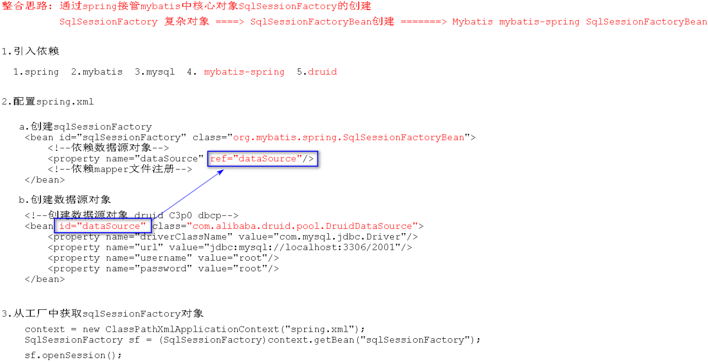

### 6.2.1 框架的作用

- Spring框架：项目管理框架，主要负责项目中`组件对象的创建、使用与销毁`
- Mybatis框架：持久层框架，主要用来`简化数据库访问的操作`

- 所谓Spring整合Mybatis，其实就是`通过Spring框架接管Mybatis框架中核心对象的创建`
  - Mybatis框架中核心对象：操作数据库
  - Spring框架`接管`：控制反转——原来由Mybatis创建的操作数据库的对象，现在由Spring来创建


### 6.2.2 Mybatis框架中核心对象

1. Mybatis最核心对象？

Mybatis最核心对象为：`SqlSessionFactory`，**<u>整合就是通过Spring管理`SqlSessionFactory`对象的创建</u>**！

- 在创建Mybatis核心对象`SqlSessionFactory`时，需要读取配置文件——`Mybatis-config.xml`。在Mybatis中有两份配置文件：`config.xml`（主配置文件）和`mapper.xml`（接口配置文件）
  - `config.xml`主配置文件主要包含：
    - 数据源配置
    - `mapper`文件注册

2. Spring如何管理`sqlSessionFactory`对象的创建？

```java
import java.sql.Connection;

public interface SqlSessionFactory 
```

`sqlSessionFactory`是一个接口类型的**`复杂对象`**！

3. 如何创建`sqlSessionFactory`

   ```java
   SqlSessionFactoryBean implements FactoryBean<SqlSessionFactory> {
       SqlSessionFactory getOnject() {
           inputStream = Resources.getResourceAsStream("mybatis-config.xml");  // 读配置文件
           // sqlSessionFactory = new SqlSessionFactoryBuilder().build(inputStream);
           return new SqlSessionFactoryBuilder().build(inputStream);
       }
       Class getClass() {
           return SqlSessionFactory,class;
       }
       boolean isSingleton() {
           return true;
       }
   }
   ```

4. 工厂管理`sqlSessionFactory`

   ```xml
   <bean class="xxx.sqlSessionFactoryBean" id="sqlSessionFactory"></bean>
   ```

5. 获取对象

   ```java
   sqlSessionFactory sf = context.getBean("sqlSessionFactory");
   ```

   

### 6.2.3 实现

创建工程：`D:\MarkdownFiles\Spring\SpringDemo\interceptor\src\main\java\factorybean`

1. 创建`factorybean/SqlSessionFactoryBean`

   ```java
   package factorybean;
   
   import org.apache.ibatis.io.Resources;
   import org.apache.ibatis.session.SqlSessionFactory;
   import org.apache.ibatis.session.SqlSessionFactoryBuilder;
   import org.springframework.beans.factory.FactoryBean;
   
   import java.io.InputStream;
   
   /**
    * 自定义创建SqlSessionFactory复杂对象
    */
   public class SqlSessionFactoryBean implements FactoryBean<SqlSessionFactory> {
   
       @Override
       public SqlSessionFactory getObject() throws Exception {
           // import org.apache.ibatis.io.Resources;
           InputStream inputStream = Resources.getResourceAsStream("factorybean/mybatis-config.xml");
           SqlSessionFactory sqlSessionFactory = new SqlSessionFactoryBuilder().build(inputStream);
           return sqlSessionFactory;
       }
   
       @Override
       public Class<?> getObjectType() {
           return SqlSessionFactory.class;
       }
   
       @Override
       public boolean isSingleton() {
           return true;
       }
   }
   ```

   进一步对==第18行==进行修改：

   ```java
       /**
        * mybatis-config.xml位置属性注入
        */
       private String configLocation;
   
       public void setConfigLocation(String configLocation) {
           this.configLocation = configLocation;
       }
   
       @Override
       public SqlSessionFactory getObject() throws Exception {
           // import org.apache.ibatis.io.Resources;
           InputStream inputStream = Resources.getResourceAsStream(configLocation);
           SqlSessionFactory sqlSessionFactory = new SqlSessionFactoryBuilder().build(inputStream);
           return sqlSessionFactory;
       }
   ```

   

2. 创建`factorybean/mybatis-config.xml`

   ```xml
   <?xml version="1.0" encoding="UTF-8" ?>
   <!DOCTYPE configuration
           PUBLIC "-//mybatis.org//DTD Config 3.0//EN"
           "http://mybatis.org/dtd/mybatis-3-config.dtd">
   
   <configuration>
       <!--用来书写自己数据库配置-->
       <environments default="dev">
           <environment id="dev">
               <transactionManager type="JDBC"/>
               <dataSource type="POOLED">
                   <property name="driver" value="com.mysql.jdbc.Driver"/>
                   <property name="url" value="jdbc:mysql://localhost:3306/2001?characterEncoding=UTF-8"/>
                   <property name="username" value="root"/>
                   <property name="password" value="root"/>
               </dataSource>
           </environment>
       </environments>
   </configuration>
   ```

3. 创建`spring.xml`进行管理

   ```xml
   <!--管理SqlSessionFactory-->
   <bean class="factorybean.SqlSessionFactoryBean" id="sqlSessionFactory">
       <property name="configLocation" value="factorybean/mybatis-config.xml"/>
   </bean>
   ```

4. 测试

   ```java
   package factorybean;
   
   import org.apache.ibatis.session.SqlSession;
   import org.apache.ibatis.session.SqlSessionFactory;
   import org.springframework.context.ApplicationContext;
   import org.springframework.context.support.ClassPathXmlApplicationContext;
   
   public class TestSqlSessionFactory {
       public static void main(String[] args) {
           ApplicationContext context = new ClassPathXmlApplicationContext("factorybean/spring.xml");
           SqlSessionFactory sqlSessionFactory = (SqlSessionFactory) context.getBean("sqlSessionFactory");
           SqlSession sqlSession = sqlSessionFactory.openSession();
           System.out.println(sqlSession);
       }
   }
   ```

   输出结果：`org.apache.ibatis.session.defaults.DefaultSqlSession@f6106c`

### 6.2.4 Mybatis-spring与druid

#### 6.2.4.1Mybatis-spring依赖

Mybatis对`SqlSessionFactoryBean`进行封装，提供了`Mybatis-spring`包（封装了`SqlSessionFactory`对象的创建），减少了代码的冗余！

创建`SqlSessionFactory`对象的类为`SqlSessionFactoryBean`！

**<u>Mybatis提供的`SqlSessionFactoryBean`不再使用[Mybatis主配置文件](# 6.2.2 Mybatis框架中核心对象)</u>**（该文件包含`数据源配置`和`mapper`注册），因此在`spring.xml`配置文件中，需添加上述两部分：

```xml
<!--创建sqlSessionFactory-->
<bean id="sqlSessionFactory" class="org.mybatis.spring.SqlSessionFactoryBean">
    <!--创建数据源对象的工具：druid-->
    
    <!--依赖数据源对象-->
    <property name="dataSource" ref="dataSource"/>
    <!--mapper文件注册-->
    <property name="mapperLocations" >
        <array>
            <value>classpath:com/baizhi/mapper/UserDAOMapper.xml</value>
        </array>
    </property>
</bean>
```


#### 6.2.4.2 druid创建数据源依赖

```xml
<dependency>
    <groupId>com.alibaba</groupId>
    <artifactId>druid</artifactId>
    <version>1.1.12</version>
</dependency>
```

需要交给工厂进行管理：

```java
package factorybean;

import com.alibaba.druid.pool.DruidDataSource;
import com.alibaba.druid.pool.DruidPooledConnection;

import java.sql.SQLException;

public class TestDruid {
    public static void main(String[] args) throws SQLException {

        DruidDataSource druidDataSource = new DruidDataSource();
        druidDataSource.setDriverClassName("com.mysql.jdbc.Driver");
        druidDataSource.setUrl("jdbc:mysql://localhost:3306/2001");
        druidDataSource.setUsername("root");
        druidDataSource.setPassword("admin");

        DruidPooledConnection connection = druidDataSource.getConnection();
        System.out.println(connection);

    }
}
```

数据源是简单对象，对其进行管理：

```xml
<!--创建数据源对象 druid C3p0 dbcp-->
<bean class="com.alibaba.druid.pool.DruidDataSource" id="dataSource">
    <property value="com.mysql.jdbc.Driver" name="driverClassName"/>
    <property value="jdbc:mysql://localhost:3306/2001" name="url"/>
    <property value="root" name="username"/>
    <property value="admin" name="password"/>
</bean>
```


## 6.3 SM整合DAO编程

创建`spring_mybatis`工程：`D:\MarkdownFiles\Spring\SpringDemo\spring_mybatis`

### 6.3.1 引入相关依赖

1. 引入Spring相关jar包

   ```xml
   <dependency>
     <groupId>org.springframework</groupId>
     <artifactId>spring-core</artifactId>
     <version>4.3.2.RELEASE</version>
   </dependency>
   <dependency>
     <groupId>org.springframework</groupId>
     <artifactId>spring-context</artifactId>
     <version>4.3.2.RELEASE</version>
   </dependency>
   <dependency>
     <groupId>org.springframework</groupId>
     <artifactId>spring-context-support</artifactId>
     <version>4.3.2.RELEASE</version>
   </dependency>
   <dependency>
       <groupId>org.springframework</groupId>
       <artifactId>spring-jdbc</artifactId>
       <version>4.3.2.RELEASE</version>
     </dependency>
   <dependency>
     <groupId>org.springframework</groupId>
     <artifactId>spring-aop</artifactId>
     <version>4.3.2.RELEASE</version>
   </dependency>
   <dependency>
     <groupId>org.springframework</groupId>
     <artifactId>spring-beans</artifactId>
     <version>4.3.2.RELEASE</version>
   </dependency>
   <dependency>
     <groupId>org.springframework</groupId>
     <artifactId>spring-expression</artifactId>
     <version>4.3.2.RELEASE</version>
   </dependency>
   <dependency>
     <groupId>org.springframework</groupId>
     <artifactId>spring-aspects</artifactId>
     <version>4.3.2.RELEASE</version>
   </dependency>
   <dependency>
     <groupId>org.springframework</groupId>
     <artifactId>spring-web</artifactId>
     <version>4.3.2.RELEASE</version>
   </dependency>
   ```

   

2. 引入Mybatis的依赖jar包

   ```xml
   <dependency>
     <groupId>org.mybatis</groupId>
     <artifactId>mybatis</artifactId>
     <version>3.5.4</version>
   </dependency>
   ```

   

3. 引入mybatis-spring整合jar包

   ```xml
   <dependency>
     <groupId>org.mybatis</groupId>
     <artifactId>mybatis-spring</artifactId>
     <version>2.0.4</version>
   </dependency>
   ```

   

4. 引入数据库驱动mysql和druid

   ```xml
   <dependency>
     <groupId>mysql</groupId>
     <artifactId>mysql-connector-java</artifactId>
     <version>5.1.40</version>
   </dependency>
   <dependency>
       <groupId>com.alibaba</groupId>
       <artifactId>druid</artifactId>
       <version>1.1.19</version>
   </dependency>
   ```

   

### 6.3.2 新建数据库、表

```mysql
# 创建数据库
CREATE DATABASE `spring_mybatis` CHARACTER SET 'utf8';

# 创建表
CREATE TABLE `table_user` (
  `id` varchar(40) NOT NULL,
  `name` varchar(40) DEFAULT NULL,
  `age` int(3) DEFAULT NULL,
  `bir` timestamp NULL DEFAULT NULL,
  PRIMARY KEY (`id`)
) ENGINE=InnoDB DEFAULT CHARSET=utf8;
```


### 6.3.3 实体类

创建实体类：`com.chenzf.entity.User`!

快捷键`Alt+Insert`调用`Generate`，快速插入方法：

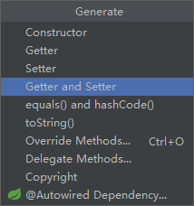

```java
package com.chenzf.entity;

import java.util.Date;

public class User {

    private String id;
    private String name;
    private Integer age;
    private Date birth;

    /**
     * 显式地构造无参构造
     */
    public User() {
    }

    public User(String id, String name, Integer age, Date birth) {
        this.id = id;
        this.name = name;
        this.age = age;
        this.birth = birth;
    }

    @Override
    public String toString() {
        return "User{" +
                "id='" + id + '\'' +
                ", name='" + name + '\'' +
                ", age=" + age +
                ", birth=" + birth +
                '}';
    }

    public String getId() {
        return id;
    }

    public void setId(String id) {
        this.id = id;
    }

    public String getName() {
        return name;
    }

    public void setName(String name) {
        this.name = name;
    }

    public Integer getAge() {
        return age;
    }

    public void setAge(Integer age) {
        this.age = age;
    }

    public Date getBirth() {
        return birth;
    }

    public void setBirth(Date birth) {
        this.birth = birth;
    }
}
```


### 6.3.4 DAO接口

- 创建DAO接口：`com.chenzf.dao.UserDAO`

```java
package com.chenzf.dao;

import com.chenzf.entity.User;

import java.util.List;

public interface UserDAO {

    /**
     * 查询所有User
     * @return User列表
     */
    List<User> findAllUser();
}
```


- `UserDAO`接口的实现，在`Mybatis`中是通过`mapper.xml`完成的！


### 6.3.5 编写mapper配置文件实现接口

创建`mapper.xml`：`com/chenzf/mapper/mapper.xml`

```xml
<?xml version="1.0" encoding="UTF-8" ?>
<!DOCTYPE mapper PUBLIC "-//mybatis.org//DTD Mapper 3.0//EN" "http://mybatis.org/dtd/mybatis-3-mapper.dtd">
<mapper namespace="com.chenzf.dao.UserDAO">

    <!--findAllUser-->
    <select id="findAllUser" resultType="com.chenzf.entity.User">
        SELECT * FROM table_user;
    </select>

</mapper>
```


### 6.3.6 编写Spring-myabtis整合配置文件

创建`spring.xml`：`resources/spring.xml`

```xml
<?xml version="1.0" encoding="UTF-8"?>
<beans xmlns="http://www.springframework.org/schema/beans"
       xmlns:xsi="http://www.w3.org/2001/XMLSchema-instance"
       xsi:schemaLocation="http://www.springframework.org/schema/beans http://www.springframework.org/schema/beans/spring-beans.xsd">

    <!--创建数据源datasource-->
    <bean id="dataSource" class="com.alibaba.druid.pool.DruidDataSource">
        <property name="driverClassName" value="com.mysql.jdbc.Driver"/>
        <property name="url" value="jdbc:mysql://localhost:3306/spring_mybatis"/>
        <property name="username" value="root"/>
        <property name="password" value="admin"/>
    </bean>

    <!--创建sqlSessionFactory-->
    <bean id="sqlSessionFactory" class="org.mybatis.spring.SqlSessionFactoryBean">

        <!--依赖数据源-->
        <property name="dataSource" ref="dataSource"/>
        
        <!--注入mapper配置文件
                private Resource[] mapperLocations;
                Resource[]=>String[]-->
        <property name="mapperLocations">
            <array>
                <value>classpath:com/chenzf/mapper/UserDAOMapper.xml</value>
            </array>
        </property>

    </bean>

</beans>
```


### 6.3.7 测试

启动工厂，获取`SqlSessionFactory`！

创建`com.chenzf.test.TestSqlSessionFactory`：

```java
package com.chenzf.test;

import com.chenzf.dao.UserDAO;
import org.apache.ibatis.session.SqlSession;
import org.apache.ibatis.session.SqlSessionFactory;
import org.springframework.context.ApplicationContext;
import org.springframework.context.support.ClassPathXmlApplicationContext;

public class TestSqlSessionFactory {
    public static void main(String[] args) {
        ApplicationContext context = new ClassPathXmlApplicationContext("spring.xml");
        SqlSessionFactory sqlSessionFactory = (SqlSessionFactory) context.getBean("sqlSessionFactory");
        SqlSession sqlSession = sqlSessionFactory.openSession();

        System.out.println(sqlSession);

        UserDAO userDAO = sqlSession.getMapper(UserDAO.class);
        userDAO.findAllUser().forEach(user -> System.out.println(user));
    }
}
```

输出结果：`User{id='1', name='chenzf', age=27, birth=null}`


### 6.3.8 MapperFactoryBean

`mybatis-spring`对`TestSqlSessionFactory`中下列语句作了进一步封装！

```java
SqlSession sqlSession = sqlSessionFactory.openSession();
UserDAO userDAO = sqlSession.getMapper(UserDAO.class);
```

`MapperFactoryBea`是用来创建DAO对象的一个类，实现的前提：

- 依赖于`SqlSessionFactory`：`sqlSessionFactory`、`getMapper`
- 依赖于创建DAO全限定名：`UserDAO.class`

#### 6.3.8.1 修改spring.xml配置文件(重要)

添加==第38-47行==：

```xml
<?xml version="1.0" encoding="UTF-8"?>
<beans xmlns="http://www.springframework.org/schema/beans"
       xmlns:xsi="http://www.w3.org/2001/XMLSchema-instance"
       xsi:schemaLocation="http://www.springframework.org/schema/beans http://www.springframework.org/schema/beans/spring-beans.xsd">

    <!--1.创建数据源datasource-->
    <!--driverClassName、url、username、password不可更改-->
    <bean id="dataSource" class="com.alibaba.druid.pool.DruidDataSource">
        <property name="driverClassName" value="com.mysql.jdbc.Driver"/>
        <property name="url" value="jdbc:mysql://localhost:3306/spring_mybatis"/>
        <property name="username" value="root"/>
        <property name="password" value="admin"/>
    </bean>

    <!--2.根据数据源创建sqlSessionFactory-->
    <bean id="sqlSessionFactory" class="org.mybatis.spring.SqlSessionFactoryBean">

        <!--依赖数据源-->
        <!--name="dataSource"中dataSource不可更改-->
        <property name="dataSource" ref="dataSource"/>

        <!--注入mapper配置文件
                private Resource[] mapperLocations;
                Resource[]=>String[]-->
        
        <!--mapperLocations为源码固定值，不可更改-->
        <!--可以不用下面的方式，而采用通用方式-->
        <property name="mapperLocations">
            <array>
                <value>classpath:com/chenzf/mapper/UserDAOMapper.xml</value>
            </array>
        </property>
        <!--注入mapper配置文件通用方式-->
        <property name="mapperLocations" value="classpath:com/chenzf/mapper/*.xml"/> 

    </bean>

    <!--3.根据sqlSessionFactory创建DAO组件类-->
    <bean id="userDAO" class="org.mybatis.spring.mapper.MapperFactoryBean">
        <!--注入sqlSessionFactory-->
        <!--name="sqlSessionFactory"为源码固定值，不可更改-->
        <property name="sqlSessionFactory" ref="sqlSessionFactory"/>
        
        <!--注入创建DAO接口类型；注入接口的全限定名：包.接口-->
        <!--name="mapperInterface"为源码固定值，不可更改-->
        <property name="mapperInterface" value="com.chenzf.dao.UserDAO"/>
    </bean>

</beans>
```

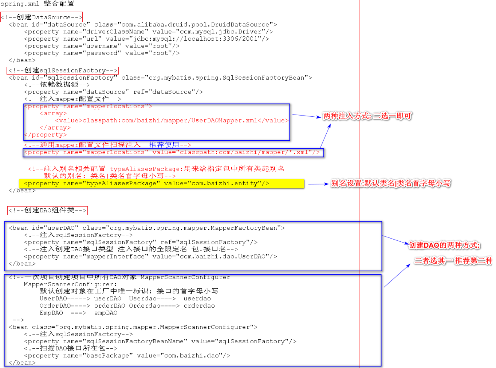

#### 6.3.8.2 测试

启动工厂，获取DAO，调用方法：

创建`com.chenzf.test.TestUserDAO`：

```java
package com.chenzf.test;

import com.chenzf.dao.UserDAO;
import org.springframework.context.support.ClassPathXmlApplicationContext;

public class TestUserDAO {
    public static void main(String[] args) {
        ClassPathXmlApplicationContext context = new ClassPathXmlApplicationContext("spring.xml");
        UserDAO userDAO = (UserDAO) context.getBean("userDAO");
        userDAO.findAllUser().forEach(user -> System.out.println(user));
    }
}
```

运行结果：`User{id='1', name='chenzf', age=27, birth=null}`


## 6.4 事务

### 6.4.1 Mybatis框架中事务控制

使用`SqlSession`对象中的两个方法：

- 提交：`sqlSession.commit()`
- 回滚：`sqlSession.rollback()`

但Mybatis是对原始`JDBC`技术的封装，`JDBC`才是与数据库打交道的最底层的规范！

在使用`JDBC`操作数据库，控制事务操作时，使用了`java.sql.Connection`对象，数据库只认它的

- 提交：`commit()`
- 回滚：`rollback()`

而`SqlSession`的底层实现提交和回滚，调用的也是`java.sql.Connection`的提交和回滚方法。所以，**项目中真正负责数据库事务控制的对象是：`Connection`对象**！即：用来实现事务控制的核心对象是`Connection`对象的`commit()、rollback()`方法！

## 6.5 SM整合Service编程

### 6.5.1 创建Service接口及其实现类

- 创建`com.chenzf.service.UserService`接口：

```java
package com.chenzf.service;

import com.chenzf.entity.User;

import java.util.List;

public interface UserService {
    List<User> findAllUser();
}
```


- 创建`com.chenzf.service.UserServiceImpl`实现类：

```java
package com.chenzf.service;

import com.chenzf.dao.UserDAO;
import com.chenzf.entity.User;

import java.util.List;

public class UserServiceImpl implements UserService {

    /**
     * 依赖注入
     */
    private UserDAO userDAO;

    public void setUserDAO(UserDAO userDAO) {
        this.userDAO = userDAO;
    }

    @Override
    public List<User> findAllUser() {
        return userDAO.findAllUser();
    }
}
```


### 6.5.2 将Service组件交给工厂进行管理

在`spring.xml`中添加：

```xml
<!--4.管理Service组件-->
<bean id="userService" class="com.chenzf.service.UserServiceImpl">
    <!--注入DAO-->
    <property name="userDAO" ref="userDAO"/>
</bean>
```


### 6.5.3 初步验证测试

创建`com.chenzf.test.TestUserService`：

```java
package com.chenzf.test;

import com.chenzf.service.UserService;
import org.springframework.context.ApplicationContext;
import org.springframework.context.support.ClassPathXmlApplicationContext;

public class TestUserService {
    public static void main(String[] args) {
        ApplicationContext context = new ClassPathXmlApplicationContext("spring.xml");
        UserService userService = (UserService) context.getBean("userService");
        userService.findAllUser().forEach(user -> System.out.println(user));
    }
}
```

输出结果：`User{id='1', name='chenzf', age=27, birth=null}`


### 6.5.4 给现有业务层加入事务

#### 6.4.4.1 添加`saveUser`方法

1. 在`com.chenzf.dao.UserDAO`中添加`saveUser`方法：

   ```java
   /**
   * 保存User
   * 需要控制事务
   * @param name
   */
   void saveUser(User user);
   ```


2. [在`com/chenzf/mapper/UserDAOMapper.xml`中实现接口](# 6.3.5 编写mapper配置文件实现接口)

   ```xml
   <!--saveUser-->
   <insert id="saveUser" parameterType="com.chenzf.entity.User">
       INSERT INTO table_user VALUES (#{id}, #{name}, #{age}, #{birth});
   </insert>
   ```


3. 在业务接口`com.chenzf.service.UserService`里增加对应方法

   ```java
   package com.chenzf.service;
   
   import com.chenzf.entity.User;
   
   import java.util.List;
   
   public interface UserService {
       List<User> findAllUser();
   
       void saveUser(User user);
   }
   ```

   

4. 实现`UserService`接口中的`saveUser`方法

   ```java
   @Override
   public void saveUser(User user) {
       // 处理业务
       user.setId(UUID.randomUUID().toString());
       // 调用业务
       userDAO.saveUser(user);
   }
   ```

   

5. 初步测试

   ```java
   package com.chenzf.test;
   
   import com.chenzf.entity.User;
   import com.chenzf.service.UserService;
   import org.springframework.context.ApplicationContext;
   import org.springframework.context.support.ClassPathXmlApplicationContext;
   
   import java.util.Date;
   
   public class TestUserService {
       public static void main(String[] args) {
           ApplicationContext context = new ClassPathXmlApplicationContext("spring.xml");
           UserService userService = (UserService) context.getBean("userService");
   
           // 先保存用户
           userService.saveUser(new User("", "zufeng", 1, new Date()));
           // 再查看用户
           userService.findAllUser().forEach(user -> System.out.println(user));
       }
   }
   ```

   

6. 运行结果：`User{id='100b401f-1421-4cce-9acd-e76feec8228f', name='zufeng', age=1, birth=null}`


#### 6.5.4.2 数据库的增删改需要控制事务

1. 如果有事务控制，那么出现异常可以回滚：

在`com.chenzf.service.UserServiceImpl`中添加异常：

```java
	@Override
    public void saveUser(User user) {
        // 处理业务
        user.setId(UUID.randomUUID().toString());
        // 调用业务
        userDAO.saveUser(user);

        // 抛出异常
        throw new RuntimeException("出错了，验证是否可以回滚！");
    }
```

运行后结果：`Exception in thread "main" java.lang.RuntimeException: 出错了，验证是否可以回滚！`

查看数据库：

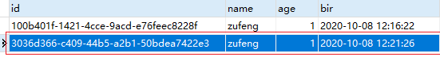

**`虽然出错了，但数据库仍然添加了信息，没有回滚`**！

说明：业务层没有事务！

2. **没有事务，那么是如何将信息提交到数据库的**？
   - Spring在DAO的方法上添加了**`小事务`**来`方便测试`DAO
   - 当外部存在事务时，小事务自动消失


#### 6.5.4.3 数据源事务管理器

1. 现有项目中如何获得Connection对象

用来[实现事务控制的核心对象](# 6.4.1 Mybatis框架中事务控制)是`Connection`对象！而现有项目中`DruidDataSource`连接池中就有`Connection`对象！

```java
Connection connection = DruidDataSource().getConnection();
```


2. 想让Connection对象去控制事务（正常地提交与回滚）的基本要求

```java
UserService {
    save() {
        userDAO.save();
    }
}

UserDAO {
    save() {}
}
```

`在业务层获得的连接对象`，与DAO真正执行时，打开的`数据库连接对象`，保持一致：同一个线程同一个连接（mybatis使用`threadlocal`来实现）

3. 现在我们**获得的连接与DAO的连接不一样**！由于DAO的执行已经由框架封装好了，无法改动
4. 在Spring与Mybatis框架中提供了`DataSourceTransactionManager`：
   - 在全局创建一个事务管理器，用来统一调度**`业务层当前使用连接对象`**和**`DAO层使用连接对象`**是一致的
   - 控制数据源的线程安全，因此得告知其控制哪个数据源的安全——注入数据源！


#### 6.5.4.4 控制事务PlatformTransactionManager

1. 在`spring.xml`中添加数据源事务管理：

```xml
<!--5.控制数据源事务管理-->
<bean id="transactionManager" class="org.springframework.jdbc.datasource.DataSourceTransactionManager">
    <!--注入数据源-->
    <property name="dataSource" ref="dataSource"/>
</bean>
```


2. 业务层不仅依赖`UserDAo`还得注入`TransactionManager`依赖——实际用来控制事务的是`PlatformTransactionManager`

   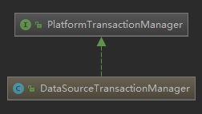

   - 在`com.chenzf.service.UserServiceImpl`中添加：

     ```java
     	/**
          * 注入事务管理器依赖
          */
         private PlatformTransactionManager platformTransactionManager;
     
         public void setPlatformTransactionManager(PlatformTransactionManager platformTransactionManager) {
             this.platformTransactionManager = platformTransactionManager
         }
     ```

   - 在`spring.xml`配置文件中注入事务管理器

     ```xml
     	<!--4.管理Service组件-->
         <bean id="userService" class="com.chenzf.service.UserServiceImpl">
             <!--注入DAO-->
             <property name="userDAO" ref="userDAO"/>
             <!--注入事务管理器-->
             <property name="platformTransactionManager" ref="transactionManager"/>
         </bean>
     ```

     

3. 控制事务：`com.chenzf.service.UserServiceImpl`

   ```java
   package com.chenzf.service;
   
   import com.chenzf.dao.UserDAO;
   import com.chenzf.entity.User;
   import org.springframework.transaction.PlatformTransactionManager;
   import org.springframework.transaction.TransactionDefinition;
   import org.springframework.transaction.TransactionStatus;
   import org.springframework.transaction.support.DefaultTransactionDefinition;
   
   import java.util.List;
   import java.util.UUID;
   
   public class UserServiceImpl implements UserService {
   
       /**
        * 依赖注入
        */
       private UserDAO userDAO;
   
       public void setUserDAO(UserDAO userDAO) {
           this.userDAO = userDAO;
       }
   
       /**
        * 注入事务管理器依赖
        */
       private PlatformTransactionManager platformTransactionManager;
   
       public void setPlatformTransactionManager(PlatformTransactionManager platformTransactionManager) {
           this.platformTransactionManager = platformTransactionManager;
       }
   
       @Override
       public List<User> findAllUser() {
           return userDAO.findAllUser();
       }
   
       @Override
       public void saveUser(User user) {
           // 控制事务
   
           // 为了获取事务状态，需要创建事务配置对象
           TransactionDefinition transactionDefinition = new DefaultTransactionDefinition();
           // 获取当前事务状态
           TransactionStatus transactionStatus = platformTransactionManager.getTransaction(transactionDefinition);
   
           try {
               // 处理业务
               user.setId(UUID.randomUUID().toString());
   
               // 调用业务
               userDAO.saveUser(user);
   
               // 抛出异常
               // throw new RuntimeException("出错了，验证是否可以回滚！");
               System.out.println("1/0");
               int i = 1 / 0;
   
               // 提交需要传入事务状态
               platformTransactionManager.commit(transactionStatus);
   
           } catch (Exception e) {
               e.printStackTrace();
               // 回滚需要传入事务状态
               platformTransactionManager.rollback(transactionStatus);
           }
       }
   }
   ```

4. 测试

   ```
   1/0
   java.lang.ArithmeticException: / by zero
   	at com.chenzf.service.UserServiceImpl.saveUser(UserServiceImpl.java:57)
   	at com.chenzf.test.TestUserService.main(TestUserService.java:16)
   // 回滚成功，没有添加新的信息	
   User{id='100b401f-1421-4cce-9acd-e76feec8228f', name='zufeng', age=1, birth=null}
   ```

#### 6.5.4.5 增删改均需事务导致代码冗余

增删改均需事务导致代码冗余，因此需要[面向切面编程](# 5 面向切面编程)！


### 6.5.5 Spring中处理事务的两种方式

#### 6.5.5.1 编程式事务控制

- 定义：通过在业务层中注入事务管理对象，然后通过代码实现的方式进行事务控制
- [缺点](# 6.5.4.5 增删改均需事务导致代码冗余)：代码冗余、不通用、不便于维护

#### 6.5.5.2 声明式事务控制(推荐)

- 定义：通过AOP切面编程进行事务控制，并对事务属性在配置文件中完成细粒度配置
- 好处：通用、减少代码冗余，更加专注于业务逻辑开发


### 6.5.6 SM整合之Service层事务优化

增删改均需事务导致代码冗余，因此需要[面向切面编程](# 5 面向切面编程)！

#### 6.5.6.1 自定义完成事务管理

1. 环绕通知

   ```java
   TransactionAdvice implements MethodInterceptor {
       private PlatformTransactionManager platformTransactionManager;
       
       public void setPlatformTransactionManager(PlatformTransactionManager platformTransactionManager) {
           this.platformTransactionManager = platformTransactionManager;
       }
       
       public Object invoke(MethodInvocation methodInvocation) {
           // 创建事务配置对象
           TransactionDefinition transactionDefinition = new DefaultTransactionDefinition();
           // 获取事务状态
           TransactionStatus status = platformTransactionManager.getTransaction(transactionDefinition);
           // 放行目标方法
           try {
               Object result = methodInvocation.proceed();
               platformTransactionManager.commit(status);  // 提交事务
               return result;
           } catch(Exception e) {
               e.printStackTrace();
               platformTransactionManager.rollback(status);  // 回滚事务
           }
       }
       
   }
   ```

   

2. 切面配置

   - 配置通知对象

   ```xml
   <bean id = "tx" class="xxx.TransactionAdvice">
       <property name="platformTransactionManager" ref="dataSourceTransactionManager"/>
   </bean>
   ```

   

   - 配置切面

   ```xml
   <aop:config>
       <aop:pointcut id="pc" expression="within(com.chenzf.service.*ServiceImpl)"/>
       <aop:advisor advice-ref="tx" pointcut-ref="pc"/>
   </aop:config>
   ```


#### 6.5.6.2 声明式事务编程

Sping框架通过声明式事务编程，避免了去自定义完成事务管理！

1. Spring框架提供了`tx:advice`标签
   - 可以根据事务管理器创建一个基于事务环绕通知对象
   - 可以对事务进行细粒度控制——所以没有使用`<bean>`

```xml
<!--id为创建出来通知对象在工厂中唯一标识；transaction-manager为事务管理器-->
<tx:advice id="transactionAdvice" transaction-manager="transactionManager">
    <!--事务细粒度配置：查询没必要添加事务，避免影响查询效率-->
    <tx:attributes>
        <tx:method name="save*"/>
    	<tx:method name="delete*"/>
    	<tx:method name="update*"/>
    </tx:attributes>
</tx:advice>
```

相当于在`自定义完成事务管理`中，创建`环绕通知`和`切面配置`中的`配置通知对象`

2. 配置切面

```xml
<aop:config>
    <aop:pointcut id="pc" expression="within(com.chenzf.service.*ServiceImpl)"/>
    <aop:advisor advice-ref="transactionAdvice" pointcut-ref="pc"/>
</aop:config>
```


## 6.6 Spring整合Mybatis标准开发流程(重要)

编程步骤：

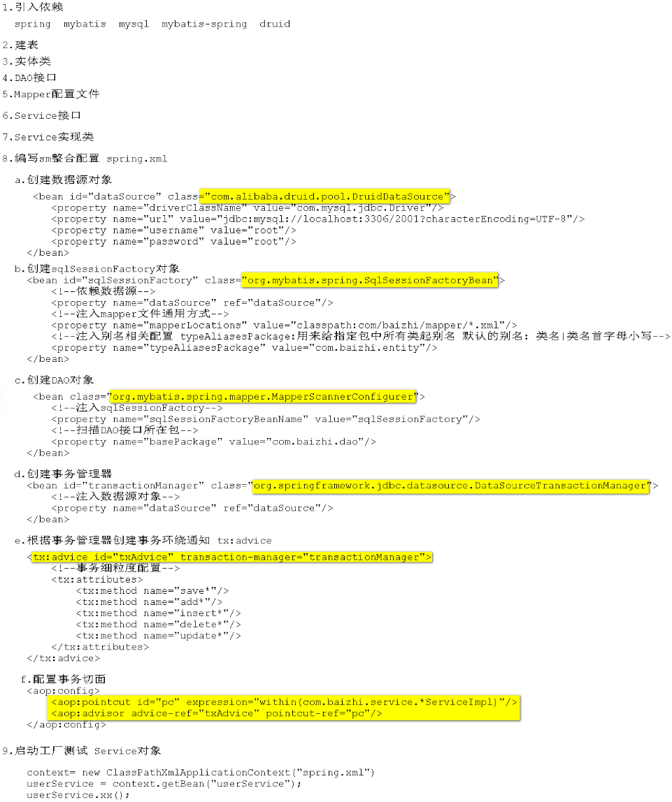


### 6.6.1 创建标准目录

- 工程路径：`D:\MarkdownFiles\Spring\SpringDemo\spring_mybatis_project`

- 标准目录

### 6.6.2 导入依赖

```xml
<!--spring相关-->

      <dependency>
          <groupId>org.springframework</groupId>
          <artifactId>spring-core</artifactId>
          <version>4.3.2.RELEASE</version>
      </dependency>
      <dependency>
          <groupId>org.springframework</groupId>
          <artifactId>spring-context</artifactId>
          <version>4.3.2.RELEASE</version>
      </dependency>
      <dependency>
          <groupId>org.springframework</groupId>
          <artifactId>spring-context-support</artifactId>
          <version>4.3.2.RELEASE</version>
      </dependency>
      <dependency>
          <groupId>org.springframework</groupId>
          <artifactId>spring-jdbc</artifactId>
          <version>4.3.2.RELEASE</version>
      </dependency>
      <dependency>
          <groupId>org.springframework</groupId>
          <artifactId>spring-aop</artifactId>
          <version>4.3.2.RELEASE</version>
      </dependency>
      <dependency>
          <groupId>org.springframework</groupId>
          <artifactId>spring-beans</artifactId>
          <version>4.3.2.RELEASE</version>
      </dependency>
      <dependency>
          <groupId>org.springframework</groupId>
          <artifactId>spring-expression</artifactId>
          <version>4.3.2.RELEASE</version>
      </dependency>
      <dependency>
          <groupId>org.springframework</groupId>
          <artifactId>spring-aspects</artifactId>
          <version>4.3.2.RELEASE</version>
      </dependency>
      <dependency>
          <groupId>org.springframework</groupId>
          <artifactId>spring-web</artifactId>
          <version>4.3.2.RELEASE</version>
      </dependency>

      <!--mybatis-->

      <dependency>
          <groupId>org.mybatis</groupId>
          <artifactId>mybatis</artifactId>
          <version>3.5.4</version>
      </dependency>

      <!--mybatis-spring-->

      <dependency>
          <groupId>org.mybatis</groupId>
          <artifactId>mybatis-spring</artifactId>
          <version>2.0.4</version>
      </dependency>

      <!--mysql-->

      <dependency>
          <groupId>mysql</groupId>
          <artifactId>mysql-connector-java</artifactId>
          <version>5.1.40</version>
      </dependency>

      <!--druid-->

      <dependency>
          <groupId>com.alibaba</groupId>
          <artifactId>druid</artifactId>
          <version>1.1.19</version>
      </dependency>
```


### 6.6.3 新建库、表

```mysql
# 创建数据库
CREATE DATABASE `spring_mybatis` CHARACTER SET 'utf8';

# 创建表
CREATE TABLE `table_user` (
  `id` varchar(40) NOT NULL,
  `name` varchar(40) DEFAULT NULL,
  `age` int(3) DEFAULT NULL,
  `birth` timestamp NULL DEFAULT NULL,
  PRIMARY KEY (`id`)
) ENGINE=InnoDB DEFAULT CHARSET=utf8;
```


### 6.6.4 实体类

`com.chenzf.entity.User`

```java
package com.chenzf.entity;

import java.util.Date;

public class User {

    private String id;
    private String name;
    private Integer age;
    private Date birth;

    /**
     * 显式地构造无参构造
     */
    public User() {
    }

    public User(String id, String name, Integer age, Date birth) {
        this.id = id;
        this.name = name;
        this.age = age;
        this.birth = birth;
    }

    @Override
    public String toString() {
        return "User{" +
                "id='" + id + '\'' +
                ", name='" + name + '\'' +
                ", age=" + age +
                ", birth=" + birth +
                '}';
    }

    public String getId() {
        return id;
    }

    public void setId(String id) {
        this.id = id;
    }

    public String getName() {
        return name;
    }

    public void setName(String name) {
        this.name = name;
    }

    public Integer getAge() {
        return age;
    }

    public void setAge(Integer age) {
        this.age = age;
    }

    public Date getBirth() {
        return birth;
    }

    public void setBirth(Date birth) {
        this.birth = birth;
    }
}
```


### 6.6.5 创建DAO接口

`com.chenzf.dao.UserDAO`

```java
package com.chenzf.dao;

import com.chenzf.entity.User;

import java.util.List;

public interface UserDAO {

    void saveUser(User user);

    List<User> findAllUser();
}
```


### 6.6.6 创建`mapper`配置文件

`com/chenzf/mapper/UserDAOMapper.xml`

```xml
<?xml version="1.0" encoding="UTF-8" ?>
<!DOCTYPE mapper PUBLIC "-//mybatis.org//DTD Mapper 3.0//EN" "http://mybatis.org/dtd/mybatis-3-mapper.dtd">
<mapper namespace="com.chenzf.dao.UserDAO">

    <!--saveUser-->
    <!--id和方法名一致，参数使用别名User-->
    <insert id="saveUser" parameterType="User">
        INSERT INTO table_user VALUES (#{id}, #{name}, #{age}, #{birth});
    </insert>

    <!--findAllUser-->
    <select id="findAllUser" resultType="User">
        SELECT * FROM table_user;
    </select>

</mapper>
```


### 6.6.7 创建Service接口及实现类

`com.chenzf.service.UserService`

```java
package com.chenzf.service;

import com.chenzf.entity.User;

import java.util.List;

public interface UserService {

    void saveUser(User user);

    List<User> findAllUser();
}
```

`com.chenzf.service.UserServiceImpl`：不再处理事务，只专心于业务逻辑

```java
package com.chenzf.service;

import com.chenzf.dao.UserDAO;
import com.chenzf.entity.User;

import java.util.List;
import java.util.UUID;

/**
 * 处理业务逻辑，调用DAO
 */

public class UserServiceImpl implements UserService {

    /**
     * 引入依赖
     */
    private UserDAO userDAO;

    public void setUserDAO(UserDAO userDAO) {
        this.userDAO = userDAO;
    }

    @Override
    public void saveUser(User user) {
        user.setId(UUID.randomUUID().toString());
        userDAO.saveUser(user);
    }

    @Override
    public List<User> findAllUser() {
        return userDAO.findAllUser();
    }
}

```


### 6.6.8 编写SM整合配置`spring`

`resources/spring.xml`

```xml
<?xml version="1.0" encoding="UTF-8"?>
<beans xmlns="http://www.springframework.org/schema/beans"
       xmlns:xsi="http://www.w3.org/2001/XMLSchema-instance"
       xmlns:tx="http://www.springframework.org/schema/tx"
       xmlns:aop="http://www.springframework.org/schema/aop"
       xsi:schemaLocation="http://www.springframework.org/schema/beans
                                            http://www.springframework.org/schema/beans/spring-beans.xsd
                                            http://www.springframework.org/schema/tx
                                            http://www.springframework.org/schema/tx/spring-tx.xsd
                                            http://www.springframework.org/schema/aop
                                            http://www.springframework.org/schema/aop/spring-aop.xsd">

    <!--1.创建数据源datasource-->
    <bean id="dataSource" class="com.alibaba.druid.pool.DruidDataSource">
        <property name="driverClassName" value="com.mysql.jdbc.Driver"/>
        <property name="url" value="jdbc:mysql://localhost:3306/spring_mybatis?characterEncoding=UTF-8"/>
        <property name="username" value="root"/>
        <property name="password" value="admin"/>
    </bean>

    <!--2.根据数据源创建sqlSessionFactory-->
    <bean id="sqlSessionFactory" class="org.mybatis.spring.SqlSessionFactoryBean">
        <!--2.1依赖数据源-->
        <property name="dataSource" ref="dataSource"/>
        <!--2.2注入mapper配置文件：通用方式-->
        <property name="mapperLocations" value="classpath:com/chenzf/mapper/*.xml"/>
        <!--2.3注入别名相关配置：用来给指定包中所有类起别名-->
        <property name="typeAliasesPackage" value="com.chenzf.entity"/>
    </bean>

    <!--3.根据sqlSessionFactory创建DAO组件类：一次性创建所有DAO-->
    <bean class="org.mybatis.spring.mapper.MapperScannerConfigurer">
        <!--注入sqlSessionFactory-->
        <property name="sqlSessionFactoryBeanName" value="sqlSessionFactory"/>
        <!--扫描DAO接口所在包-->
        <property name="basePackage" value="com.chenzf.dao"/>
    </bean>


    <!--4.创建事务管理器（解决连接一致性安全问题）-->
    <bean id="transactionManager" class="org.springframework.jdbc.datasource.DataSourceTransactionManager">
        <!--注入数据源-->
        <property name="dataSource" ref="dataSource"/>
    </bean>

    <!--5.根据事务管理器创建事务环绕通知：声明式-->
    <!--注意命名空间网址中是tx不是cache-->
    <tx:advice id="txAdvice" transaction-manager="transactionManager">
        <!--事务细粒度控制-->
        <tx:attributes>
            <tx:method name="save*"/>
            <tx:method name="delete*"/>
            <tx:method name="update*"/>
        </tx:attributes>
    </tx:advice>

    <!--6.配置事务切面-->
    <aop:config>
        <aop:pointcut id="pc" expression="within(com.chenzf.service.*ServiceImpl)"/>
        <aop:advisor advice-ref="txAdvice" pointcut-ref="pc"/>
    </aop:config>

    <!--7.管理Service层组件-->
    <bean id="userService" class="com.chenzf.service.UserServiceImpl">
        <!--注入DAO-->
        <property name="userDAO" ref="userDAO"/>
    </bean>

</beans>
```


### 6.6.9 启动工厂进行测试

`com.chenzf.test.TestUserService`

```java
package com.chenzf.test;

import com.chenzf.entity.User;
import com.chenzf.service.UserService;
import org.junit.After;
import org.junit.Before;
import org.junit.Test;
import org.springframework.context.support.ClassPathXmlApplicationContext;

import java.util.Date;

public class TestUserService {

    private ClassPathXmlApplicationContext context;

    @Before
    public void before() {
        this.context = new ClassPathXmlApplicationContext("spring.xml");
    }
    
    @Test
    public void testSaveUser() {
        UserService userService = (UserService) context.getBean("userService");
        User user = new User();
        user.setBirth(new Date());
        user.setAge(20);
        user.setName("祖峰");
        userService.saveUser(user);
    }

    @Test
    public void testFindAllUser() {
        UserService userService = (UserService) context.getBean("userService");
        userService.findAllUser().forEach(user -> System.out.println("user = " + user));
    }

    @After
    public void after() {
        context.close();
    }
}
```

- 测试事务是否正常工作

  - 在`com.chenzf.service.UserServiceImpl`添加

    ```java
    @Override
    public void saveUser(User user) {
        user.setId(UUID.randomUUID().toString());
        userDAO.saveUser(user);
        // 测试事务是否回滚
        int i = 1 / 0;
    }
    ```

    


# 7 Spring注解式开发

通过Spring框架提供的一系列相关注解（`Annotation`）完成项目快速开发！


## 7.1 Spring中注解

前置条件：必须在工厂配置文件中完成注解扫描配置！

### 7.1.1 开启注解扫描配置

```xml
<!--开启注解扫描-->
<context:component-scan base-package="com"/>
```


### 7.1.2 实例化相关注解


#### 7.1.2.1 Component

`@Component(value="beanid")`

- 作用：通用的创建实例的注解，用来创建当前这个类的实例
- 修饰范围：用在类上
- `value`属性:	用来指定创建的对象在工厂中的唯一标识，如果不指定，默认创建对象在工厂中的标识为**`类名首字母小写`**

未使用注解式开发时，需要通过`spring.xml`[工厂管理](# 2.2.4 工厂管理)来完成对象的创建！但是每编写一个组件都得配置一遍！


```xml

				
# 2. @Repository 
				修饰范围:    用在类上
				注解作用:    @component的子类注解专用于DAO组件的创建,通常加在DAO组件上
				value属性:	用来指定创建的对象在工厂中的唯一标识   如果不指定默认创建对象在工厂中的标识为类名首字母小写

# 3. @Service
				修饰范围:    用在类上
				注解作用:    @component的子类注解专用于Service组件的创建,通常加在Service组件上
				value属性:	用来指定创建的对象在工厂中的唯一标识   如果不指定默认创建对象在工厂中的标识为类名首字母小写

# 4. @Controller
			  修饰范围:    用在类上
				注解作用:    @component的子类注解专用于Action组件的创建,通常加在Action组件上
				value属性:	用来指定创建的对象在工厂中的唯一标识   如果不指定默认创建对象在工厂中的标识为类名首字母小写
```


