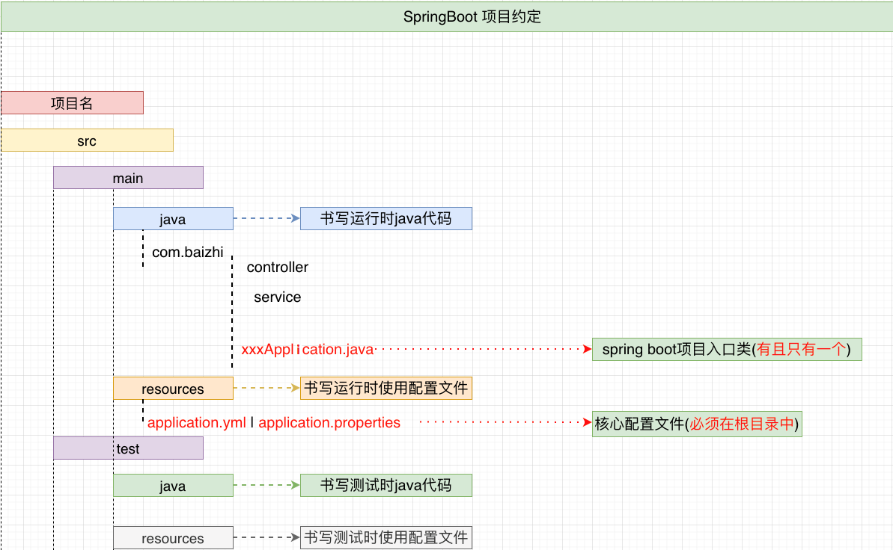
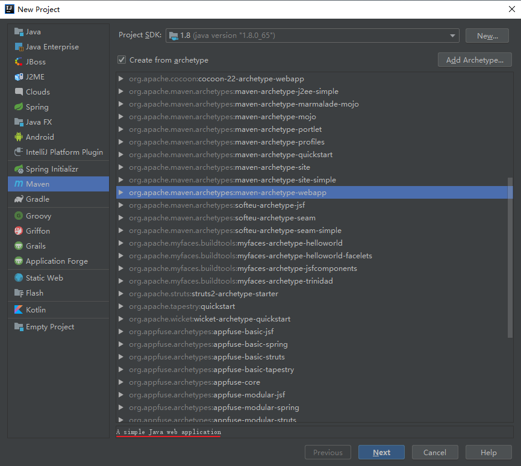
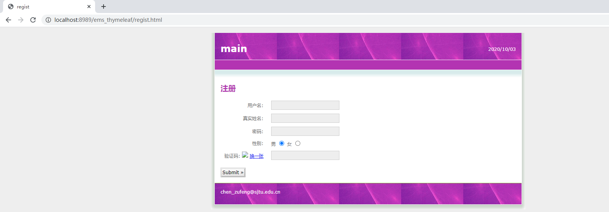

# 参考资料

https://www.bilibili.com/video/BV1RE411c7RN?p=1

# 1 引言

Spring Boot是由`Pivotal团队提供的全新框架`，其设计目的是用来`简化Spring应用的初始搭建以及开发过程`。该框架使用了`特定的方式来进行配置`，从而使开发人员`不再需要定义样板化的配置`。

`SSH(Spring Struts Hibernate)`-->`SSM(Spring stauts2|struts1 mybatis)`-->`SSM(Spring SpringMVC mybatis)`

`Spring Boot(微框架) = Spring MVC(控制器) + Spring core(项目管理)`

## 1.1 Spring Boot 特点

- `创建独立的Spring应用程序  `
- `嵌入了Tomcat，无需部署WAR文件`
- `简化Maven配置`
- `自动配置Spring，没有XML配置`

## 1.2 Spring Boot 约定大于配置

使用`Maven`项目目录进行构建。

- `Spring Boot项目中必须在src/main/resources中放入application.yml(.properties)核心配置文件，名字必须为:application。`
- `Spring Boot项目中必须在src/main/java中所有子包之外构建全局入口类：xxApplication，入口类一个Spring Boot项目只能有一个。`



# 2 Spring Boot 配置

## 2.1 环境要求

https://docs.spring.io/spring-boot/docs/2.2.10.RELEASE/reference/html/getting-started.html#getting-started

- Spring Boot 2.3.4.RELEASE requires [Java 8](https://www.java.com/) and is compatible up to Java 14 (included). [Spring Framework 5.2.9.RELEASE](https://docs.spring.io/spring/docs/5.2.9.RELEASE/spring-framework-reference/) or above is also required.

- Explicit build support is provided for the build tools: [Maven3.3+](http://maven.apache.org/download.cgi)
- Spring Boot supports the embedded servlet containers: [Tomcat 9.0—4.0](https://tomcat.apache.org/)
- [IDEA 2018](https://www.jetbrains.com/)

## 2.2 使用Maven创建一个项目

### 2.2.1 使用Maven创建一个项目



groupId为sjtu.chenzf；artifactId为hellospringboot；工程名为Demo1（默认为artifactId）；Maven设置为


注意：`Maven projects need to be imported`，点击`import Changes`。

然后**对项目结构进行调整**——添加`java`和`resources`：


- 将`main`文件夹下的`java`作为`Sources Root`
- 将`main`文件夹下的`resources`作为`Resources Root`
- 将`test`文件夹下的`java`作为`Test Sources Root`
- 将`test`文件夹下的`resources`作为`Test Resources Root`

### 2.2.2 创建文件夹方式

- 错误方式：[会出现问题](# 3.7.7-开发DAO接口以及mapper)


- 正确方式


## 2.3 项目中引入依赖

https://docs.spring.io/spring-boot/docs/2.2.10.RELEASE/reference/html/getting-started.html#getting-started

在`pom.xml`中

- 继承springboot的父项目(为与[教程](https://www.bilibili.com/video/BV1RE411c7RN?p=1)一致，第5行使用`2.2.5`)：

```xml
<!-- Inherit defaults from Spring Boot -->
  <parent>
    <groupId>org.springframework.boot</groupId>
    <artifactId>spring-boot-starter-parent</artifactId>
    <version>2.2.5.RELEASE</version>
  </parent>
```

点击`import Changes`！

- 引入Spring Boot 的web支持(先将`junit`依赖去除)

```xml
<!-- Add typical dependencies for a web application -->
    <dependencies>
        <dependency>
            <groupId>org.springframework.boot</groupId>
            <artifactId>spring-boot-starter-web</artifactId>
        </dependency>
    </dependencies>
```

点击`import Changes`：


## 2.4 建包并编写入口类和控制器

`main/java/sjtu/chenzf/Application.java`

```java
package sjtu.chenzf;

import org.springframework.boot.SpringApplication;
import org.springframework.boot.autoconfigure.EnableAutoConfiguration;
import org.springframework.web.bind.annotation.GetMapping;
import org.springframework.web.bind.annotation.RestController;

@EnableAutoConfiguration  // 通过该注解，开启自动配置
@RestController

public class Application {
    public static void main(String[] args) {
        /**
         * SpringApplication为Spring的应用类，用来启动SpringBoot应用（部署到对应的web容器中）
         * 参数1：传入入口类的类对象；参数2为main函数的参数
         */
        SpringApplication.run(Application.class, args);
    }

    @GetMapping("/hello")
    public String hello(){
        System.out.println("Hello SpringBoot");
        return "hello springboot";
    }
}
```

在浏览器中输入`http://localhost:8989/hello`，页面显示`hello springboot`，控制台显示`Hello SpringBoot`。

### 2.4.1 将入口类与控制器解耦合

`main/java/sjtu/chenzf/Application.java`

```java
package sjtu.chenzf;

import org.springframework.boot.SpringApplication;
import org.springframework.boot.autoconfigure.EnableAutoConfiguration;
import org.springframework.web.bind.annotation.GetMapping;
import org.springframework.web.bind.annotation.RestController;

@EnableAutoConfiguration  // 通过该注解，开启自动配置

public class Application {
    public static void main(String[] args) {
        /**
         * SpringApplication为Spring的应用类，用来启动SpringBoot应用（部署到对应的web容器中）
         * 参数1：传入入口类的类对象；参数2为main函数的参数
         */
        SpringApplication.run(Application.class, args);
    }
}
```

`main/java/sjtu/chenzf/controller/HelloController.java`

```java
package sjtu.chenzf.controller;

import org.springframework.web.bind.annotation.GetMapping;
import org.springframework.web.bind.annotation.RequestMapping;
import org.springframework.web.bind.annotation.RestController;

@RestController
@RequestMapping("/chenzf")  // 为避免路径冲突，再添加一级命名空间
public class HelloController {
    @GetMapping("/hello")  // 方法的访问路径
    public String hello() {
        System.out.println("Hello Spring Boot !");
        return "hello springboot";
    }
}
```

此时，需通过在浏览器中输入`http://localhost:8989/chenzf/hello`来进行访问，但访问时出现了问题，无法访问控制器！

### 2.4.2 添加ComponentScan

在`main/java/sjtu/chenzf/Application.java`中，`@EnableAutoConfiguration`仅能完成开启自动配置——初始化Spring和Spring MVC环境等作用，无法扫描到`controller`包中`HelloController.java`的注解，而解耦前，这些注解都是在一个文件中，所以能够正常工作。

在`Application.java`中添加`@ComponentScan`(第8行)来扫描当前入口类所在包及其子包中相关注解：

```java
package sjtu.chenzf;

import org.springframework.boot.SpringApplication;
import org.springframework.boot.autoconfigure.EnableAutoConfiguration;
import org.springframework.context.annotation.ComponentScan;

@EnableAutoConfiguration  // 通过该注解，开启自动配置
@ComponentScan  // 用来扫描相关注解，扫描范围为当前入口类所在包及其子包

public class Application {
    public static void main(String[] args) {
        /**
         * SpringApplication为Spring的应用类，用来启动SpringBoot应用（部署到对应的web容器中）
         * 参数1：传入入口类的类对象；参数2为main函数的参数
         */
        SpringApplication.run(Application.class, args);
    }
}
```

### 2.4.3 标准开发方式 @SpringBootApplication

https://docs.spring.io/spring-boot/docs/2.2.10.RELEASE/reference/html/using-spring-boot.html#using-boot-structuring-your-code

> We generally recommend that you `locate your main application class in a root package above other classes`. The [`@SpringBootApplication` annotation](https://docs.spring.io/spring-boot/docs/2.2.10.RELEASE/reference/html/using-spring-boot.html#using-boot-using-springbootapplication-annotation) is often placed on your main class, and it implicitly defines a base “search package” for certain items. For example, if you are writing a JPA application, the package of the `@SpringBootApplication` annotated class is used to search for `@Entity` items. Using a root package also allows component scan to apply only on your project.

```java
package sjtu.chenzf;

import org.springframework.boot.SpringApplication;
import org.springframework.boot.autoconfigure.SpringBootApplication;

@SpringBootApplication  // 组合注解：组合了@EnableAutoConfiguration和@ComponentScan

public class Application {
    public static void main(String[] args) {
        SpringApplication.run(Application.class, args);
    }
}
```

## 2.5 Tomcat端口占用

```
***************************
APPLICATION FAILED TO START
***************************

Description:

Web server failed to start. Port 8080 was already in use.

Action:

Identify and stop the process that's listening on port 8080 or configure this application to listen on another port.
```

在`main/resources`文件下添加`application.yml`。然后在`application.yml`中修改端口号（注意数值8989前的空格）：

```yml
server:
  port: 8989
```

还可以通过`application.yml`指定当前应用的名称：

```xml
#  数值前要有空格
server:
  port: 8989  # 用来指定内嵌服务器端口号
  servlet:
    context-path: /HelloSpringBoot  #用来指定当前应用在部署到内嵌容器中的项目名称
```

此时，需通过在浏览器中输入`http://localhost:8989/HelloSpringBoot/chenzf/hello`来进行访问。

## 2.6 配置文件

在`application.yml`中：

```xml
#  数值前要有空格
server:
  port: 8989  # 用来指定内嵌服务器端口号
  servlet:
    context-path: /HelloSpringBoot  #用来指定当前应用在部署到内嵌容器中的项目名称
```

在`application.properties`中

```xml
#用来指定内嵌服务器端口号
server.port=8989

#用来指定当前应用在部署到内嵌容器中的项目名称
server.servlet.context-path=/HelloSpringBoot
```

## 2.7 注解与main方法

### 2.7.1 注解

#### 2.7.1.1 @EnableAutoConfiguration

> This `class-level` annotation tells Spring Boot to “guess” how you want to configure Spring, based on the jar dependencies that you have added. Since `spring-boot-starter-web` added `Tomcat` and `Spring MVC`, the auto-configuration assumes that you are developing a `web application` and `sets up Spring` accordingly.

- 功能：开启自动配置
- 修饰范围：只能用于类
- 实际作用：根据`pom.xml`文件中的依赖（如`spring-boot-starter-web`），来构建相关环境（`Tomcat`—web容器和`Spring MVC`）

#### 2.7.1.2 @ComponentScan

- 作用：开启注解扫描
- 修饰范围：只能用于类
- 扫描范围：当前包及其子包

#### 2.7.1.3 @RestController

> This is known as a *stereotype* annotation. It provides hints for people reading the code and for Spring that the `class plays a specific role`. In this case, our class is a web `@Controller`, so Spring considers it when handling incoming web requests.

- 作用：用来实例化当前对象为一个控制器对象，并将类上所有方法的返回值转为`json`，响应给浏览器
  - 相当于`@Controller`（**实例化当前类为一个控制器**）与`@ResponseBody`（将当前方法返回值转换为`json`，响应给浏览器）的组合，支持`RESTful`访问方 式，返回结果都是`json`字符串。
- 修饰范围：只能用于类

#### 2.7.1.4 @RequestMapping

> The `@RequestMapping` annotation provides “routing” information. It tells Spring that any HTTP request with the `/chenzf` path should be mapped to the `hello` method. The `@RestController` annotation tells Spring to render the resulting string directly back to the caller.

- 作用：用来加入访问路径
- 修饰范围：类（加入命名空间）与方法（指定具体路径）
- `@GetMapping`限定请求方式只能是`Get`，并指定路径，可以被`RequestMapping`替代，一般只用于修饰方法
- `@PostMapping`、`@PutMapping`、`@DeleteMapping`类似，也用于限定请求方式

#### 2.7.1.5 @SpringBootApplication

`@SpringBootApplication` 注解**等价于**

- `@SpringBootConfiguration`：标识注解，标识这是一个Spring Boot的配置类
- `@EnableAutoConfiguration` ：自动与项目中集成的第三方技术进行集成
- `@ComponentScan`：扫描入口类所在子包以及子包后代包中注解

### 2.7.2 main方法

`SpringApplication.run(Application.class, args);`

> This is a standard method that follows the Java convention for an application entry point. Our main method delegates to Spring Boot’s `SpringApplication` class by calling `run`. `SpringApplication` bootstraps our application, starting Spring, which, in turn, starts the auto-configured Tomcat web server. <u>We need to pass `Application.class` as an argument to the `run` method to tell `SpringApplication` which is the primary Spring component.</u> The `args` array is also passed through to expose any command-line arguments.

- 通过标准Java入口方式，委托给`SpringApplication`，并告知当前Spring Boot主应用类是谁，从而启动Spring Boot中Tomcat容器
- `args`可以在启动时指定外部参数，来覆盖Spring Boot中一些默认配置
  - 不修改配置文件，在运行时将端口号临时改为9999：


`Tomcat initialized with port(s): 9999 (http)`

## 2.8 创建jar包

### 2.8.1 打包方法

To create an executable jar, we need to add the `spring-boot-maven-plugin` to our `pom.xml`. To do so, insert the following lines just below the `dependencies` section:

```xml
<build>
    <finalName>hellospringboot</finalName>
    	<plugins>
        	<plugin>
            	<groupId>org.springframework.boot</groupId>
            	<artifactId>spring-boot-maven-plugin</artifactId>
        	</plugin>
    	</plugins>
</build>
```

并将`war`换成`jar`：

```xml
<groupId>sjtu.chenzf</groupId>
<artifactId>hellospringboot</artifactId>
<version>1.0-SNAPSHOT</version>
<packaging>jar</packaging>
```

然后使用`Maven Projects`里`Lifecycle`中`package`进行打包：


在`target`中可以找到打包完成后的文件：


### 2.8.2 基于jar包运行应用

在Windows环境下使用`terminal`：

```
D:\MarkdownFiles\SpringBoot\SpringBootDemo\Demo1>cd target

D:\MarkdownFiles\SpringBoot\SpringBootDemo\Demo1\target>java -jar hellospringboot.jar
```

## 2.9 Starters 启动器

https://docs.spring.io/spring-boot/docs/2.2.10.RELEASE/reference/html/using-spring-boot.html#using-boot-starter

> Starters and Auto-configuration
>
> Auto-configuration is designed to work well with “Starters”, but the `two concepts are not directly tied`. You are free to pick and choose jar dependencies outside of the starters. Spring Boot still does its best to auto-configure your application.

Starters are a set of convenient `dependency descriptors（依赖关系描述符）` that you can include in your application. You get a `one-stop shop for all the Spring and related technologies` that you need without having to hunt through sample code and copy-paste loads of dependency descriptors. For example, if you want to get started using Spring and JPA for database access, include the `spring-boot-starter-data-jpa` dependency in your project.

The `starters contain a lot of the dependencies` that you need to get a project up and running quickly and with a consistent, supported set of managed transitive dependencies.

# 3 使用 Spring Boot

## 3.1 Configuration Classes

https://docs.spring.io/spring-boot/docs/2.2.10.RELEASE/reference/html/using-spring-boot.html#using-boot-configuration-classes

Spring Boot favors `Java-based configuration（推荐）`. Although it is possible to use `SpringApplication` with `XML（了解）` sources, we generally recommend that your primary source be a single `@Configuration` class. Usually the class that defines the `main` method is a good candidate as the primary `@Configuration`.

### 3.1.1 Importing Additional Configuration Classes

> You need not put all your `@Configuration` into a single class. The `@Import` annotation can be used to import additional configuration classes. Alternatively, you can use `@ComponentScan` to automatically pick up all Spring components, including `@Configuration` classes.

在`main/java/sjtu/chenzf/entity`中创建`User`类：

```java
package sjtu.chenzf.entity;

import org.springframework.context.annotation.Configuration;

@Configuration
public class User {
    private String id;
    private String name;

    public User () {}

    public User (String id, String name) {
        this.id = id;
        this.name = name;
    }

    public String getId() {
        return id;
    }

    public void setId(String id) {
        this.id = id;
    }

    public String getName() {
        return name;
    }

    public void setName(String name) {
        this.name = name;
    }

    @Override
    public String toString() {
        return "User {" + " id= " + id + " name= " + name + " }";
    }
}
```

修改`main/java/sjtu/chenzf/controller`中`HelloController.java`（第12-13行，第18行）：

```java
package sjtu.chenzf.controller;

import org.springframework.beans.factory.annotation.Autowired;
import org.springframework.web.bind.annotation.GetMapping;
import org.springframework.web.bind.annotation.RequestMapping;
import org.springframework.web.bind.annotation.RestController;
import sjtu.chenzf.entity.User;

@RestController
@RequestMapping("/chenzf")  // 为避免路径冲突，再添加一级命名空间
public class HelloController {
    @Autowired
    private User user;

    @GetMapping("/hello")  // 最好与方法名对应
    public String hello() {
        System.out.println("Hello Spring Boot !");
        System.out.println(user);
        return "hello springboot";
    }
}
```

控制台输出结果：

```java
Hello Spring Boot !
User { id= null name= null }
```

## 3.2 配置文件拆分

在实际开发过程中生产环境和测试环境有可能是不一样的，因此将`生产中的配置`和`测试中的配置`拆分开，是非常必要的。在Spring Boot 中提供了`配置文件拆分`的方式。

以生产中项名名称不一致为例：

```
生产中项目名为: SpringBootApplication
测试中项目名为: HelloSpringBoot
端口同时为: 8989
```

可以做如下拆分：

- 主配置文件：`application.properties`用来书写`相同的的配置`
  - `server.port=8989` # 生产和测试为同一个端口
- 生产配置文件：`application-prod.properties`
  - `server.servlet.context-path=/SpringBootApplication`

- 测试配置文件：`application-dev.properties`
  - `server.servlet.context-path=/HelloSpringBoot`

为了明确运行时，使用生产和测试中哪一个配置文件，在主配置文件`application.properties`中添加`spring.profiles.active=dev(使用测试环境配置)`。


启动后，在控制台可以看到`The following profiles are active: dev`和`Tomcat started on port(s): 8989 (http) with context path '/HelloSpringBoot'`。

## 3.3 创建自定义对象

### 单个对象

管理简单对象时，可以直接使用注解来创建。

- 使用 `@Repository`、` @Service`、`@Controller`以及`@Component`管理不同的单个简单对象。

比如通过工厂创建自定义User对象(`main/java/sjtu/chenzf/entity`)：`User.java`

```java
@Component
@Data
public class User {
  private String id;
  private String name;
  ......
}
```

- 通过工厂创建之后可以`在使用处任意注入该对象`

比如在控制器中创建自定义的单个简单对象(`@Autowired`)：

```java
@Controller
@RequestMapping("hello")
public class HelloController {
    @Autowired
    private User user;
  	......
}
```

#### 实例

在`main/java/sjtu/chenzf/service`下创建`UserService`接口：

```java
package sjtu.chenzf.service;

public interface UserService {
    void save(String name);
}
```

然后在`service`下创建一个实现类`UserServiceImp`：

```java
package sjtu.chenzf.service;

import org.springframework.stereotype.Service;

@Service
public class UserServiceImp implements UserService {
    @Override
    public void save(String name) {
        System.out.println("name = " + name);
    }
}
```

接着对控制器进行修改（第19-20行，第26行）：

```java
package sjtu.chenzf.controller;

import org.springframework.beans.factory.annotation.Autowired;
import org.springframework.web.bind.annotation.GetMapping;
import org.springframework.web.bind.annotation.RequestMapping;
import org.springframework.web.bind.annotation.RestController;
import sjtu.chenzf.entity.User;
import sjtu.chenzf.service.UserService;
import sjtu.chenzf.service.UserServiceImp;

@RestController
@RequestMapping("/chenzf")  // 为避免路径冲突，再添加一级命名空间

public class HelloController {

    @Autowired
    private User user;

    @Autowired
    private UserService userService;

    @GetMapping("/hello")  // 最好与方法名对应
    public String hello() {
        System.out.println("Hello Spring Boot !");
        System.out.println(user);
        userService.save("chenzufeng");
        return "hello springboot";
    }
}
```

启动后，在控制台显示：

```
Hello Spring Boot !
User { id= null name= null }
name = chenzufeng
```

### 多个对象

在Spring Boot中如果要管理`复杂对象`必须使用`@Configuration + @Bean`注解进行管理

- 复杂对象的创建

```java
@Configuration(推荐)|@Component(不推荐)
public class Beans {
    @Bean
    public Calendar getCalendar(){
        return Calendar.getInstance();
    }
}
```

- 使用复杂对象

```java
@Controller
@RequestMapping("hello")
public class HelloController {
    @Autowired
    private Calendar calendar;
    ......
}
```

注意：

- `@Configuration`配置注解主要用来生产多个组件交给工厂管理（注册形式）
- `@Component`用来管理单个组件（包扫描形式）

#### 实例

在`main/java/sjtu/chenzf/configs`下创建`BeanConfigs`类：

```java
package sjtu.chenzf.configs;

import org.springframework.context.annotation.Bean;
import org.springframework.context.annotation.Configuration;

import java.util.Calendar;

@Configuration
public class BeanConfigs {

    /**
     * 将该方法的返回值交给Spring Boot管理
     * 在工厂中默认标识：类名首字母小写
     */
    @Bean  //(name = "calendar")
    public Calendar getCalendar() {
        // 实例化
        return Calendar.getInstance();
    }
}
```

然后在`main/java/sjtu/chenzf/controller/HelloController.java`中注入使用（第24-25行，第32行）：

```java
package sjtu.chenzf.controller;

import org.springframework.beans.factory.annotation.Autowired;
import org.springframework.web.bind.annotation.GetMapping;
import org.springframework.web.bind.annotation.RequestMapping;
import org.springframework.web.bind.annotation.RestController;
import sjtu.chenzf.entity.User;
import sjtu.chenzf.service.UserService;
import sjtu.chenzf.service.UserServiceImp;

import java.util.Calendar;

@RestController
@RequestMapping("/chenzf")  // 为避免路径冲突，再添加一级命名空间

public class HelloController {

    @Autowired
    private User user;

    @Autowired
    private UserService userService;

    @Autowired
    private Calendar calendar;

    @GetMapping("/hello")  // 最好与方法名对应
    public String hello() {
        System.out.println("Hello Spring Boot !");
        System.out.println(user);
        userService.save("chenzufeng");
        System.out.println(calendar.getTime());
        return "hello springboot";
    }
}
```

启动后，在控制台显示：

```java
Hello Spring Boot !
User { id= null name= null }
name = chenzufeng
Thu Oct 01 22:22:51 CST 2020
```

#### 验证是否以`单例模式`创建

第27-28行，第36-39行：

```java
package sjtu.chenzf.controller;

import org.springframework.beans.factory.annotation.Autowired;
import org.springframework.web.bind.annotation.GetMapping;
import org.springframework.web.bind.annotation.RequestMapping;
import org.springframework.web.bind.annotation.RestController;
import sjtu.chenzf.entity.User;
import sjtu.chenzf.service.UserService;
import sjtu.chenzf.service.UserServiceImp;

import java.util.Calendar;

@RestController
@RequestMapping("/chenzf")  // 为避免路径冲突，再添加一级命名空间

public class HelloController {

    @Autowired
    private User user;

    @Autowired
    private UserService userService;

    @Autowired
    private Calendar calendar;

    @Autowired
    private Calendar calendar1;

    @GetMapping("/hello")  // 最好与方法名对应
    public String hello() {
        System.out.println("Hello Spring Boot !");
        System.out.println(user);
        userService.save("chenzufeng");

        System.out.println(calendar.getTime());
        System.out.println(calendar);
        System.out.println(calendar1);
        System.out.println(calendar == calendar1);
        
        return "hello springboot";
    }
}
```

启动后，在控制台显示：

```java
Thu Oct 01 22:26:46 CST 2020
java.util.GregorianCalendar[time=1601562406723,areFieldsSet=true,areAllFieldsSet=true,lenient=true,zone=sun.util.calendar.ZoneInfo[id="Asia/Shanghai",offset=28800000,dstSavings=0,useDaylight=false,transitions=19,lastRule=null],firstDayOfWeek=1,minimalDaysInFirstWeek=1,ERA=1,YEAR=2020,MONTH=9,WEEK_OF_YEAR=40,WEEK_OF_MONTH=1,DAY_OF_MONTH=1,DAY_OF_YEAR=275,DAY_OF_WEEK=5,DAY_OF_WEEK_IN_MONTH=1,AM_PM=1,HOUR=10,HOUR_OF_DAY=22,MINUTE=26,SECOND=46,MILLISECOND=723,ZONE_OFFSET=28800000,DST_OFFSET=0]
java.util.GregorianCalendar[time=1601562406723,areFieldsSet=true,areAllFieldsSet=true,lenient=true,zone=sun.util.calendar.ZoneInfo[id="Asia/Shanghai",offset=28800000,dstSavings=0,useDaylight=false,transitions=19,lastRule=null],firstDayOfWeek=1,minimalDaysInFirstWeek=1,ERA=1,YEAR=2020,MONTH=9,WEEK_OF_YEAR=40,WEEK_OF_MONTH=1,DAY_OF_MONTH=1,DAY_OF_YEAR=275,DAY_OF_WEEK=5,DAY_OF_WEEK_IN_MONTH=1,AM_PM=1,HOUR=10,HOUR_OF_DAY=22,MINUTE=26,SECOND=46,MILLISECOND=723,ZONE_OFFSET=28800000,DST_OFFSET=0]
true
```

#### 将对象构建成多例形式

第17行：

```java
package sjtu.chenzf.configs;

import org.springframework.context.annotation.Bean;
import org.springframework.context.annotation.Configuration;
import org.springframework.context.annotation.Scope;

import java.util.Calendar;

@Configuration
public class BeanConfigs {

    /**
     * 将该方法的返回值交给Spring Boot管理
     * 在工厂中默认标识：类名首字母小写
     */
    @Bean  // (name = "calendar")
    @Scope("prototype")  // 将对象构建成多例。默认是singleton，以单例模式创建
    public Calendar getCalendar() {
        // 实例化
        return Calendar.getInstance();
    }
}
```

启动后，在控制台显示：

```java
Thu Oct 01 22:31:36 CST 2020
java.util.GregorianCalendar[time=1601562696083,areFieldsSet=true,areAllFieldsSet=true,lenient=true,zone=sun.util.calendar.ZoneInfo[id="Asia/Shanghai",offset=28800000,dstSavings=0,useDaylight=false,transitions=19,lastRule=null],firstDayOfWeek=1,minimalDaysInFirstWeek=1,ERA=1,YEAR=2020,MONTH=9,WEEK_OF_YEAR=40,WEEK_OF_MONTH=1,DAY_OF_MONTH=1,DAY_OF_YEAR=275,DAY_OF_WEEK=5,DAY_OF_WEEK_IN_MONTH=1,AM_PM=1,HOUR=10,HOUR_OF_DAY=22,MINUTE=31,SECOND=36,MILLISECOND=83,ZONE_OFFSET=28800000,DST_OFFSET=0]
java.util.GregorianCalendar[time=1601562696083,areFieldsSet=true,areAllFieldsSet=true,lenient=true,zone=sun.util.calendar.ZoneInfo[id="Asia/Shanghai",offset=28800000,dstSavings=0,useDaylight=false,transitions=19,lastRule=null],firstDayOfWeek=1,minimalDaysInFirstWeek=1,ERA=1,YEAR=2020,MONTH=9,WEEK_OF_YEAR=40,WEEK_OF_MONTH=1,DAY_OF_MONTH=1,DAY_OF_YEAR=275,DAY_OF_WEEK=5,DAY_OF_WEEK_IN_MONTH=1,AM_PM=1,HOUR=10,HOUR_OF_DAY=22,MINUTE=31,SECOND=36,MILLISECOND=83,ZONE_OFFSET=28800000,DST_OFFSET=0]
false
```

## 3.4 注入

先完成基本环境的搭建，具体过程参考[2 Spring Boot 配置](# 2-Spring Boot 配置)。

注入：将属性值注入组件中

### 3.4.1 属性注入

在`HelloController.java`中想要得到一个属性`name`，而其可以通过配置文件进行注入：

- `@Value`属性注入（第16-26行，第32-36行）

```java
package sjtu.chenzf.controller;

import org.springframework.beans.factory.annotation.Value;
import org.springframework.web.bind.annotation.GetMapping;
import org.springframework.web.bind.annotation.RequestMapping;
import org.springframework.web.bind.annotation.RestController;

import java.util.List;
import java.util.Map;

@RestController
@RequestMapping("/chenzf")

public class HelloController {

    @Value("${name}")
    private String name;

    @Value("${server.port}")
    private int port;

    @Value("${stringList}")
    private List<String> stringList;

    @Value("#{${map}}")
    private Map<String, String> map;

    @GetMapping("hello")
    public String hello() {
        System.out.println("Spring Boot 注入");

        System.out.println("验证注入是否有效：");
        System.out.println("name = " + name);
        System.out.println("server.port = " + port);
        stringList.forEach(item -> System.out.println("item = " + item));
        map.forEach((key, value) -> System.out.println("key = " + key + "; value = " + value));

        return "学习Spring Boot注入";
    }
}
```

第35行使用了`Lambda`表达式，`IDEA`报错：`Lambda expressions are not supported at language level '7'`。因此需要在`Project Structure`中做以下修改：


- 配置文件注入

```xml
# 向HelloController注入该属性
name=chenzf
stringList=chen,zu,feng
map={'1' : 'chen', '2' : 'zufeng'}
```

启动后，在控制台显示：

```java
Spring Boot 注入
验证注入是否有效：
name = chenzf
server.port = 8989
item = chen
item = zu
item = feng
key = 1; value = chen
key = 2; value = zufeng
```

### 3.4.2 对象注入

- 在`main/java/sjtu/chenzf/entity`下编写`User`类
  - `@ConfigurationProperties(prefix="前缀")`

```java
package sjtu.chenzf.entity;

import org.springframework.boot.context.properties.ConfigurationProperties;
import org.springframework.stereotype.Component;

@Component
@ConfigurationProperties(prefix = "user")

public class User {
    private String id;
    private String name;
    private Integer age;

    public User () {}

    public User (String id, String name, Integer age) {
        this.id = id;
        this.name = name;
        this.age = age;
    }

    public String getId() {
        return id;
    }

    public void setId(String id) {
        this.id = id;
    }

    public String getName() {
        return name;
    }

    public void setName(String name) {
        this.name = name;
    }

    public Integer getAge() {
        return age;
    }

    public void setAge(Integer age) {
        this.age = age;
    }

    @Override
    public String toString() {
        return "User {" + " id= " + id + " name= " + name + " age= " + age + " }";
    }
}
```

- 引入依赖构建自定义注入元数据
  - `Spring Boot Configuration Annotation Processor not find in classpath`
  - 可以使得在对象注入时能够进行提示

```xml
<!-- 构建元数据（非必要） -->
<dependency>
    <groupId>org.springframework.boot</groupId>
    <artifactId>spring-boot-configuration-processor</artifactId>
    <optional>true</optional>
</dependency>
```

添加后，点击`Import Changes`。

- 编写配置文件
  - 由于上一步的操作，使得在编写配置文件的时候，会出现提醒

```xml
user.id=21
user.name=chenzufeng
user.age=27
```

启动后，在控制台显示：

```java
Spring Boot 注入
验证注入是否有效：
属性注入
name = chenzf
server.port = 8989
item = chen
item = zu
item = feng
key = 1; value = chen
key = 2; value = zufeng
对象注入
user = User { id= 21 name= Chenzf age= 27 }
```

#### 出现问题

注意：此时`name= Chenzf`而非设置的`user.name=chenzufeng`？？？

## 3.5 集成thymeleaf页面模板

[Thymeleaf](https://www.thymeleaf.org/)是一个用于web和独立环境的现代服务器端Java模板引擎。该模板在有网络和无网络的环境下皆可运行，即它可以让美工在浏览器查看页面的静态效果，也可以让程序员在服务器查看带数据的动态页面效果。

### 3.5.1 搭建环境

可在当前`Project`中新建`Module`：在`IDEA`中，`Project`是顶级的结构单元，然后才是`Module`。一个`Project`中可以有多个`Module` 。现在大多数大型项目的结构都是`多Module结构`，主要是按功能划分，有一个主模块，下面有很多的子模块，这些模块之间相互依赖，都处于同一个项目中，彼此之间有着不可分割的业务关系。

一个`Project`是由一个或多个`Module`组成，

- 当为单`Module`项目的时候，这个单独的`Module`实际上就是一个`Project`；
- 当为多`Module`项目的时候，多个模块处于同一个`Project`之中，此时彼此之间具有互相依赖的关联关系。

### 3.5.2 引入依赖

```xml
<!--使用thymeleaf-->
	<dependency>
        <groupId>org.springframework.boot</groupId>
        <artifactId>spring-boot-starter-thymeleaf</artifactId>
    </dependency>
```

### 3.5.3 编写配置

在`application.properties`（位于`main.sjtu.chenzf.resources`目录）中输入`spring.thymeleaf.`时，会提示`spring.thymeleaf.prefix=classpath:/templates/`。所以在`main.sjtu.chenzf.resources`下创建目录`templates`。

在`application.properties`中键入以下配置：

```xml
server.port=8989
server.servlet.context-path=/thymeleaf_springboot

# 使用模板目录
spring.thymeleaf.prefix=classpath:/templates/
# 使用模板后缀
spring.thymeleaf.suffix=.html
# 使用模板编码
spring.thymeleaf.encoding=UTF-8
# 开始thymeleaf模板
spring.thymeleaf.enabled=true
# 使用模板响应类型
spring.thymeleaf.servlet.content-type=text/html
```

然后在`main/resources/templates`中创建`index.html`文件：

```html
<!DOCTYPE html>
<html lang="en">
<head>
    <meta charset="UTF-8">
    <title>thymeleaf</title>
</head>
<body>
<h1>Learning Spring Boot Thymeleaf</h1>
</body>
</html>
```

`templates`下的模板只能通过控制器跳转过来，不能直接访问。

### 3.5.4 编写控制器

在`main/java/sjtu/chenzf/controller`下创建`UserController.java`：

```java
package sjtu.chenzf.controller;

import org.springframework.stereotype.Controller;
import org.springframework.web.bind.annotation.GetMapping;
import org.springframework.web.bind.annotation.RequestMapping;

@Controller
@RequestMapping("chenzf")

public class UserController {

    @GetMapping("/findThymeleaf")  // 路径名不能与/hello冲突
    public String hello() {
        System.out.println("学习thymeleaf");
        // 返回逻辑名，去resources/templates中寻找"逻辑名.html"
        return "index";
    }
}
```

**先将`application.properties`中配置信息（第4-13行）删除**，在浏览器键入http://localhost:8989/thymeleaf_springboot/chenzf/findThymeleaf，启动后，浏览器显示`Learning Spring Boot Thymeleaf`，控制台输出：`学习thymeleaf`。

### 3.5.5 static与templates目录

`templates`下的模板只能通过控制器跳转过来，不能直接访问。在`main/resources`下创建`static`目录，用于放置静态资源，编写`index.html`：

```html
<!DOCTYPE html>
<html lang="en">
<head>
    <meta charset="UTF-8">
    <title>thymeleaf</title>
</head>
<body>
<h1>This is a static html</h1>
</body>
</html>
```

在浏览器键入http://localhost:8989/thymeleaf_springboot/index.html，启动后，浏览器显示`This is a static html`。

如果想访问`templates`下的模板，而不想通过控制器，则需要在配置文件`application.properties`中进行设置：`spring.resources.static-locations=["classpath:/META-INF/resources/", "classpath:/resources",...]`，文件夹`static`则只存放`css`等。

让`templates`下文件既是模板又是资源：

`spring.resources.static-locations=classpath:/templates/, classpath:/static/`

使用`Maven Projects`下`Lifecycle`中`clean`清除一下缓存，然后在浏览器键入http://localhost:8989/thymeleaf_springboot/index.html，启动后，浏览器显示`Learning Spring Boot Thymeleaf`，控制台无输出。

## 3.6 Thymeleaf语法

`在使用Thymeleaf时，必须在页面中加入如下命名空间:`

```html
<html lang="en" xmlns:th="http://www.thymeleaf.org">
```

其中，`th`为`别名`！

### 3.6.1 展示单个数据

- 在后端控制器中设置数据：`model.addAttribute("name","张三"); 或 request.setAttribute("name","小黑");`

```java
package sjtu.chenzf.controller;

import org.springframework.stereotype.Controller;
import org.springframework.ui.Model;
import org.springframework.web.bind.annotation.GetMapping;
import org.springframework.web.bind.annotation.RequestMapping;

import javax.servlet.http.HttpServletRequest;

@Controller
@RequestMapping("chenzf")

public class UserController {

    @GetMapping("/findThymeleaf")
    public String findThymeleaf(HttpServletRequest request, Model model) {
        System.out.println("学习thymeleaf");
        
        model.addAttribute("name", "祖峰");
        model.addAttribute("username", "<a href=''>chenzf</a>");
        
        // 返回逻辑名，去resources/templates中寻找"逻辑名.html"
        return "index";
    }
}
```

- 获取数据：`<span th:text="${name}"></span>`，不允许在`span`内添加内容；或`欢迎：<span th:text="${name}"/>`
  - `text`直接将值作为文本，而`utext`则可以解析值里的`html`，然后将结果显示在页面中

```html
<!DOCTYPE html>
<html lang="en" xmlns:th="http://www.thymeleaf.org">
<head>
    <meta charset="UTF-8">
    <title>thymeleaf</title>
</head>
<body>
    <h1>Learning Spring Boot Thymeleaf</h1>

    <h1>展示单个数据</h1>
    <span th:text="${name}"></span>
    欢迎：<span th:text="${name}"/>
    username: <span th:utext="${username}"></span>
    <input type="text" th:value="${username}">

    <h1>展示对象数据</h1>
    <h1>有条件的展示数据</h1>
    <h1>展示多个数据</h1>

</body>
</html>
```

在浏览器键入`http://localhost:8989/thymeleaf_springboot/chenzf/findThymeleaf`。页面关键部分显示：


总结：

1. 使用`th:text="${属性名}"`获取对应数据，获取数据时会将对应标签中数据清空，因此最好是空标签
2. 使用`th:utext="${属性名}"`获取对应的数据，可以将数据中html先解析在渲染到页面
3. 使用`th:value="${属性名}"`获取数据直接作为表单元素value属性

### 3.6.2 展示对象数据

- 在`main/java/sjtu/chenzf/entity`下创建对象`User`

```java
package sjtu.chenzf.entity;

import lombok.AllArgsConstructor;
import lombok.Data;
import lombok.ToString;

import java.util.Date;

@Data
@AllArgsConstructor
@ToString
public class User {
    private String id;
    private String name;
    private Integer age;
    private Date date;
}
```

- 依赖中引入`lombok`

```xml
<!--使用lombok-->
   <dependency>
     <groupId>org.projectlombok</groupId>
     <artifactId>lombok</artifactId>
     <version>1.18.12</version>
     <scope>provided</scope>
   </dependency>
```

- 在`UserController`中构造对象

```java
model.addAttribute("user", new User("1", "chenzufeng", 27, new Date()));
```

```java
package sjtu.chenzf.controller;

import org.springframework.stereotype.Controller;
import org.springframework.ui.Model;
import org.springframework.web.bind.annotation.GetMapping;
import org.springframework.web.bind.annotation.RequestMapping;
import sjtu.chenzf.entity.User;

import javax.servlet.http.HttpServletRequest;
import java.util.Date;

@Controller
@RequestMapping("chenzf")

public class UserController {

    @GetMapping("/findThymeleaf")
    public String findThymeleaf(HttpServletRequest request, Model model) {
        System.out.println("学习thymeleaf");

        model.addAttribute("name", "祖峰");
        model.addAttribute("username", "<a href=''>chenzf</a>");
        model.addAttribute("user", new User("1", "chenzufeng", 27, new Date()));

        // 返回逻辑名，去resources/templates中寻找"逻辑名.html"
        return "index";
    }
}
```

- 在页面中展示对象

```xml
<h1>展示对象数据</h1>

    <ul>
        <li>id:<span th:text="${user.id}"/> </li>
        <li>name:<span th:text="${user.name}"/> </li>
        <li>age:<span th:text="${user.age}"/> </li>
        <li>date:<span th:text="${user.date}"/> </li>
        <li>date:<span th:text="${#dates.format(user.date, 'yyyy-MM-dd HH:mm')}"></span> </li>
    </ul>
```

在浏览器键入`http://localhost:8989/thymeleaf_springboot/chenzf/findThymeleaf`。页面关键部分显示：


自定义日期显示格式：`<span th:text="${#dates.format(user.date, 'yyyy-MM-dd HH:mm')}"></span>`，显示为`date:2020-10-02 17:21`

### 3.6.3 有条件地展示数据

只有`if`

- 运算符

```
gt：great than（大于）>
ge：great equal（大于等于）>=
eq：equal（等于）==
lt：less than（小于）<
le：less equal（小于等于）<=
ne：not equal（不等于）!=
```

```java
model.addAttribute("user", new User("1", "chenzufeng", 27, new Date()));
```

```xml
<h1>有条件的展示数据</h1>
   <span th:if="${user.age} le 27" th:text="${user.name}"></span>
```


### 3.6.4 展示多个数据

- 在`UserController.java`中构建集合

```java
List<User> users = Arrays.asList(new User("2", "chen", 26, new Date()), new User("3", "zufeng", 25, new Date()));
model.addAttribute("users", users);
```
完整的`UserController.java`文件：
```java
package sjtu.chenzf.controller;

import org.springframework.stereotype.Controller;
import org.springframework.ui.Model;
import org.springframework.web.bind.annotation.GetMapping;
import org.springframework.web.bind.annotation.RequestMapping;
import sjtu.chenzf.entity.User;

import javax.servlet.http.HttpServletRequest;
import java.util.Arrays;
import java.util.Date;
import java.util.List;

@Controller
@RequestMapping("chenzf")

public class UserController {

    @GetMapping("/findThymeleaf")
    public String findThymeleaf(HttpServletRequest request, Model model) {
        System.out.println("学习thymeleaf");

        model.addAttribute("name", "祖峰");
        model.addAttribute("username", "<a href=''>chenzf</a>");
        model.addAttribute("user", new User("1", "chenzufeng", 27, new Date()));

        List<User> users = Arrays.asList(new User("2", "chen", 26, new Date()),
                                                                new User("3", "zufeng", 25, new Date()));
        model.addAttribute("users", users);

        // 返回逻辑名，去resources/templates中寻找"逻辑名.html"
        return "index";
    }
}
```

- 直接遍历集合

```xml
<ul th:each="user:${users}">
    <li th:text="${user.id}"></li>
    <li th:text="${user.name}"></li>
    <li th:text="${user.age}"></li>
    <li th:text="${#dates.format(user.date, 'yyyy-MM-dd')}"></li>
</ul>
```

启动后结果：


- 遍历时获取遍历状态

```xml
<h2>展示多个数据（获取遍历状态）</h2>

    <ul th:each="user,userStat:${users}">

        <!-- 获取遍历次数 count从1开始 index从0开始 -->
        <li>当前遍历次数:<span th:text="${userStat.count}"/>
             当前遍历的索引:<span th:text="${userStat.index}"/>
             当前遍历是否是奇数行:<span th:text="${userStat.odd}"/>
             当前遍历是否是偶数行:<span th:text="${userStat.even}"/>
             当前集合的大小:<span th:text="${userStat.size}"/>
        </li>

        <li><span th:text="${user.id}"/></li>
        <li><span th:text="${user.name}"/></li>
        <li><span th:text="${user.age}"/></li>
        <li><span th:text="${user.date}"/></li>

    </ul>
```

完整的`index.html`文件：

```xml
<!DOCTYPE html>
<html lang="en" xmlns:th="http://www.thymeleaf.org">
<head>
    <meta charset="UTF-8">
    <title>thymeleaf</title>
</head>
<body>
    <h1>Learning Spring Boot Thymeleaf</h1>

    <h1>展示单个数据</h1>

    <span th:text="${name}"></span>
    欢迎：<span th:text="${name}"/>
    username: <span th:utext="${username}"></span>
    <input type="text" th:value="${username}">

    <h1>展示对象数据</h1>

    <ul>
        <li>id:<span th:text="${user.id}"/> </li>
        <li>name:<span th:text="${user.name}"/> </li>
        <li>age:<span th:text="${user.age}"/> </li>
        <li>date:<span th:text="${user.date}"/> </li>
        <li>date:<span th:text="${#dates.format(user.date, 'yyyy-MM-dd HH:mm')}"></span> </li>

    </ul>

    <h1>有条件的展示数据</h1>

    <span th:if="${user.age} le 27" th:text="${user.name}"></span>

    <h1>展示多个数据</h1>

    <ul th:each="user:${users}">
        <li th:text="${user.id}"></li>
        <li th:text="${user.name}"></li>
        <li th:text="${user.age}"></li>
        <li th:text="${#dates.format(user.date, 'yyyy-MM-dd')}"></li>
    </ul>

    <h2>展示多个数据（获取遍历状态）</h2>

    <ul th:each="user,userStat:${users}">

        <!-- 获取遍历次数 count从1开始 index从0开始 -->
        <li>当前遍历次数:<span th:text="${userStat.count}"/>
             当前遍历的索引:<span th:text="${userStat.index}"/>
             当前遍历是否是奇数行:<span th:text="${userStat.odd}"/>
             当前遍历是否是偶数行:<span th:text="${userStat.even}"/>
             当前集合的大小:<span th:text="${userStat.size}"/>
        </li>

        <li><span th:text="${user.id}"/></li>
        <li><span th:text="${user.name}"/></li>
        <li><span th:text="${user.age}"/></li>
        <li><span th:text="${user.date}"/></li>

    </ul>

</body>
</html>
```

启动后结果：


### 3.6.5 引入静态资源

`thymeleaf模板项目中静态资源默认放在resources路径下static目录中`：


- 在`resources/static/css`下创建`index.css`：

```css
h1 {
    background: aquamarine;
}
```

希望在`resources/templates/index.html`中引入`index.css`。

配置文件中已经指定了静态资源的位置`spring.resources.static-locations=classpath:/templates/, classpath:/static/`

- 在`index.html`页面中添加（第4-5行）：

```html
<head>
    <meta charset="UTF-8">
    <title>thymeleaf</title>
    <!-- 给标题上色 -->
    <link rel="stylesheet" th:href="@{/css/index.css}">
    <!-- 引入js -->
    <script th:src="@{/js/jquery-min.js}"></script>
</head>
```

## 3.7 整合Mybatis开发

[Mybatis](https://mybatis.org/mybatis-3/zh/index.html)是一款`持久层框架`，它支持自定义 SQL、存储过程以及高级映射。MyBatis`免除了几乎所有的 JDBC 代码以及设置参数和获取结果集的工作——简化数据库操作`。MyBatis 可以通过简单的 XML 或注解来配置和映射原始类型、接口和 Java POJO（Plain Old Java Objects，普通老式 Java 对象）为数据库中的记录。

Spring Boot整合Mybatis官方步骤：http://mybatis.org/spring-boot-starter/mybatis-spring-boot-autoconfigure/。

### 3.7.1 搭建环境

- 配置

```xml
server.port=8989
server.servlet.context-path=/mybatis_springboot

spring.thymeleaf.prefix=classpath:/templates
spring.thymeleaf.suffix=.html
spring.thymeleaf.encoding=UTF-8
spring.thymeleaf.cache=false
spring.thymeleaf.servlet.content-type=text.html

spring.resources.static-locations=classpath:/templates/,classpath:/static/
```

- 项目结构


- 依赖

```xml
	<!-- Inherit defaults from Spring Boot -->
    <parent>
        <groupId>org.springframework.boot</groupId>
        <artifactId>spring-boot-starter-parent</artifactId>
        <version>2.2.5.RELEASE</version>
    </parent>

    <dependencies>
        <!-- Add typical dependencies for a web application -->
        <dependency>
            <groupId>org.springframework.boot</groupId>
            <artifactId>spring-boot-starter-web</artifactId>
        </dependency>

        <!--使用thymeleaf-->
        <dependency>
            <groupId>org.springframework.boot</groupId>
            <artifactId>spring-boot-starter-thymeleaf</artifactId>
        </dependency>

        <!--使用lombok-->
        <dependency>
            <groupId>org.projectlombok</groupId>
            <artifactId>lombok</artifactId>
            <version>1.18.12</version>
            <scope>provided</scope>
        </dependency>

    </dependencies>
```

### 3.7.2 引入依赖

```xml
<!--引入mybatis-->
<dependency>
    <groupId>org.mybatis.spring.boot</groupId>
    <artifactId>mybatis-spring-boot-starter</artifactId>
    <version>2.1.1</version>
</dependency>

<!--连接池依赖-->
<dependency>
	<groupId>com.alibaba</groupId>
	<artifactId>druid</artifactId>
	<version>1.1.19</version>
</dependency>

<!--mysql-->
<dependency>
    <groupId>mysql</groupId>
    <artifactId>mysql-connector-java</artifactId>
    <version>5.1.38</version>
</dependency>
```

说明：由于Spring Boot整合Mybatis版本中默认依赖Mybatis，因此不需要额外引入Mybatis版本，否则会出现冲突。

### 3.7.3 配置设置

```properties
server.port=8989
server.servlet.context-path=/mybatis_springboot

spring.thymeleaf.prefix=classpath:/templates/
spring.thymeleaf.suffix=.html
spring.thymeleaf.encoding=UTF-8
spring.thymeleaf.cache=false
spring.thymeleaf.servlet.content-type=text/html

spring.resources.static-locations=classpath:/templates/,classpath:/static/

# 指定连接池类型
spring.datasource.type=com.alibaba.druid.pool.DruidDataSource
# 指定驱动
spring.datasource.driver-class-name=com.mysql.jdbc.Driver
# 指定url
spring.datasource.url=jdbc:mysql://127.0.0.1:3306/student?characterEncoding=UTF-8
# 指定用户名
spring.datasource.username=root
# 指定密码
spring.datasource.password=admin
```

在`main/resources/sjtu/chenzf`目录下新建`mapper`文件夹来存放`Mybatis`配置文件：

```properties
# 指定mapper配置文件位置
mybatis.mapper-locations=classpath:/sjtu/chenzf/mapper/*.xml
# 指定起别名的类
mybatis.type-aliases-package=sjtu.chenzf.entity
```


### 3.7.4 入口类添加注解扫描`mapper`

第8行用来做`mapper`扫描：

```java
package sjtu.chenzf;

import org.mybatis.spring.annotation.MapperScan;
import org.springframework.boot.SpringApplication;
import org.springframework.boot.autoconfigure.SpringBootApplication;

@SpringBootApplication
@MapperScan("sjtu.chenzf.dao")
public class Application {
    public static void main(String[] args) {
        SpringApplication.run(Application.class, args);
    }
}
```

### 3.7.5 建表

```mysql
CREATE TABLE `student`.`information`  (
  `id` varchar(40) NOT NULL,
  `name` varchar(80) NULL,
  `age` int(3) NULL,
  `date` timestamp NULL,
  PRIMARY KEY (`id`)
);
```


### 3.7.6 创建实体类

在`main/java/sjit/chenzf`下新建`entity`文件夹，然后创建`User`类：

```java
package sjtu.chenzf.entity;

import lombok.AllArgsConstructor;
import lombok.Data;
import lombok.NoArgsConstructor;
import lombok.ToString;

import java.util.Date;

// lombok
@Data
@AllArgsConstructor
@NoArgsConstructor
@ToString
public class User {
    private String id;
    private String name;
    private Integer age;
    private Date date;
}
```

### 3.7.7 开发DAO接口以及`mapper`

在`main/java/sjtu/chenzf`下新建`dao`文件夹，然后创建`UserDAO`接口：

```java
package sjtu.chenzf.dao;

import sjtu.chenzf.entity.User;

import java.util.List;

public interface UserDAO {
    void saveUser(User user);
    List<User> findAllUser();
}
```

在`main/resources/sjtu/chenzf`下新建`mapper`文件夹，然后创建`UserDAO.xml`：

```xml
<?xml version="1.0" encoding="UTF-8" ?>
<!DOCTYPE mapper PUBLIC "-//mybatis.org//DTD Mapper 3.0//EN" "http://mybatis.org/dtd/mybatis-3-mapper.dtd">
<mapper namespace="sjtu.chenzf.dao.UserDAO">

    <!--saveUser-->
    <!--id和方法名一致，参数使用别名User-->
    <insert id="saveUser" parameterType="User">
        INSERT INTO information VALUES (#{id}, #{name}, #{age}, #{date});
    </insert>

    <!--findAllUser-->
    <select id="findAllUser" resultType="User   ">
        SELECT * FROM information;
    </select>

</mapper>
```

#### 问题：`Invalid bound statement`

注意：新建`mapper`文件夹时，不能通过`.`的形式：


否则会出现`Invalid bound statement (not found): sjtu.chenzf.dao.UserDAO.findAllUser`

正确创建文件夹的方式为：


### 3.7.8 开发业务层service以及实现

在`main/java/sjtu/chenzf`下新建`service`文件夹，然后创建`UserService`接口：

```java
package sjtu.chenzf.service;

import sjtu.chenzf.entity.User;

import java.util.List;

public interface UserService {
    void saveUser(User user);
    List<User> findAllUser();
}
```

接着创建`UserServiceImpl`实现类：

```java
package sjtu.chenzf.service;

import org.springframework.beans.factory.annotation.Autowired;
import org.springframework.stereotype.Service;
import org.springframework.transaction.annotation.Transactional;
import sjtu.chenzf.dao.UserDAO;
import sjtu.chenzf.entity.User;

import java.util.List;
import java.util.UUID;

@Service
@Transactional

public class UserServiceImpl implements UserService {

    @Autowired
    private UserDAO userDAO;

    @Override
    public void saveUser(User user) {
        user.setId(UUID.randomUUID().toString());
        userDAO.saveUser(user);
    }

    @Override
    public List<User> findAllUser() {
        return userDAO.findAllUser();
    }
}
```

### 3.7.9 不连接模板编写控制器进行测试

#### 3.7.9.1 控制器

在`main/java/sjtu/chenzf`下新建`controller`文件夹，然后创建`UserController`类：

```java
package sjtu.chenzf.controller;

import org.springframework.beans.factory.annotation.Autowired;
import org.springframework.web.bind.annotation.GetMapping;
import org.springframework.web.bind.annotation.RequestMapping;
import org.springframework.web.bind.annotation.RestController;
import sjtu.chenzf.entity.User;
import sjtu.chenzf.service.UserService;

import java.util.List;

@RestController
@RequestMapping("/chenzf")
public class UserController {

    @Autowired
    private UserService userService;

    @GetMapping("/findAllUser")
    public List<User> findAllUser() {
        return userService.findAllUser();
    }

    @GetMapping("/saveUser")  // 便于在地址栏操作
    public void saveUser(User user) {
        userService.saveUser(user);
    }
}
```

#### 3.7.9.2 测试方法

- 调用`saveUser`方法

在浏览器地址栏输入：`http://localhost:8989/mybatis_springboot/chenzf/saveUser?name=chenzf&age=27&date=1993/09/27`

- 调用`findAllUser`方法

在浏览器地址栏输入：`http://localhost:8989/mybatis_springboot/chenzf/findAllUser`

页面显示：`[{"id":"764a8b25-7a0c-4b2a-8cc1-24580b4c3878","name":"chenzf","age":27,"date":"1993-09-26T16:00:00.000+0000"}]`

- [可能出现的问题](https://blog.csdn.net/qq_40646143/article/details/90783416)

### 3.7.10 通过thymeleaf模板方式展示数据

#### 3.7.10.1 修改控制器类

使用`@Controller`并添加第21-26行：

```java
package sjtu.chenzf.controller;

import org.springframework.beans.factory.annotation.Autowired;
import org.springframework.stereotype.Controller;
import org.springframework.ui.Model;
import org.springframework.web.bind.annotation.GetMapping;
import org.springframework.web.bind.annotation.RequestMapping;
import sjtu.chenzf.entity.User;
import sjtu.chenzf.service.UserService;

import java.util.List;

@Controller
@RequestMapping("/chenzf")

public class UserController {

    @Autowired
    private UserService userService;

    @GetMapping("/findAllUser")
    public String findAllUser(Model model) {
        List<User> users = userService.findAllUser();
        model.addAttribute("users", users);
        return "showAllUser";
    }

    @GetMapping("/saveUser")  // 便于在地址栏操作
    public String saveUser(User user) {
        userService.saveUser(user);
        // 重定向至findAllUser去查询数据库再渲染到页面
        return "redirect:/chenzf/findAllUser";
    }
}
```

#### 3.7.10.2 在`templates`中添加页面

在`templates`中添加`showAllUser.html`：

```html
<!DOCTYPE html>

<!--添加thymeleaf命名空间-->
<html lang="en" xmlns:th="http://www.thymeleaf.org">

<head>
    <meta charset="UTF-8">
    <title>ShowAllUsers</title>
</head>
<body>
    <!--遍历-->
    <ul th:each="user:${users}">
        <li><span th:text="${user.id}"/></li>
        <li><span th:text="${user.name}"/></li>
        <li><span th:text="${user.age}"/></li>
        <li><span th:text="${#dates.format(user.date, 'yyyy-MM-dd')}"/></li>
    </ul>
</body>
</html>
```

此时调用`findAllUser`方法时，会跳转到`showAllUser.html`：


在浏览器地址栏输入：`http://localhost:8989/mybatis_springboot/chenzufeng/saveUser?name=chenzf&age=26&date=1992/09/27`

会重定向至`http://localhost:8989/mybatis_springboot/chenzf/findAllUser`去查询数据库再渲染到页面！

# 4 基于thymeleaf与mybatis的员工管理

整个工程项目位于：`D:\MarkdownFiles\SpringBoot\SpringBootDemo\ems_thymeleaf`

该管理系统的用户可以通过注册或登录的方式来查看所有员工信息，并对其进行增、删、改操作！

## 4.1 使用Spring Initializer搭建环境

1. 点击`New->Project`，选择`Spring Initializer`：


2. 选择依赖：


3. 增加`mysql`版本号以及添加`druid`依赖：

```xml
		<dependency>
            <groupId>mysql</groupId>
            <artifactId>mysql-connector-java</artifactId>
            <version>5.1.38</version>
            <!--删除<scope>runtime</scope>-->
        </dependency>

        <!--连接池依赖-->
        <dependency>
            <groupId>com.alibaba</groupId>
            <artifactId>druid</artifactId>
            <version>1.1.19</version>
        </dependency>
```

4. 修改配置文件

```properties
server.port=8989
server.servlet.context-path=/ems_thymeleaf

spring.datasource.type=com.alibaba.druid.pool.DruidDataSource
spring.datasource.driver-class-name=com.mysql.jdbc.Driver
spring.datasource.url=jdbc:mysql://localhost:3306/ems_thymeleaf?characterEncoding=UTF-8
spring.datasource.username=root
spring.datasource.password=admin

mybatis.mapper-locations=classpath:/com/example/mapper/*.xml
mybatis.type-aliases-package=com.example.entity

spring.resources.static-locations=classpath:/templates/,classpath:/static/
```

5. 修改入口类：添加`@MapperScan("com.example.dao")`

```java
package com.example;

import org.mybatis.spring.annotation.MapperScan;
import org.springframework.boot.SpringApplication;
import org.springframework.boot.autoconfigure.SpringBootApplication;

@SpringBootApplication
@MapperScan("com.example.dao")
public class EmsThymeleafApplication {

    public static void main(String[] args) {
        SpringApplication.run(EmsThymeleafApplication.class, args);
    }

}
```

6. 添加目录（要用`/`而不是`.`）

`com/example/mapper`：


## 4.2 库表设计

### 4.2.1 需求与表结构分析

- 需求分析
  - 用户
    - 用户登录
    - 用户注册：先生成验证码
  - 员工
    - CRUD
- 库表结构分析
  - `table_user`
    - `id, username, realname, password, sexual`
  - `table_employee`
    - `id, name, salary, age, birthday`

### 4.2.2 新建库表

```mysql
CREATE DATABASE `ems_thymeleaf` CHARACTER SET 'utf8';
```

打开数据库，**新建查询**，创建表：

```mysql
CREATE TABLE table_user (
	id VARCHAR ( 40 ) PRIMARY KEY,
	username VARCHAR ( 40 ),
	realname VARCHAR ( 40 ),
	userpassword VARCHAR ( 40 ),
	sexual VARCHAR ( 8 ) 
);
CREATE TABLE table_employee (
	id VARCHAR ( 40 ) PRIMARY KEY,
	employeename VARCHAR ( 40 ),
	salary DOUBLE ( 7, 2 ), 
	age INT ( 3 ),
	birthday date 
);
```

点击`运行`。

可以将上述代码放置在`main/resources/com/example/sql`下`init.sql`文件中。

## 4.3 将页面引入到项目中

### 4.3.1 直接引用

在`main/resources/templates`下添加5个`html`文件；然后将`css`和`img`文件夹至于`main/resources/static`下。


在浏览器地址栏输入http://localhost:8989/ems_thymeleaf/regist.html可以显示：



### 4.3.2 使用thymeleaf方式引用

- 在`login.html`中添加：`<html lang="en" xmlns:th="http://www.thymeleaf.org">`
- 将`href="css/style.css"`修改为**动态获取的方式**`th:href="@{/css/style.css}"`
  - 可以通过修改配置`spring.resources.static-locations=classpath:/templates/,classpath:/static/`，将`templates`模板变成静态资源，随后可以使用[4.3.1](4.3.1-直接引用)的方式来调用。但如果想使用`thymeleaf`来引用，则必须经过控制器。

## 4.4 编写控制器

- 在`main\java\com\example\controller`下编写`IndexController.java`：

```java
package com.example.controller;

import org.springframework.stereotype.Controller;
import org.springframework.web.bind.annotation.GetMapping;

@Controller
public class IndexController {

    @GetMapping("/index")
    public String toIndex() {
        return "/login";
    }
}
```

然后通过http://localhost:8989/ems_thymeleaf/index访问：


点击页面中`Regist`按钮，可以跳转到上图显示的注册页面。

从`login.html`中可以看出(`onclick="location.href='./regist.html'"`)，点击`Regist`时，是直接跳转到`templates/regist.html`文件的，需要**设置成跳转到控制器**：` onclick="location.href='/ems_thymeleaf/toRegistController'"`。

- 在控制器添加：

```java
@GetMapping("toRegistController")
    public String toRegistController() {
        return "regist";
    }
```

## 4.5 注册页面的图片验证码

### 4.5.1 编写验证码生成函数

新建`com.example.utils`文件夹，放入`ValidateImageCodeUtils.java`

### 4.5.2 开发控制器`UserController`

```java
package com.example.controller;

import com.example.utils.ValidateImageCodeUtils;
import org.springframework.stereotype.Controller;
import org.springframework.web.bind.annotation.GetMapping;
import org.springframework.web.bind.annotation.RequestMapping;

import javax.imageio.ImageIO;
import javax.servlet.ServletOutputStream;
import javax.servlet.http.HttpServletResponse;
import javax.servlet.http.HttpSession;
import java.awt.image.BufferedImage;
import java.io.IOException;

@Controller
@RequestMapping("/chenzf")

public class UserController {

    @GetMapping("/validateCode")
    public void getImage(HttpSession session, HttpServletResponse response) throws IOException {
        // 生成验证码
        String validateCode = ValidateImageCodeUtils.getSecurityCode();
        BufferedImage image = ValidateImageCodeUtils.createImage(validateCode);
        // 存入session作用域
        session.setAttribute("validateCode", validateCode);
        // 响应图片
        ServletOutputStream outputStream = response.getOutputStream();
        ImageIO.write(image, "png", outputStream);
    }
}
```

在浏览器键入`http://localhost:8989/ems_thymeleaf/chenzf/validateCode`：


刷新页面时会更新！

### 4.5.3 将验证码放置在注册页面上

- 使用`Thymeleaf`

  在`regist.html`页面中加入如下[命名空间](# 3.6-Thymeleaf语法)：

  ```html
  <html lang="en" xmlns:th="http://www.thymeleaf.org">
  ```

  其中，`th`为`别名`！

- 修改`regist.html`页面中验证码的路径

  ```html
  验证码:
  <!--    -->
  
  ```

  此时在浏览器地址栏输入`http://localhost:8989/ems_thymeleaf/toRegistController`会出现验证码，点击刷新按钮验证码会更新，但点击`换一张`时，则无法刷新！

- 将`regist.html`中`<a href="javascript:;" onclick="document.getElementById('num').src = 'image?'+(new Date()).getTime()">换一张</a>`修改为`src = '/ems_thymeleaf/chenzf/validateCode?'`


此时`换一张`功能正常！

## 4.6 注册功能

注册功能本质就是将用户的信息保存至数据库中。

### 4.6.1 创建User

在`com.example.entity`下创建`User`类：

```java
package com.example.entity;

import lombok.AllArgsConstructor;
import lombok.Data;
import lombok.NoArgsConstructor;
import lombok.ToString;

@Data
@AllArgsConstructor
@NoArgsConstructor
@ToString

public class User {
    private String id;
    private String username;
    private String realname;
    private String userpassword;
    private String sexual;
}
```

### 4.6.2 创建UserDAO接口添加保存方法

在`com.example.dao`下创建`UserDAO`接口：

```java
package com.example.dao;

import com.example.entity.User;

public interface UserDAO {
    void saveUser(User user);
}
```

### 4.6.3 创建mapper配置文件

可以先创建`mapper.xml`模板：


在`com.example.mapper`（注意文件夹的创建方式为`/`）下创建`UserDAOMapper.xml`：

```xml
<?xml version="1.0" encoding="UTF-8" ?>
<!DOCTYPE mapper PUBLIC "-//mybatis.org//DTD Mapper 3.0//EN" "http://mybatis.org/dtd/mybatis-3-mapper.dtd">
<mapper namespace="com.example.dao.UserDAO">

    <!--注册saveUser-->
    <!--id和方法名一致，参数使用别名User-->
    <insert id="saveUser" parameterType="User">
        INSERT INTO table_user VALUES (#{id}, #{username}, #{realname}, #{userpassword}, #{sexual});
    </insert>
    
</mapper>
```

### 4.6.4 开发业务层service

在`com.example.service`下创建`UserService`接口：

```java
package com.example.service;

import com.example.entity.User;

public interface UserService {
    void regist(User user);
}
```

然后创建实现类`UserServiceImpl`：

```java
package com.example.service;

import com.example.dao.UserDAO;
import com.example.entity.User;
import org.springframework.beans.factory.annotation.Autowired;
import org.springframework.stereotype.Service;
import org.springframework.transaction.annotation.Transactional;

import java.util.UUID;

@Service
@Transactional
public class UserServiceImpl implements UserService {

    @Autowired
    private UserDAO userDAO;

    @Override
    public void regist(User user) {
        user.setId(UUID.randomUUID().toString());
        userDAO.saveUser(user);
    }
}

```

### 4.6.5 向UserController注入对象

第24-36行：

```java
package com.example.controller;

import com.example.entity.User;
import com.example.service.UserService;
import com.example.utils.ValidateImageCodeUtils;
import org.springframework.beans.factory.annotation.Autowired;
import org.springframework.stereotype.Controller;
import org.springframework.web.bind.annotation.GetMapping;
import org.springframework.web.bind.annotation.PostMapping;
import org.springframework.web.bind.annotation.RequestMapping;

import javax.imageio.ImageIO;
import javax.servlet.ServletOutputStream;
import javax.servlet.http.HttpServletResponse;
import javax.servlet.http.HttpSession;
import java.awt.image.BufferedImage;
import java.io.IOException;

@Controller
@RequestMapping("/chenzf")

public class UserController {

    @Autowired
    private UserService userService;

    /**
     * 注册
     * @param user
     * @return 跳转至登录页面
     */
    @PostMapping("/regist")
    public String regist(User user) {
        userService.regist(user);
        return "redirect:/index";
    }


    /**
     * 生成验证码
     * @param session
     * @param response
     * @throws IOException
     */
    @GetMapping("/validateCode")
    public void getImage(HttpSession session, HttpServletResponse response) throws IOException {
        String validateCode = ValidateImageCodeUtils.getSecurityCode();
        BufferedImage image = ValidateImageCodeUtils.createImage(validateCode);
        // 存入session作用域
        session.setAttribute("validateCode", validateCode);
        // 响应图片
        ServletOutputStream outputStream = response.getOutputStream();
        ImageIO.write(image, "png", outputStream);
    }
}
```

### 4.6.6 修改`regist.html`注册部分

将原注册部分（直接跳转至`login.html`）：

```html
注册
</h1>
	<form action="login.html" method="post">
```

根据`UserController.java`

```java
@RequestMapping("/chenzf")
@PostMapping("/regist")
```

修改为：

```html
<form th:action="@{/chenzf/regist}" method="post">
```

其余部分做适当修改：

```html
用户名:name="username"
真实姓名:name="realname"
密码:name="userpassword"
性别:name="sexual" value="男"  name="sexual" value="女"
```

### 4.6.7 实现注册界面验证码验证功能

- 修改`regist.html`中`验证码`部分：

将原来的

```html
<input type="text" class="inputgri" name="number" />
```

改为

```html
<input type="text" class="inputgri" name="validateCode" />
```

- 修改`UserController.java`中`regist`：将`输入的验证码`与`sessionCode`比较

```java
    /**
     * 注册
     * @param user
     * @return 跳转至登录页面或注册页面
     */
    @PostMapping("/regist")
    public String regist(User user, String validateCode, HttpSession session) {
        String sessionCode = (String) session.getAttribute("validateCode");
        if (sessionCode.equalsIgnoreCase(validateCode)) {
            userService.regist(user);
            // 跳转至登录页面
            return "redirect:/index";
        } else {
            // 跳转至控制器再跳转到注册页面
            return "redirect:/toRegistController";
        }
    }
```
### 4.6.8 登录测试

在浏览器地址栏键入http://localhost:8989/ems_thymeleaf/toRegistController，填写相关信息后，点击`Submit`跳转到**登录页面**（`UserController.java`）：http://localhost:8989/ems_thymeleaf/index。

数据库数据更新：


## 4.7 登录功能

### 4.7.1 在UserDAO接口中增加登录方法

第9-10行：

```java
package com.example.dao;

import com.example.entity.User;
import org.apache.ibatis.annotations.Param;

public interface UserDAO {
    void saveUser(User user);

    // 在mybatis中传递多个参数，需要参数绑定
    User login(@Param("username") String username, @Param("userpassword") String userpassword);
}
```

### 4.7.2 修改mapper配置文件

添加数据库登录语句：==第5-9行==

```xml
<?xml version="1.0" encoding="UTF-8" ?>
<!DOCTYPE mapper PUBLIC "-//mybatis.org//DTD Mapper 3.0//EN" "http://mybatis.org/dtd/mybatis-3-mapper.dtd">
<mapper namespace="com.example.dao.UserDAO">

    <!--登录 -->
    <select id="login" resultType="User">
        SELECT id, username, realname, userpassword, sexual FROM table_user
        WHERE username = #{username} AND userpassword = #{userpassword};
    </select>

    <!--注册saveUser-->
    <!--id和方法名一致，参数使用别名User-->
    <insert id="saveUser" parameterType="User">
        INSERT INTO table_user VALUES (#{id}, #{username}, #{realname}, #{userpassword}, #{sexual});
    </insert>

</mapper>
```

### 4.7.3 修改业务层

- 在`UserService`接口中添加==第9行==：

```java
package com.example.service;

import com.example.entity.User;

public interface UserService {
    
    void regist(User user);
    
    User login(String username, String userpassword);
}
```

- 在`UserServiceImpl`类中添加==第18-21行==：

```java
package com.example.service;

import com.example.dao.UserDAO;
import com.example.entity.User;
import org.springframework.beans.factory.annotation.Autowired;
import org.springframework.stereotype.Service;
import org.springframework.transaction.annotation.Transactional;

import java.util.UUID;

@Service
@Transactional
public class UserServiceImpl implements UserService {

    @Autowired
    private UserDAO userDAO;
    
    @Override
    public User login(String username, String userpassword) {
        return userDAO.login(username, userpassword);
    }

    @Override
    public void regist(User user) {
        user.setId(UUID.randomUUID().toString());
        userDAO.saveUser(user);
    }
}
```

### 4.7.4 修改控制器

在`UserController.java`中添加：

```java
    /**
     * 登录页面
     * @param username
     * @param userpassword
     * @return
     */
	@PostMapping("/login")
    public String login(String username, String userpassword) {
        User login = userService.login(username, userpassword);
        if (login != null) {
            // 跳转到员工列表界面
            return "redirect:/employee/findAllEmployee";
        } else {
            // 跳转到登录页面
            return "redirect:/index";
        }
    }
```

### 4.7.5 修改`login.html`

将原来的

```html
<html <html lang="en" xmlns:th="http://www.thymeleaf.org">

<h1>
	login
</h1>
	<form action="employeeList.html" method="post">
        
username:<input type="text" class="inputgri" name="name" />
        
password:<input type="password" class="inputgri" name="pwd" />
```

修改成

```html
<html <html lang="en" xmlns:th="http://www.thymeleaf.org">

<h1>
	login
</h1>
	<form th:action="@{/chenzf/login}" method="post">

username:<input type="text" class="inputgri" name="username" />
        
password:<input type="password" class="inputgri" name="userpassword" />
```

###4.7.6 登录测试

登录http://localhost:8989/ems_thymeleaf/index，输入相应的内容，页面跳转到http://localhost:8989/ems_thymeleaf/employee/findAllEmployee。

## 4.8 查询所有员工

### 4.8.1 创建员工实体

在`com/example/entity`下创建`Employee`类：

```java
package com.example.entity;

import lombok.AllArgsConstructor;
import lombok.Data;
import lombok.NoArgsConstructor;
import lombok.ToString;

import java.util.Date;

@Data
@AllArgsConstructor
@NoArgsConstructor
@ToString

public class Employee {
    private String id;
    private String employeename;
    private Double salary;
    private Integer age;
    private Date birthday;
}
```

### 4.8.2 创建EmployeeDAO

```java
package com.example.dao;

import com.example.entity.Employee;

import java.util.List;

public interface EmployeeDAO {
    List<Employee> findAllEmployee();
}
```

### 4.8.3 创建EmployeeDAOMapper配置文件

```xml
<?xml version="1.0" encoding="UTF-8" ?>
<!DOCTYPE mapper PUBLIC "-//mybatis.org//DTD Mapper 3.0//EN" "http://mybatis.org/dtd/mybatis-3-mapper.dtd">
<mapper namespace="com.example.dao.EmployeeDAO">

    <!--findAllEmployee-->
    <select id="findAllEmployee" resultType="Employee">
        SELECT * FROM table_employee;
    </select>

</mapper>
```

### 4.8.4 开发业务层

- 创建`EmployeeService`接口：

```java
package com.example.service;

import com.example.entity.Employee;

import java.util.List;

public interface EmployeeService {
    List<Employee> findAllEmployee();
}
```

- 创建接口实现类`EmployeeServiceImpl`：

```java
package com.example.service;

import com.example.dao.EmployeeDAO;
import com.example.entity.Employee;
import org.springframework.beans.factory.annotation.Autowired;
import org.springframework.stereotype.Service;
import org.springframework.transaction.annotation.Propagation;
import org.springframework.transaction.annotation.Transactional;

import java.util.List;

@Service
@Transactional

public class EmployeeServiceImpl implements EmployeeService {

    @Autowired
    private EmployeeDAO employeeDAO;

    @Override
    @Transactional(propagation = Propagation.SUPPORTS)
    public List<Employee> findAllEmployee() {
        return employeeDAO.findAllEmployee();
    }
}
```

### 4.8.5 创建控制器

```java
package com.example.controller;

import com.example.entity.Employee;
import com.example.service.EmployeeService;
import org.springframework.beans.factory.annotation.Autowired;
import org.springframework.stereotype.Controller;
import org.springframework.ui.Model;
import org.springframework.web.bind.annotation.GetMapping;
import org.springframework.web.bind.annotation.RequestMapping;

import java.util.List;

@Controller
@RequestMapping("/employee")

public class EmployeeController {
    
    @Autowired
    private EmployeeService employeeService;
    
    @GetMapping("/findAllEmployee")
    public String findAllEmployee(Model model) {
        List<Employee> employees = employeeService.findAllEmployee();
        model.addAttribute("employees", employees);
        return "/employeeList";
    }
}
```

### 4.8.6 修改`employeeList.html`

- 引入命名空间`<html lang="en" xmlns:th="http://www.thymeleaf.org">`
- 对结果进行遍历`<tr class="row1" th:each="employee:${employees}">`
- 解析样式`<link rel="stylesheet" type="text/css" th:href="@{/css/style.css}" />`

点击http://localhost:8989/ems_thymeleaf/employee/findAllEmployee进行访问！


## 4.9 添加员工

### 4.9.1 通过`IndexController`控制器访问模板

1. 在`EmployeeList.html`页面中添加`Add Employee`按钮：

```html
<input type="button" class="button" value="Add Employee" onclick="location.href='/ems_thymeleaf/employee/AddEmployee'"/>
```

向控制器发起请求，然后由控制器跳转到对应的模板（`thymeleaf`必须通过控制器来访问模板视图）！

2. 在`IndexController.java`添加控制语句：

```java
@GetMapping("/employee/AddEmployee")
public String addEmployee() {
    return "/addEmployee";
}
```

在浏览器地址栏键入`http://localhost:8989/ems_thymeleaf/employee/findAllEmployee`，然后点击`Add Employee`按钮，进入添加员工界面


### 4.9.2 将添加的员工信息添加至数据库

1. 修改`EmployeeDAO`，添加`addEmployee`方法

```java
package com.example.dao;

import com.example.entity.Employee;

import java.util.List;

public interface EmployeeDAO {

    List<Employee> findAllEmployee();

    void addEmployee(Employee employee);
}
```

2. 在`EmployeeDAOMapper.xml`中添加`mysql`语句（==第10-13行==）：

```xml
<?xml version="1.0" encoding="UTF-8" ?>
<!DOCTYPE mapper PUBLIC "-//mybatis.org//DTD Mapper 3.0//EN" "http://mybatis.org/dtd/mybatis-3-mapper.dtd">
<mapper namespace="com.example.dao.EmployeeDAO">

    <!--findAllEmployee-->
    <select id="findAllEmployee" resultType="Employee">
        SELECT * FROM table_employee;
    </select>

    <!--addEmployee-->
    <insert id="addEmployee" parameterType="Employee">
        INSERT INTO table_employee VALUES (#{id}, #{employeename}, #{salary}, #{age}, #{birthday});
    </insert>

</mapper>
```

3. 开发业务层

   - 在`EmployeeService.java`添加`void addEmployee(Employee employee);`
   - 在`EmployeeServiceImpl`实现上述方法

   ```java
   @Override
   public void addEmployee(Employee employee) {
       employee.setId(UUID.randomUUID().toString());
       employeeDAO.addEmployee(employee);
   }
   ```

4. 修改`EmployeeController`

```java
	/**
     * 添加员工信息
     * @param employee
     * @return
     */
    @PostMapping("/addEmployee")
    public String addEmployee(Employee employee) {
        employeeService.addEmployee(employee);
        // 跳转到当前控制器findAllEmployee，由控制器去访问模板
        return "redirect:/employee/findAllEmployee";
    }
```

**注意跳转的路径**！

5. 修改`addEmplyee.html`

将原来的

```html
<h1>
	Add Employee Information:
</h1>
	<form action="employeeList.html" method="post">
```

修改为`<form th:action="@{/employee/addEmployee}" method="post">`（`@{/employee/addEmployee}`对应的地址为`/ems_thymeleaf/employee/addEmployee`），并添加缺失的属性：

```html
name:<input type="text" class="inputgri" name="employeename" />

<tr>
    <td valign="middle" align="right">
        birthday:
    </td>
    <td valign="middle" align="left">
        <input type="text" class="inputgri" name="birthday" />
    </td>
</tr>
```

6. 测试功能

在浏览器地址栏键入http://localhost:8989/ems_thymeleaf/employee/AddEmployee，然后点击`Confirm`按钮，进入员工列表界面：


## 4.10 修改员工信息

### 4.10.1 删除员工信息

1. 修改`employeeList.html`中`delete employee`所对应的连接

   将原来的

   ```html
   <td>
   	<a href="employeeList.html">delete</a>&nbsp;
   	<a href="updateEmployee.html">update</a>
   </td>
   ```

   修改为

   ```html
   <a th:href="@{/employee/deleteEmployee(id=${employee.id})}">delete</a>&nbsp;
   ```

   通过浏览器的`检查`功能可以看到，该链接为`href="/ems_thymeleaf/employee/deleteEmployee?id=f2b79150-9ef6-408b-ae63-23149178d476"`

2. 修改`EmployeeDAO`，添加`deleteEmployee`方法：`void deleteEmployee(String id);`

3. 在`EmployeeDAOMapper.xml`中添加`mysql`语句：

   ```mysql
   <!--deleteEmployee-->
   <delete id="deleteEmployee" parameterType="String">
   	DELETE FROM table_employee WHERE id = #{id};
   </delete>
   ```

4. 开发业务层

   - 在`EmployeeService.java`添加`void deleteEmployee(String id);`
   - 在`EmployeeServiceImpl`实现上述方法

   ```java
   @Override
   public void deleteEmployee(String id) {
       employeeDAO.deleteEmployee(id);
   }
   ```

5. 修改`EmployeeController`

   ```java
   /**
   * 删除员工信息
   * @param id
   * @return
   */
   @GetMapping("/deleteEmployee")
   public String deleteEmployee(String id) {
       employeeService.deleteEmployee(id);
       // 跳转到当前控制器findAllEmployee，由控制器去访问模板
       return "redirect:/employee/findAllEmployee";
   }
   ```

6. 测试

   测试地址http://localhost:8989/ems_thymeleaf/employee/findAllEmployee，点击`delete`。

### 4.10.2 更新员工信息

1. 先查后改

   - 修改`employeeList.html`中`delete employee`所对应的连接
     - 将原来的`<a href="updateEmployee.html">update</a>`
     - 修改为`<a th:href="@{/employee/findEmployee(id=${employee.id})}">update</a>`

   - 检查修改后的链接：运行，页面检查->`href="/ems_thymeleaf/employee/findEmployee?id=35c2d389-e63e-4854-9531-1be752986275"`

2. 修改`EmployeeDAO`，添加`findEmployee`方法（根据`id`先找到对应的员工）：`Employee findEmployee(String id);`

3. 在`EmployeeDAOMapper.xml`中添加`mysql`语句：

   ```mysql
   <!--findEmployee根据id查询员工-->
   <select id="findEmployee" parameterType="String" resultType="Employee">
   	SELECT id, employeename, salary, age, birthday FROM table_employee
       WHERE id = #{id}
   </select>
   ```

4. 开发业务层

   - 在`EmployeeService.java`添加`Employee findEmployee(String id);`
   - 在`EmployeeServiceImpl`实现上述方法

   ```java
   @Override
   @Transactional(propagation = Propagation.SUPPORTS)
   public Employee findEmployee(String id) {
       return employeeDAO.findEmployee(id);
   }
   ```

5. 修改`EmployeeController`

   ```java
   /**
   * 根据id查找员工
   * @param id
   * @param model
   * @return updateEmployee.html
   */
   @GetMapping("/findEmployee")
   public String findEmployee(String id, Model model) {
       Employee employee = employeeService.findEmployee(id);
       model.addAttribute("employee", "employee");
       return "updateEmployee";
   }
   ```

6. 修改`updateEmployee.html`

   - 命名空间：`<html lang="en" xmlns:th="http://www.thymeleaf.org">`

   - 修改样式引用：`th:href="@{/css/style.css}"`

   - 修改其余属性

     ```html
     id:<span th:text="${employee.id}"/>
     
     <input type="text" class="inputgri" name="employeename" th:value="${employee.employeename}"/>
     
     <input type="text" class="inputgri" name="salary" th:value="${employee.salary}"/>
     
     <input type="text" class="inputgri" name="age" th:value="${employee.age}"/>
     
     <input type="text" class="inputgri" name="birthday" th:value="${#dates.format(employee.birthday, 'yyyy/MM/dd')}"/>
     ```

7. 测试

   输入http://localhost:8989/ems_thymeleaf/employee/findAllEmployee，点击`update`按钮：

   

8. 修改`updateEmployee.html`表单

   - 修改提交路径：将`updateEmployee.html`中`<form action="employeeList.html" method="post">`修改为`<form th:action="@{/employee/update}" method="post">`
   - 对`id`属性进行修改，添加==第2行==

   ```html
   <span th:text="${employee.id}"/>
   <input type="hidden" th:value="${employee.id}" name="id">
   ```

9. 修改`EmployeeDAO`，添加`update`方法：`void update(Employee employee);`

10. 在`EmployeeDAOMapper.xml`中添加`mysql`语句：

    ```mysql
    <!--update-->
    <update id="update" parameterType="Employee">
    	UPDATE table_employee SET employeename = #{employeename}, salary = #{salary}, age = #{age}, birthday = #{birthday}
        WHERE id = #{id}
    </update>
    ```

11. 开发业务层

    - 在`EmployeeService.java`添加`void update(Employee employee);`
    - 在`EmployeeServiceImpl`实现上述方法

    ```java
    @Override
    public void update(Employee employee) {
        employeeDAO.update(employee);
    }
    ```

12. 修改`EmployeeController`

    ```java
    /**
    * 更新员工信息
    * @param employee
    * @return
    */
    @PostMapping("/update")
    public String update(Employee employee) {
        employeeService.update(employee);
        return "redirect:/employee/findAllEmployee";
    }
    ```

13. 测试

    - 访问http://localhost:8989/ems_thymeleaf/employee/findAllEmployee

    

    - 点击`update`，进入链接http://localhost:8989/ems_thymeleaf/employee/findEmployee?id=35c2d389-e63e-4854-9531-1be752986275，修改信息并点击`Confirm`

    


# 5 使用devtools开启热部署


