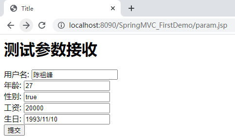
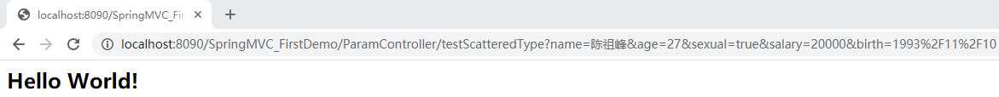
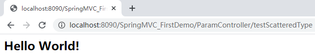
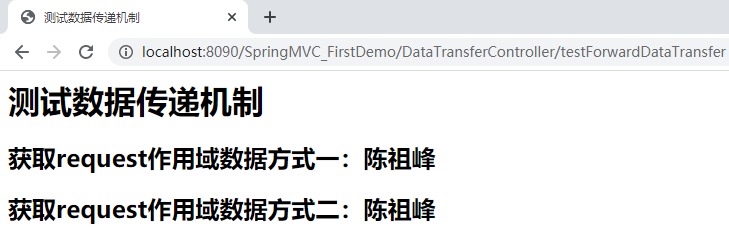
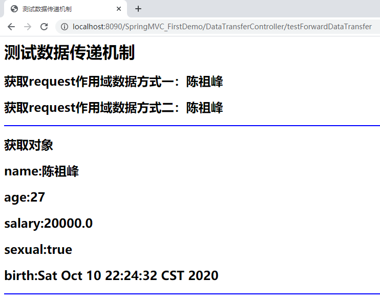
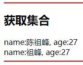

# 1 引言

SpringFrameWork在Spring基础上开发SpringMVC框架，从而在使用Spring进行Web开发时可以选择使用**Spring的SpringMVC框架作为web开发的`控制器`框架**。控制器主要完成**`接收请求参数、调用业务对象、流程跳转`**。

## 1.1 MVC模型

MVC（Model View Controller）是模型、视图和控制器的缩写，是一种用于设计创建Web应用程序`表现层`的模式。

- Model模型
  - `service、dao、entity`
  - `jdbc->Mybatis`
- View视图
  - webapp页面
  - `jsp（动态网页——根据数据库中数据动态展现）、html`
- Controller控制器
  - **`接收请求参数、调用业务对象、流程跳转`**
  - `action`
  - `servlet->Struts2->SpringMVC`

## 1.2 SpringMVC优点

- 可以和Spring框架无缝整合
- 运行效率高于struts2框架
- `注解式开发`更高效


## 1.3 SpringMVC运行流程


## 1.4 SSM框架模型


# 2 第一个程序开发步骤

创建工程`D:\MarkdownFiles\SpringMVC\SpringMVC_Demo\SpringMVC_FirstDemo`

## 2.1 引入依赖

```xml
	<!--1.Spring相关依赖-->
	<dependency>
      <groupId>org.springframework</groupId>
      <artifactId>spring-core</artifactId>
      <version>4.3.2.RELEASE</version>
    </dependency>
    <dependency>
      <groupId>org.springframework</groupId>
      <artifactId>spring-context</artifactId>
      <version>4.3.2.RELEASE</version>
    </dependency>
    <dependency>
      <groupId>org.springframework</groupId>
      <artifactId>spring-context-support</artifactId>
      <version>4.3.2.RELEASE</version>
    </dependency>
    <dependency>
      <groupId>org.springframework</groupId>
      <artifactId>spring-jdbc</artifactId>
      <version>4.3.2.RELEASE</version>
    </dependency>
    <dependency>
      <groupId>org.springframework</groupId>
      <artifactId>spring-aop</artifactId>
      <version>4.3.2.RELEASE</version>
    </dependency>
    <dependency>
      <groupId>org.springframework</groupId>
      <artifactId>spring-beans</artifactId>
      <version>4.3.2.RELEASE</version>
    </dependency>
    <dependency>
      <groupId>org.springframework</groupId>
      <artifactId>spring-expression</artifactId>
      <version>4.3.2.RELEASE</version>
    </dependency>
    <dependency>
      <groupId>org.springframework</groupId>
      <artifactId>spring-aspects</artifactId>
      <version>4.3.2.RELEASE</version>
    </dependency>
    <dependency>
      <groupId>org.springframework</groupId>
      <artifactId>spring-tx</artifactId>
      <version>4.3.2.RELEASE</version>
    </dependency>
    <dependency>
      <groupId>org.springframework</groupId>
      <artifactId>spring-web</artifactId>
      <version>4.3.2.RELEASE</version>
    </dependency>
		
	<!--2.SpringMVC核心依赖-->
	<dependency>
      <groupId>org.springframework</groupId>
      <artifactId>spring-webmvc</artifactId>
      <version>4.3.2.RELEASE</version>
    </dependency>

   <!--3.servlet-api-->
    <dependency>
      <groupId>javax.servlet</groupId>
      <artifactId>servlet-api</artifactId>
      <version>2.5</version>
      <scope>provided</scope>
    </dependency>
```


## 2.2 配置SpringMVC的核心Servlet—web.xml

在`main/webapp/WEB-INF/web.xml`中添加：

```xml
<!DOCTYPE web-app PUBLIC
 "-//Sun Microsystems, Inc.//DTD Web Application 2.3//EN"
 "http://java.sun.com/dtd/web-app_2_3.dtd" >

<web-app>
  <display-name>Archetype Created Web Application</display-name>

  <!--配置SpringMVC核心Servlet-->
    <servlet>
        <servlet-name>springmvc</servlet-name>
        <servlet-class>org.springframework.web.servlet.DispatcherServlet</servlet-class>

        <!--指定SpringMVC配置文件springmvc.xml位置-->
        <init-param>
            <param-name>contextConfigLocation</param-name>
            <param-value>classpath:springmvc.xml</param-value>
        </init-param>
    </servlet>

    <servlet-mapping>
        <servlet-name>springmvc</servlet-name>
        <!--/：拦截所有请求，交给SpringMVC处理-->
        <url-pattern>/</url-pattern>
    </servlet-mapping>

</web-app>
```


## 2.3 编写SpringMVC配置文件—springmvc.xml

在`main\resources\springmvc.xml`中添加：

```xml
<?xml version="1.0" encoding="UTF-8"?>
<beans xmlns="http://www.springframework.org/schema/beans"
       xmlns:xsi="http://www.w3.org/2001/XMLSchema-instance"
       xmlns:context="http://www.springframework.org/schema/context"
       xmlns:mvc="http://www.springframework.org/schema/mvc"
       xsi:schemaLocation="http://www.springframework.org/schema/beans
                                            http://www.springframework.org/schema/beans/spring-beans.xsd
                                            http://www.springframework.org/schema/context
                                            http://www.springframework.org/schema/context/spring-context.xsd http://www.springframework.org/schema/mvc http://www.springframework.org/schema/mvc/spring-mvc.xsd">

    <!--1.开启注解扫描-->
    <!--xmlns:context="http://www.springframework.org/schema/context"-->
    <context:component-scan base-package="com.chenzf.controller"/>

    <!--注册处理器映射器-->
    <!-- <bean class="org.springframework.web.servlet.mvc.method.annotation.RequestMappingHandlerMapping"/> -->

    <!--注册处理器适配器-->
    <!--<bean class="org.springframework.web.servlet.mvc.method.annotation.RequestMappingHandlerAdapter"/> -->

    <!--2.注册处理器映射器和处理器适配器，以及参数类型转换，跳转和响应处理等-->
    <!--xmlns:mvc="http://www.springframework.org/schema/mvc"-->
    <mvc:annotation-driven/>

    <!--3.注册视图解析器-->
    <bean class="org.springframework.web.servlet.view.InternalResourceViewResolver">
        <!--注入前缀和后缀-->
        <property name="prefix" value="/"/>
        <property name="suffix" value=".jsp"/>
    </bean>

</beans>
```


## 2.4 开发控制器

创建`com.chenzf.controller.HelloController`：

```java
package com.chenzf.controller;

import org.springframework.stereotype.Controller;
import org.springframework.web.bind.annotation.RequestMapping;

/**
 * @Controller 作用：在类上标识这是一个控制器组件类，
 *                  并创建这个类实例用来创建HelloController对象
 *                  参数：工厂中唯一标识
 * @author Chenzf
 */
@Controller("helloController")
@RequestMapping("/HelloSpringMVC")
public class HelloController {

    /**
     * RequestMapping 用来指定类以及类中方法的请求路径
     * @return 返回页面逻辑名
     */
    @RequestMapping(value = "/hello")
    public String hello() {
        // 1.收集数据

        // 2.调用业务方法
        System.out.println("HelloController控制器中调用业务方法！");

        // 3.处理响应：返回页面逻辑名
        return "index";
    }
}
```


### Controller和RequestMapping

- `@Controller`：该注解用来在类上**`标识这是一个控制器组件类`**并**`创建这个类实例`**

- `@RequestMapping`: 
  - 修饰范围：**用在`方法`或者`类`上**
  - 注解作用：**用来指定类以及类中方法的`请求路径`**
    - **用在`类`上，给类中所有方法加入一个统一请求路径**
    - **用在`方法`上，用来表示访问这个方法的路径**
  - **一旦类和方法上加入`@RequestMapping("/路径")`，访问时必须使用`/项目名/类路径名/方法路径名`**


## 2.5 部署项目，启动项目测试

### 2.5.1 配置Tomcat

1. 点击`run`中的`Edit Configurations`：


也许看不到`Tomcat Server`，点击`34items more(irrelevant)`，里面有`Tomcat Server`。

2. 指定Tomcat路径


3. 设置部署
   - 点击`Artifact`，自动生成`j2ee.war`


### 2.5.2 运行并测试

访问路径：`http://localhost:端口号/项目名/类上@RequestMapping路径/调用方法上@RequestMapping路径`


## 2.6 SpringMVC三大组件

**`处理器映射器、处理器适配器和视图解析器`**！

但`处理器映射器和处理器适配器`已由SpringMVC[简化](# 2.3 编写SpringMVC配置文件—springmvc.xml)成：

```xml
<!--注册处理器映射器和处理器适配器，以及参数类型转换，跳转和响应处理等-->
<!--xmlns:mvc="http://www.springframework.org/schema/mvc"-->
<mvc:annotation-driven/>
```


# 3 SpringMVC跳转方式

## 3.1 原始servlet技术中跳转方式

1. `forward`跳转：请求转发
   - 服务器内部跳转，跳转后地址栏不变。一次跳转（一次请求），跳转时可以使用`request`作用域传递数据
2. `redirect`跳转：请求重定向
   - 客户端跳转，跳转后地址栏改变。多次跳转（多次请求），跳转过程中不能使用`request`作用域传递数据

## 3.2 SpringMVC中跳转方式

测试文件：`com.chenzf.controller.ForwardAndRedirectController`

### 3.2.1 `Controller`到`JSP`页面的跳转

新建`com.chenzf.controller.ForwardAndRedirectController`

1. `forward`：默认`forward`跳转到页面。

   - 语法：`return "页面逻辑名"`

     ```java
     package com.chenzf.controller;
     
     import org.springframework.stereotype.Controller;
     import org.springframework.web.bind.annotation.RequestMapping;
     
     /**
      * 测试forward和redirect跳转
      */
     
     @Controller
     @RequestMapping("/ForwardAndRedirectController")
     
     public class ForwardAndRedirectController {
     
         /**
          * 测试forward跳转到页面
          * controller跳转到jsp页面就是forward跳转
          * @return 返回页面逻辑名
          */
         @RequestMapping("/testForward")
         public String testForward() {
             System.out.println("测试forward跳转到index.jsp");
             return "index";
         }
     }
     ```

     

   - 启动测试http://localhost:8090/SpringMVC_FirstDemo/ForwardAndRedirectController/testForward

2. `redirect`：使用SpringMVC提供的关键字`redirect`。

   - 语法：`return "redirect:视图全名"`——`return "redirect:/index.jsp"`

     ```java
     package com.chenzf.controller;
     
     import org.springframework.stereotype.Controller;
     import org.springframework.web.bind.annotation.RequestMapping;
     
     /**
      * 测试forward和redirect跳转
      */
     
     @Controller
     @RequestMapping("/ForwardAndRedirectController")
     
     public class ForwardAndRedirectController {
     
         /**
          * 测试fredirct跳转到页面
          * @return 返回页面全名
          */
         @RequestMapping("/testRedirect")
         public String testRedirect() {
             System.out.println("测试redirect跳转到index.jsp");
             return "redirect:/index.jsp";
         }
     }
     
     ```

     

   - 使用`redirect`跳转**不会经过视图解析器**，所以要把路径写全！

   - 跳转后地址栏改变

   - 测试

     - 输入http://localhost:8090/SpringMVC_FirstDemo/ForwardAndRedirectController/testRedirect
     - 地址栏跳转至http://localhost:8090/SpringMVC_FirstDemo/index.jsp


### 3.2.2 `Controller`与`Controller`之间跳转

#### 3.2.2.1 `forward`跳转

- 语法：`return "forward:/跳转controller类上@RequestMapping路径/跳转类中指定方法上@RequestMapping路径"`

1. `forward`跳转到相同controller类中不同方法

   ```java
   /**
   * 测试forward跳转到相同controller类中不同方法
   * @return forward:/类路径/方法路径
   */
   @RequestMapping("/testForwardSameController")
   public String testForwardSameController() {
       System.out.println("测试forward跳转到相同controller类中不同方法");
       return "forward:/ForwardAndRedirectController/testForward";
   }
   ```

   

   - 跳转后地址栏不改变
   - 输入：http://localhost:8090/SpringMVC_FirstDemo/ForwardAndRedirectController/testForwardSameController

2. `forward`跳转到不同controller类中方法：与1中方式相同！


#### 3.2.2.2 `redirect`跳转

- 语法：`return "redirect:/跳转controller类上@RequestMapping路径/跳转类中指定方法上@RequestMapping路径"`

1. `redirect`：跳转到相同controller类中不同方法

   ```java
   /**
   * 测试redirect跳转到相同controller类中不同方法
   * @return redirect:/类路径/方法路径
   */
   @RequestMapping("/testRedirectSameController")
   public String testRedirectSameController() {
       System.out.println("测试redirect跳转到相同controller类中不同方法");
       return "redirect:/ForwardAndRedirectController/testForward";
   }
   ```

   

   - 跳转后地址栏改变

     - 输入：http://localhost:8090/SpringMVC_FirstDemo/ForwardAndRedirectController/testRedirectSameController
     - 地址栏跳转至http://localhost:8090/SpringMVC_FirstDemo/ForwardAndRedirectController/testForward

   - 输出

     ```
     测试redirect跳转到相同controller类中不同方法
     测试redirect跳转到index.jsp
     ```

     

2. `redirect`跳转到不同controller类中方法：与1中方式相同！


# 4 SpringMVC中参数接收

测试文件：`com.chenzf.controller.ParamController`

SpringMVC中使用**`控制器方法形参列表`**来接收**`客户端的请求参数`**，因此要求**传递参数`key`要与对应方法的形参变量名一致**才能完成自动赋值。**在接收请求参数时直接在控制器方法中声明**即可，SpringMVC可以自动根据指定类型完成类型的转换操作。

请求参数：

- url：`http://localhost:8989/项目名/路径?name=xxx&age=xxx`
- form：`<input type="text name = "name>`

控制器方法形参列表：

```java
XXXController {
    public String xx(String name, Integer age) {
        // 接收url中的name=xxx&age=xxx
    }
}
```

## 4.1 零散类型参数接收

`八种基本类型 + String + 日期类型`

### 4.1.1 后台控制器接收

```java
package com.chenzf.controller;

import org.springframework.stereotype.Controller;
import org.springframework.web.bind.annotation.RequestMapping;

import java.util.Date;

/**
 * 用来测试参数接收
 */

@Controller
@RequestMapping("/ParamController")
public class ParamController {

    /**
     * 测试零散类型的参数接收
     * @return 页面
     */
    @RequestMapping("/testScatteredType")
    public String testScatteredType(String name, Integer age, Boolean sexual, Double salary, Date birth) {
        System.out.println("==========测试零散类型的参数接收==========");
        System.out.println("姓名：" + name);
        System.out.println("年龄：" + age);
        System.out.println("性别：" + sexual);
        System.out.println("工资：" + salary);
        System.out.println("生日：" + birth);
        return "index";
    }
}
```


### 4.1.2 前台传递参数

#### 4.1.2.1 `Get`方式传递参数：

在地址栏输入`http://localhost:8090/SpringMVC_FirstDemo/ParamController/testScatteredType?name=陈祖峰&age=27&sexual=true&salary=20000&birth=1993/11/10`

```
==========测试零散类型的参数接收==========
姓名：é???????°
年龄：27
性别：true
工资：20000.0
生日：Wed Nov 10 00:00:00 CST 1993
```


#### 4.1.2.2 使用表单

1. 创建`webapp/param.jsp`：注意`isELIgnored="false"`

   ```java
   <%--
     Created by IntelliJ IDEA.
     User: Chenzf
     Date: 2020/10/10
     Time: 19:18
     To change this template use File | Settings | File Templates.
   --%>
   <%@ page contentType="text/html;charset=UTF-8" language="java" isELIgnored="false" %>
   <html>
   <head>
       <title>Title</title>
   </head>
   <body>
   
   <h1>测试参数接收</h1>
   <form action="${pageContext.request.contextPath}/ParamController/testScatteredType" method="post">
       用户名: <input type="text" name="name"/>  <br>
       年龄:  <input type="text" name="age"/>   <br>
       性别:  <input type="text" name="sexual">    <br>
       工资:  <input type="text" name="salary"> <br>
       生日:  <input type="text" name="birth"> <br>
       <input type="submit" value="提交"/>
   </form>
   
   </body>
   </html>
   
   ```


2. 测试：http://localhost:8090/SpringMVC_FirstDemo/param.jsp

   

   点击`提交`，跳转至（`get`与`post`不同，跳转后**地址栏不一样**）：
   
   - `method="get"`：与通过`url`一样
   
   
   
   - `method="post"`
   
   

3. 输出结果

   ```
   ==========测试零散类型的参数接收==========
   姓名：é???????°
   年龄：27
   性别：true
   工资：20000.0
   生日：Wed Nov 10 00:00:00 CST 1993
   ```

   

#### 4.1.2.3 注意

- `SpringMVC在接收日期类型参数时日期格式必须为yyyy/MM/dd HH:mm:ss`
- 保证**请求参数中key**与对应**方法中声明的形参变量名**一致


## 4.2 对象类型参数接收

### 4.2.1 定义实体类

定义实体类：`com.chenzf.entity.User`

```java
package com.chenzf.entity;

import java.util.Date;

public class User {
    private String name;
    private Integer age;
    private Double salary;
    private Boolean sexual;
    private Date birth;
    
    public User() {}

    public User(String name, Integer age, Double salary, Boolean sexual, Date birth) {
        this.name = name;
        this.age = age;
        this.salary = salary;
        this.sexual = sexual;
        this.birth = birth;
    }

    @Override
    public String toString() {
        return "User{" +
                "name='" + name + '\'' +
                ", age=" + age +
                ", salary=" + salary +
                ", sexual=" + sexual +
                ", birth=" + birth +
                '}';
    }

    public String getName() {
        return name;
    }

    public void setName(String name) {
        this.name = name;
    }

    public Integer getAge() {
        return age;
    }

    public void setAge(Integer age) {
        this.age = age;
    }

    public Double getSalary() {
        return salary;
    }

    public void setSalary(Double salary) {
        this.salary = salary;
    }

    public Boolean getSexual() {
        return sexual;
    }

    public void setSexual(Boolean sexual) {
        this.sexual = sexual;
    }

    public Date getBirth() {
        return birth;
    }

    public void setBirth(Date birth) {
        this.birth = birth;
    }
}
```


### 4.2.2 后台控制器接收

控制器中接收：`com.chenzf.controller.ParamController`

```java
	/**
     * 测试对象类型的参数接收
     * @param user 接收的对象
     * @return 返回index.jsp
     */
    @RequestMapping("/testObject")
    public String testObject(User user) {
        System.out.println("==========测试对象类型的参数接收==========");
        System.out.println("ParamController接收到的对象：" + user);
        System.out.println("ParamController接收到的对象的姓名：" + name);
        return "index";
    }
```


### 4.2.3 前台传递参数

1. `Get`方式请求参数传递：

   http://localhost:8090/SpringMVC_FirstDemo/ParamController/testObject?name=chenzufeng&age=27&sexual=true&salary=20000&birth=1993/11/10

2. 测试结果

   ```
   ==========测试对象类型的参数接收==========
   ParamController接收到的对象：User{name='chenzufeng', age=27, salary=20000.0, sexual=true, birth=Wed Nov 10 00:00:00 CST 1993}
   ParamController接收到的对象的姓名：chenzufeng
   ```

   

### 4.2.4 注意

- SpringMVC直接根据**`传递参数名`**与**`对象中属性名`**一致自动封装对象！

## 4.3 数组类型参数接收

将要接收**数组类型**直接声明为**方法的形参**即可！

### 4.3.1 后台控制器接收

控制器中接收：`com.chenzf.controller.ParamController`

```java
    /**
     * 测试数组类型参数接收
     * @return 返回index.jsp
     */
    @RequestMapping("/testArray")
    public String testArray(String[] names) {
        System.out.println("==========测试数组类型的参数接收==========");
        for (String name : names) {
            System.out.println(name);
        }
        return "index";
    }
```


### 4.3.2 前台传递参数

1. `Get`方式请求参数传递：`url`中`names`要与`ParamController`中`names`一致！

   http://localhost:8090/SpringMVC_FirstDemo/ParamController/testArray?names=chen&names=zufeng

2. 测试结果

   ```
   ==========测试数组类型的参数接收==========
   chen
   zufeng
   ```


### 4.3.3 注意

- 保证请求参数多个参数key与声明数组变量名一致，SpringMVC会自动放入同一个数组中

## 4.4 集合类型参数接收

- SpringMVC不能直接通过形参列表方式收集集合类型（`list、set、map`）参数，如果要接收集合类型参数，必须将集合放入对象中！
- 推荐放入`vo`（`value object`）对象中接收集合类型


### 4.4.1 list类型参数接收

#### 4.4.1.1 定义vo包

创建`com.chenzf.vo.CollectionVO`

```java
package com.chenzf.vo;

import java.util.List;

public class CollectionVO {
    private List<String> lists;

    public List<String> getLists() {
        return lists;
    }

    public void setLists(List<String> lists) {
        this.lists = lists;
    }
}
```


#### 4.4.1.2 后台控制器接收

```java
    /**
     * 测试集合类型List的参数接收
     * @param collectionVO 接收的对象
     * @return 返回index.jsp
     */
    @RequestMapping("/testCollectionList")
    public String testCollection(CollectionVO collectionVO) {
        System.out.println("==========测试集合类型List的参数接收==========");
        collectionVO.getLists().forEach(str -> System.out.println(str));
        return "index";
    }
```


#### 4.4.1.3 前台传递参数

1. `Get`方式请求参数传递：`url`中`lists`要与`CollectionVO`中`lists`一致！

   http://localhost:8090/SpringMVC_FirstDemo/ParamController/testCollection?lists=chen&lists=zufeng

2. 测试结果

   ```
   ==========测试集合类型List的参数接收==========
   chen
   zufeng
   ```

   

### 4.4.2 map类型参数接收

#### 4.4.2.1 在vo包添加map

```java
package com.chenzf.vo;

import java.util.List;
import java.util.Map;

public class CollectionVO {
    private Map<String, String> map;

    public Map<String, String> getMap() {
        return map;
    }

    public void setMap(Map<String, String> map) {
        this.map = map;
    }
}

```


#### 4.4.2.2 后台控制器接收

```java
    /**
     * 测试集合类型Map的参数接收
     * @param collectionVO 接收的对象
     * @return 返回index.jsp
     */
    @RequestMapping("/testCollectionMap")
    public String testCollectionMap(CollectionVO collectionVO) {
        System.out.println("==========测试集合类型Map的参数接收==========");
        collectionVO.getMap().forEach((key, value) -> System.out.println("key: " + key + (", value: ") + value));
        return "index";
    }
```


#### 4.4.2.3 前台传递参数

1. `Get`方式请求参数传递：`url`中`map`要与`CollectionVO`中`map`一致！

   http://localhost:8090/SpringMVC_FirstDemo/ParamController/testCollectionMap?map['chen']=zufeng

2. 测试结果

   ```
   ==========测试集合类型Map的参数接收==========
   key: chen, value: zufeng
   ```


## 4.5 参数接收乱码问题

在[参数接收实验结果](# 4.1.2 前台传递参数)中，后台出现了乱码！

### 4.5.1 Get方式请求出现乱码

找到`Tomcat`配置文件：`D:\WinSoftware\tomcat\conf\server.xml`

- `Tomcat8`之前，默认使用`server.xml`中`URIEncoding="iso-8859-1"，编码不是UFT-8`，所以出现乱码
- `Tomcat8`之后，默认使用`server.xml`中`UFT-8`

因此将改文件中

```xml
<Connector port="8090" protocol="HTTP/1.1" connectionTimeout="20000" redirectPort="8443"/>
<Connector port="8089" protocol="AJP/1.3" redirectPort="8443"/>
```

改为

```xml
<Connector port="8090" protocol="HTTP/1.1" connectionTimeout="20000" redirectPort="8443" URIEncoding="UTF-8"/>
<Connector port="8089" protocol="AJP/1.3" redirectPort="8443" URIEncoding="UTF-8"/>
```


### 4.5.2 Post方式请求出现乱码

在SpringMVC中，默认没有对`Post`方法请求进行任何编码处理，所以直接接收`Post`方式请求，会出现乱码！

解决方案：使用SpringMVC提供的`filter`：`main\webapp\WEB-INF\web.xml`

```xml
    <!--配置post请求方式中文乱码的filter-->
    <filter>
        <filter-name>charset</filter-name>
        <filter-class>org.springframework.web.filter.CharacterEncodingFilter</filter-class>
        <init-param>
            <param-name>encoding</param-name>
            <param-value>UTF-8</param-value>
        </init-param>
    </filter>

    <filter-mapping>
        <filter-name>charset</filter-name>
        <url-pattern>/*</url-pattern>
    </filter-mapping>
```


# 5 SpringMVC中数据传递机制

工程所在位置：`D:\MarkdownFiles\SpringMVC\SpringMVC_Demo\SpringMVC_FirstDemo`

## 5.1 数据传递机制

|           |         数据如何存储          | 数据在页面如何获取 | 获取的数据如何展示 |
| :-------: | :---------------------------: | :----------------: | :----------------: |
|  Servlet  | request、session、application |      EL表达式      |      JSTL标签      |
|  Struts2  | request、session、application |      EL表达式      |      JSTL标签      |
| SpringMVC | request、session、application |      EL表达式      |      JSTL标签      |

存数据使用哪种作用域，主要与跳转方式有关：

- `forward`：一次请求——`request`作用域、`model`
- `redirct`：多次请求——`?`地址栏传递数据、`session`作用域、`application`作用域

## 5.2 使用forward与request传递数据

使用Servlet中原始的request作用域传递数据

### 5.2.1 forward传String类型数据

1. 创建：`com.chenzf.controller.DataTransferController`——存储数据

```java
package com.chenzf.controller;

import org.springframework.stereotype.Controller;
import org.springframework.web.bind.annotation.RequestMapping;

import javax.servlet.http.HttpServletRequest;
import javax.servlet.http.HttpServletResponse;

/**
 * 测试SpringMVC中数据传递机制
 */

@Controller
@RequestMapping("/DataTransferController")
public class DataTransferController {

    /**
     * 使用forward跳转页面数据传递
     * @param request 当前请求对象
     * @param response 响应对象
     * @return dataTransfer.jsp
     */
    @RequestMapping("testForwardDataTransfer")
    public String testForwardDataTransfer(HttpServletRequest request, HttpServletResponse response) {
        // 1.收集参数
        // 2.调用业务方法——先直接存储String
        System.out.println("DataTransferController调用业务，存储数据：");
        String name = "陈祖峰";
        // 存储数据
        request.setAttribute("username", name);
        // 3.流程跳转/响应处理
        return "dataTransfer";
    }

}
```


2. 显示数据

```jsp
<%--
  Created by IntelliJ IDEA.
  User: Chenzf
  Date: 2020/10/10
  Time: 21:59
  To change this template use File | Settings | File Templates.
--%>
<%@ page contentType="text/html;charset=UTF-8" language="java" isELIgnored="false" %>
<html>
<head>
    <title>测试数据传递机制</title>
</head>
<body>
	<h1>测试数据传递机制</h1>
    <h2>获取request作用域数据方式一：${requestScope.username}</h2>
    <h2>获取request作用域数据方式二：${username}</h2>
</body>
</html>
```


3. 测试：http://localhost:8090/SpringMVC_FirstDemo/DataTransferController/testForwardDataTransfer




### 5.2.2 forward传对象数据并格式化日期

1. `com.chenzf.controller.DataTransferController`

```java
User user = new User("陈祖峰", 27, 20000.0, true, new Date());
request.setAttribute("user", user);
```


2. `dataTransfer.jsp`

```jsp
<hr color="blue">
<h2>获取对象</h2>
<h2>name:${requestScope.user.name}</h2>
<h2>age:${requestScope.user.age}</h2>
<h2>salary:${requestScope.user.salary}</h2>
<h2>sexual:${requestScope.user.sexual}</h2>
<h2>birth:${requestScope.user.birth}</h2>
<hr color="blue">
```


3. 测试：http://localhost:8090/SpringMVC_FirstDemo/DataTransferController/testForwardDataTransfer



4. 格式化日期

   - 引入`jstl`依赖：`pom.xml`

     ```xml
     <!--引入jstl依赖-->
     <dependency>
         <groupId>jstl</groupId>
         <artifactId>jstl</artifactId>
         <version>1.2</version>
     </dependency>
     ```

   - 修改`dataTransfer.jsp`

     ```xml
     <h2>birth:<fmt:formatDate value="${requestScope.user.birth}" pattern="yyyy-MM-dd"/> </h2>
     ```

   - 测试结果：`birth:2020-10-10`


### 5.2.3 forward传集合数据

1. `com.chenzf.controller.DataTransferController`

   ```java
   User user = new User("陈祖峰", 27, 20000.0, true, new Date());
   User user1 = new User("祖峰", 27, 20000.0, true, new Date());
           
   List<User> users = Arrays.asList(user, user1);
   request.setAttribute("users", users);
   ```

   

2. `dataTransfer.jsp`

   ```jsp
   <hr color="red">
   <h2>获取集合</h2>
   <c:forEach items="${requestScope.users}" var="user">
       name:${user.name}, age:${user.age} <br>
   </c:forEach>
   <hr color="red">
   ```

   

3. 测试：http://localhost:8090/SpringMVC_FirstDemo/DataTransferController/testForwardDataTransfer



## 5.3 使用forward与model、modelMap传递数据

使用Springmvc中封装的`Model`和`ModelMap`对象（底层对`request`作用域封装），并且是`org.springframework.ui`中的。

创建：`com.chenzf.controller.DataTransferController1`

```java
package com.chenzf.controller;

import org.springframework.stereotype.Controller;
import org.springframework.ui.Model;
import org.springframework.web.bind.annotation.RequestMapping;

/**
 * 测试SpringMVC中数据传递机制
 */

@Controller
@RequestMapping("/DataTransferController1")
public class DataTransferController1 {

    /**
     * 使用forward跳转页面数据传递
     * @return dataTransfer.jsp
     */
    @RequestMapping("/testForwardDataTransfer1")
    public String testForwardDataTransfer(Model model) {
        // 1.收集参数
        // 2.调用业务方法——先直接存储String
        System.out.println("DataTransferController调用业务，存储数据：");

        String name = "陈祖峰";
        model.addAttribute("username", name);

        User user = new User("陈祖峰", 27, 20000.0, true, new Date());
        User user1 = new User("祖峰", 28, 30000.0, true, new Date());

        List<User> users = Arrays.asList(user, user1);

        model.addAttribute("user", user);
        model.addAttribute("users", users);

        // 3.流程跳转/响应处理
        return "dataTransfer";
    }

}
```


## 5.4 使用redirect与地址栏传递数据

传少量数据：

1. `com.chenzf.controller.DataTransferController`

```java
/**
* 使用redirect跳转页面数据传递
* @return dataTransfer.jsp
*/
@RequestMapping("/testRedirectDataTransfer")
public String testRedirectDataTransfer() {
    // 1.收集参数
    // 2.调用业务方法
    System.out.println("DataTransferController调用业务，存储数据：");
    String name = "chenzufeng";// 传中文有问题
    // 3.流程跳转/响应处理
    return "redirect:/dataTransfer.jsp?name=" + name;
}

String name = "陈祖峰";
return "redirect:/dataTransfer.jsp?name=" + URLEncoder.encode(name, "UTF-8");  // 只对中文有效果
```

2. `dataTransfer.jsp`

```jsp
<h2>redirect获取地址栏数据：${param.name}</h2>
```


## 5.5 使用redirect与session作用域传递数据

1. `com.chenzf.controller.DataTransferController`

   ```java
   /**
   * 使用redirect跳转页面数据传递
   * @return dataTransfer.jsp
   */
   @RequestMapping("/testRedirectDataTransfer")
   public String testRedirectDataTransfer(HttpServletRequest request) throws UnsupportedEncodingException {
       // 1.收集参数
       // 2.调用业务方法
       System.out.println("DataTransferController调用业务，存储数据：");
       User user2 = new User("陈祖峰", 27, 20000.0, true, new Date());
       request.getSession().setAttribute("user", user2);
       // 3.流程跳转/响应处理
       return "redirect:/dataTransfer.jsp?name=" + URLEncoder.encode(name, "UTF-8");
   }
   ```


2. `dataTransfer.jsp`

   ```jsp
   <h2>name:${sessionScope.user.name}</h2>
   <h2>age:${sessionScope.user.age}</h2>
   <h2>salary:${sessionScope.user.salary}</h2>
   <h2>sexual:${sessionScope.user.sexual}</h2>
   <h2>birth:${sessionScope.user.birth}</h2>
   ```

   


