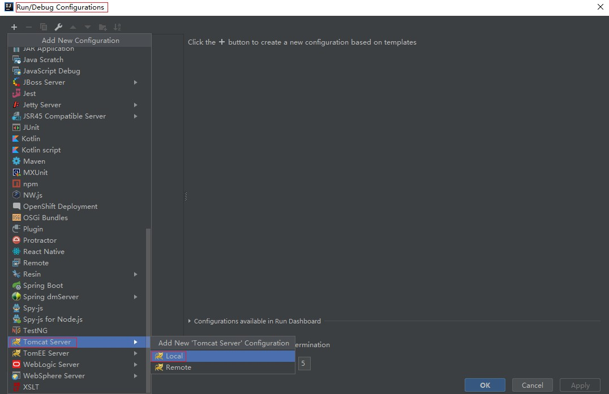

# 1 引言

SpringFrameWork在Spring基础上开发SpringMVC框架，从而在使用Spring进行Web开发时可以选择使用**Spring的SpringMVC框架作为web开发的`控制器`框架**。

## 1.1 MVC模型

MVC（Model View Controller）是模型、视图和控制器的缩写，是一种用于设计创建Web应用程序`表现层`的模式。

- Model模型
  - `service、dao、entity`
  - `jdbc->Mybatis`
- View视图
  - webapp页面
  - `jsp（动态网页——根据数据库中数据动态展现）、html`
- Controller控制器
  - 接收请求参数、调用业务对象、流程跳转
  - `action`
  - `servlet->Struts2->SpringMVC`

## 1.2 SpringMVC优点

- 可以和Spring框架无缝整合
- 运行效率高于struts2框架
- `注解式开发`更高效


## 1.3 SpringMVC运行流程


## 1.4 SSM框架模型


# 2 第一个程序开发步骤

创建工程`D:\MarkdownFiles\SpringMVC\SpringMVC_Demo\SpringMVC_FirstDemo`

## 2.1 引入依赖

```xml
	<!--1.Spring相关依赖-->
	<dependency>
      <groupId>org.springframework</groupId>
      <artifactId>spring-core</artifactId>
      <version>4.3.2.RELEASE</version>
    </dependency>
    <dependency>
      <groupId>org.springframework</groupId>
      <artifactId>spring-context</artifactId>
      <version>4.3.2.RELEASE</version>
    </dependency>
    <dependency>
      <groupId>org.springframework</groupId>
      <artifactId>spring-context-support</artifactId>
      <version>4.3.2.RELEASE</version>
    </dependency>
    <dependency>
      <groupId>org.springframework</groupId>
      <artifactId>spring-jdbc</artifactId>
      <version>4.3.2.RELEASE</version>
    </dependency>
    <dependency>
      <groupId>org.springframework</groupId>
      <artifactId>spring-aop</artifactId>
      <version>4.3.2.RELEASE</version>
    </dependency>
    <dependency>
      <groupId>org.springframework</groupId>
      <artifactId>spring-beans</artifactId>
      <version>4.3.2.RELEASE</version>
    </dependency>
    <dependency>
      <groupId>org.springframework</groupId>
      <artifactId>spring-expression</artifactId>
      <version>4.3.2.RELEASE</version>
    </dependency>
    <dependency>
      <groupId>org.springframework</groupId>
      <artifactId>spring-aspects</artifactId>
      <version>4.3.2.RELEASE</version>
    </dependency>
    <dependency>
      <groupId>org.springframework</groupId>
      <artifactId>spring-tx</artifactId>
      <version>4.3.2.RELEASE</version>
    </dependency>
    <dependency>
      <groupId>org.springframework</groupId>
      <artifactId>spring-web</artifactId>
      <version>4.3.2.RELEASE</version>
    </dependency>
		
	<!--2.SpringMVC核心依赖-->
	<dependency>
      <groupId>org.springframework</groupId>
      <artifactId>spring-webmvc</artifactId>
      <version>4.3.2.RELEASE</version>
    </dependency>

   <!--3.servlet-api-->
    <dependency>
      <groupId>javax.servlet</groupId>
      <artifactId>servlet-api</artifactId>
      <version>2.5</version>
      <scope>provided</scope>
    </dependency>
```


## 2.2 配置SpringMVC的核心Servlet—web.xml

在`main/webapp/WEB-INF/web.xml`中添加：

```xml
<!DOCTYPE web-app PUBLIC
 "-//Sun Microsystems, Inc.//DTD Web Application 2.3//EN"
 "http://java.sun.com/dtd/web-app_2_3.dtd" >

<web-app>
  <display-name>Archetype Created Web Application</display-name>

  <!--配置SpringMVC核心Servlet-->
    <servlet>
        <servlet-name>springmvc</servlet-name>
        <servlet-class>org.springframework.web.servlet.DispatcherServlet</servlet-class>

        <!--指定SpringMVC配置文件springmvc.xml位置-->
        <init-param>
            <param-name>contextConfigLocation</param-name>
            <param-value>classpath:springmvc.xml</param-value>
        </init-param>
    </servlet>

    <servlet-mapping>
        <servlet-name>springmvc</servlet-name>
        <!--/：拦截所有请求，交给SpringMVC处理-->
        <url-pattern>/</url-pattern>
    </servlet-mapping>

</web-app>
```


## 2.3 编写SpringMVC配置文件—springmvc.xml

在`main\resources\springmvc.xml`中添加：

```xml
<?xml version="1.0" encoding="UTF-8"?>
<beans xmlns="http://www.springframework.org/schema/beans"
       xmlns:xsi="http://www.w3.org/2001/XMLSchema-instance"
       xmlns:context="http://www.springframework.org/schema/context"
       xmlns:mvc="http://www.springframework.org/schema/mvc"
       xsi:schemaLocation="http://www.springframework.org/schema/beans
                                            http://www.springframework.org/schema/beans/spring-beans.xsd
                                            http://www.springframework.org/schema/context
                                            http://www.springframework.org/schema/context/spring-context.xsd http://www.springframework.org/schema/mvc http://www.springframework.org/schema/mvc/spring-mvc.xsd">

    <!--1.开启注解扫描-->
    <!--xmlns:context="http://www.springframework.org/schema/context"-->
    <context:component-scan base-package="com.chenzf.controller"/>

    <!--注册处理器映射器-->
    <!-- <bean class="org.springframework.web.servlet.mvc.method.annotation.RequestMappingHandlerMapping"/> -->

    <!--注册处理器适配器-->
    <!--<bean class="org.springframework.web.servlet.mvc.method.annotation.RequestMappingHandlerAdapter"/> -->

    <!--2.注册处理器映射器和处理器适配器，以及参数类型转换，跳转和响应处理等-->
    <!--xmlns:mvc="http://www.springframework.org/schema/mvc"-->
    <mvc:annotation-driven/>

    <!--3.注册视图解析器-->
    <bean class="org.springframework.web.servlet.view.InternalResourceViewResolver">
        <!--注入前缀和后缀-->
        <property name="prefix" value="/"/>
        <property name="suffix" value=".jsp"/>
    </bean>

</beans>
```


## 2.4 开发控制器

创建`com.chenzf.controller.HelloController`：

```java
package com.chenzf.controller;

import org.springframework.stereotype.Controller;
import org.springframework.web.bind.annotation.RequestMapping;

/**
 * @Controller 作用：在类上标识这是一个控制器组件类，
 *                                  并创建这个类实例用来创建HelloController对象
 *                       参数：工厂中唯一标识
 * @author Chenzf
 */
@Controller("helloController")
@RequestMapping("/HelloSpringMVC")
public class HelloController {

    /**
     * RequestMapping 用来指定类以及类中方法的请求路径
     * @return 返回页面逻辑名
     */
    @RequestMapping(value = "/hello")
    public String hello() {
        // 1.收集数据

        // 2.调用业务方法
        System.out.println("HelloController控制器中调用业务方法！");

        // 3.处理响应：返回页面逻辑名
        return "index";
    }
}
```


### Controller和RequestMapping

- `@Controller`：该注解用来在类上**`标识这是一个控制器组件类`**并**`创建这个类实例`**

- `@RequestMapping`: 
  - 修饰范围：**用在`方法`或者`类`上**
  - 注解作用：**用来指定类以及类中方法的`请求路径`**
    - **用在`类`上，给类中所有方法加入一个统一请求路径**
    - **用在`方法`上，用来表示访问这个方法的路径**
  - **一旦类和方法上加入`@RequestMapping("/路径")`，访问时必须使用`/项目名/类路径名/方法路径名`**


## 2.5 部署项目，启动项目测试

### 2.5.1 配置Tomcat

1. 点击`run`中的`Edit Configurations`：



也许看不到`Tomcat Server`，点击`34items more(irrelevant)`，里面有`Tomcat Server`。

2. 指定Tomcat路径


3. 设置部署
   - 点击`Artifact`，自动生成`j2ee.war`


### 2.5.2 运行并测试

访问路径：`http://localhost:端口号/项目名/类上@RequestMapping路径/调用方法上@RequestMapping路径`


## 2.6 SpringMVC三大组件

**`处理器映射器、处理器适配器和视图解析器`**！

但`处理器映射器和处理器适配器`已由SpringMVC[简化](# 2.3 编写SpringMVC配置文件—springmvc.xml)成：

```xml
<!--注册处理器映射器和处理器适配器，以及参数类型转换，跳转和响应处理等-->
<!--xmlns:mvc="http://www.springframework.org/schema/mvc"-->
<mvc:annotation-driven/>
```


# 3 SpringMVC跳转方式

## 3.1 原始servlet技术中跳转方式

1. `forward`跳转：请求转发
   - 服务器内部跳转，跳转后地址栏不变。一次跳转（一次请求），跳转时可以使用`request`作用域传递数据
2. `redirect`跳转：请求重定向
   - 客户端跳转，跳转后地址栏改变。多次跳转（多次请求），跳转过程中不能使用`request`作用域传递数据

## 3.2 SpringMVC中跳转方式

### 3.2.1 `Controller`到`JSP`页面的跳转

新建`com.chenzf.controller.ForwardAndRedirectController`

1. `forward`：默认`forward`跳转到页面。

   - 语法：`return "页面逻辑名"`

     ```java
     package com.chenzf.controller;
     
     import org.springframework.stereotype.Controller;
     import org.springframework.web.bind.annotation.RequestMapping;
     
     /**
      * 测试forward和redirect跳转
      */
     
     @Controller
     @RequestMapping("/ForwardAndRedirectController")
     
     public class ForwardAndRedirectController {
     
         /**
          * 测试forward跳转到页面
          * controller跳转到jsp页面就是forward跳转
          * @return 返回页面逻辑名
          */
         @RequestMapping("/testForward")
         public String testForward() {
             System.out.println("测试forward跳转到index.jsp");
             return "index";
         }
     }
     ```

     

   - 启动测试http://localhost:8090/SpringMVC_FirstDemo/ForwardAndRedirectController/testForward

2. `redirect`：使用SpringMVC提供的关键字`redirect`。

   - 语法：`return "redirect:视图全名"`——`return "redirect:/index.jsp"`

     ```java
     package com.chenzf.controller;
     
     import org.springframework.stereotype.Controller;
     import org.springframework.web.bind.annotation.RequestMapping;
     
     /**
      * 测试forward和redirect跳转
      */
     
     @Controller
     @RequestMapping("/ForwardAndRedirectController")
     
     public class ForwardAndRedirectController {
     
         /**
          * 测试fredirct跳转到页面
          * @return 返回页面全名
          */
         @RequestMapping("/testRedirect")
         public String testRedirect() {
             System.out.println("测试redirect跳转到index.jsp");
             return "redirect:/index.jsp";
         }
     }
     
     ```

     

   - 使用`redirect`跳转**不会经过视图解析器**，所以要把路径写全！

   - 跳转后地址栏改变

   - 测试

     - 输入http://localhost:8090/SpringMVC_FirstDemo/ForwardAndRedirectController/testRedirect
     - 地址栏跳转至http://localhost:8090/SpringMVC_FirstDemo/index.jsp


### 3.2.2 `Controller`与`Controller`之间跳转


1. `forward`：使用SpringMVC提供的关键字`forward`。
   - 语法：`return "forward:/跳转controller类上@RequestMapping路径/跳转类中指定方法上@RequestMapping路径"`

2. `redirect`：使用SpringMVC提供的关键字`redirect`。

- 语法：`return "redirect:/跳转controller类上@RequestMapping路径/跳转类中指定方法上@RequestMapping路径"`


